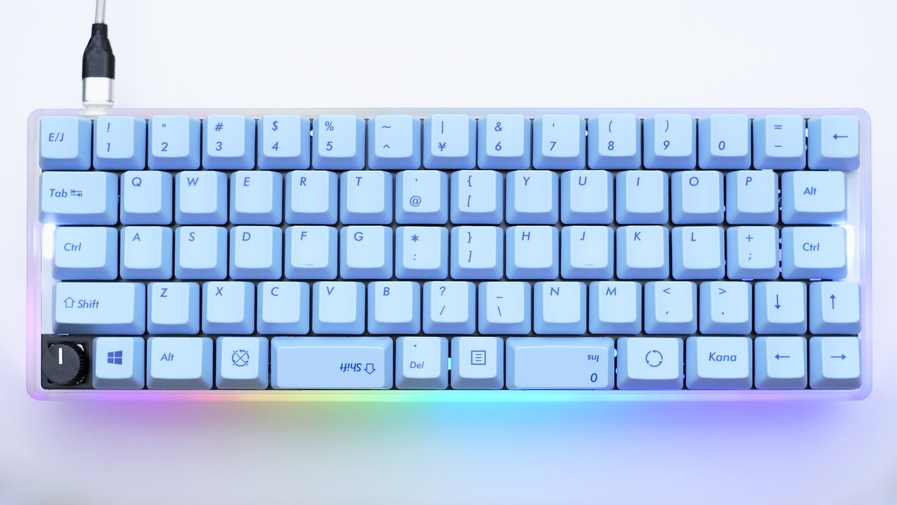
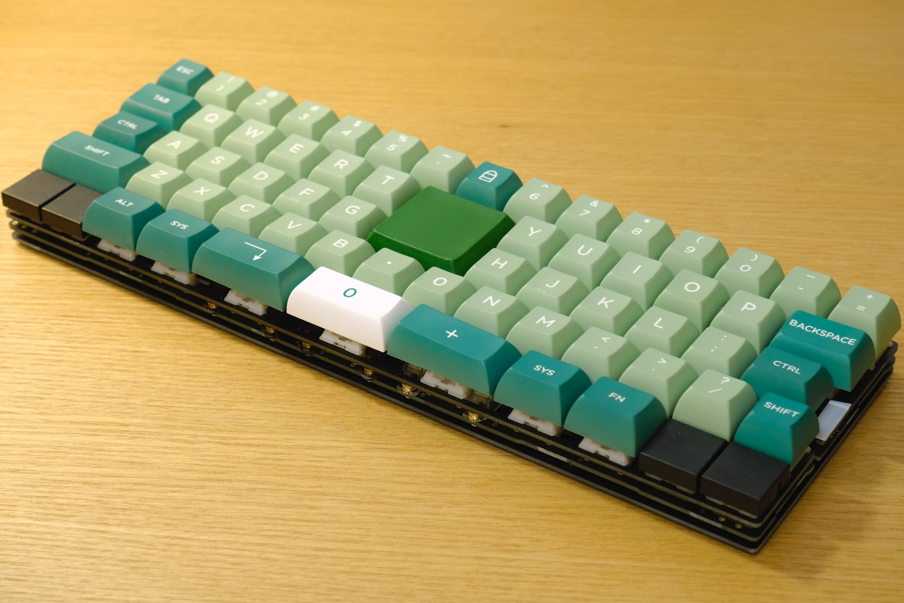
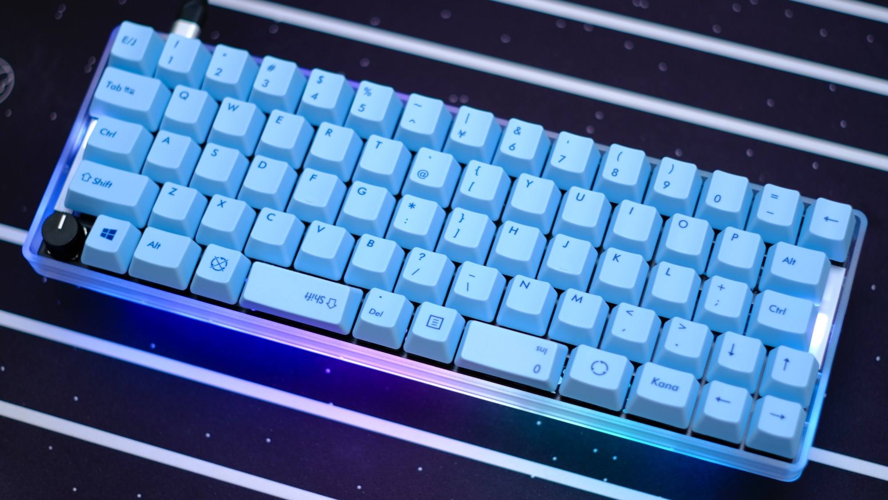
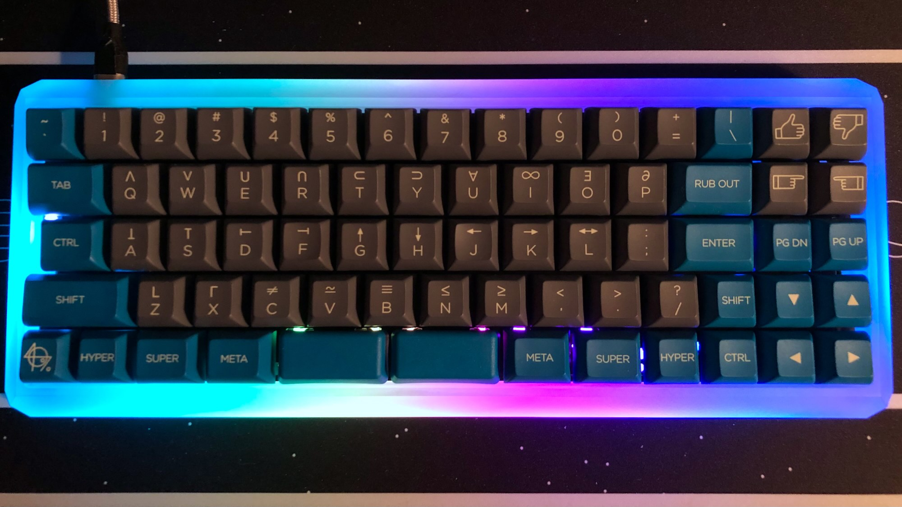
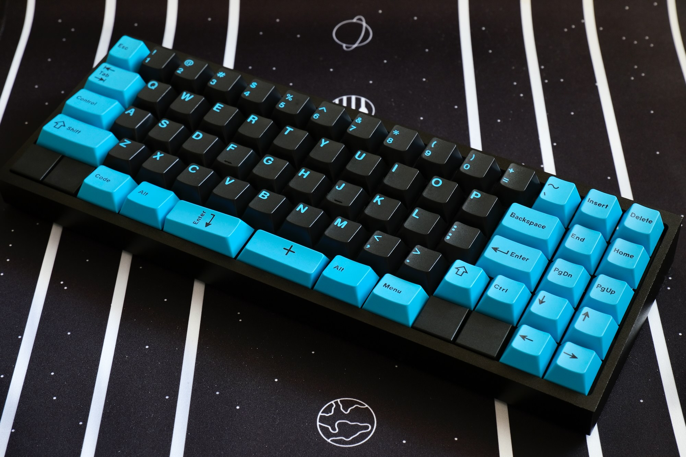
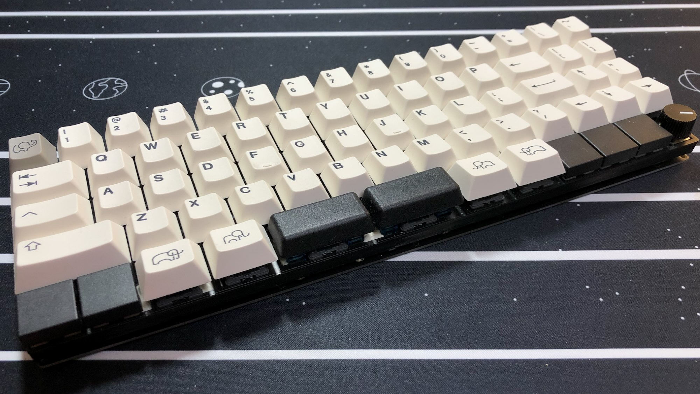

# Jones（ジョーンズ）とは



Jones（ジョーンズ）は、2行目と3行目にずれのない、シンメトリカルな60%キーボードです。  
左右対象のアルファ部と、右手側Modキーをホームポジションのすぐ隣へ配置したレイアウトが特徴で、自然なポジションで打鍵できます。  

40%や50%キーボードのコンパクトで軽快な運指の心地良さと、レイヤーに数字や記号を押し込まなくてよい十分なキー数を兼ね備えています。

GH60型やPoker型に互換性のあるケースや、専用のボトムプレートと組み合わせて使用できます。

名前の由来は、ロースタガとオルソリニアをつなぐ”橋”という意味を込めて…

``` text
橋（ブリッジ） → ブリッジド → ブリジット → ブリジット・ジョーンズ → ジョーンズ

Bridge --> Bridged --> Bridget --> Bridget Jones --> Jones
```

という具合の言葉遊びで、ジョーンズ（Jones）に決まりました。

---

Jones is a symmetrical 60% keyboard, combined with Ortho-linear and Row-staggered. It has gapless R2-R3 row.  
Symmetrical alpha-keys and nearby right side mod-keys provide natural typing position.  

It has compact and light fingering which like 40% and 50% keyboards.
And also, it has enough keys, no need to push numeric and symbol keys into layers.

It can be used with GH60 and Poker compatible cases.

## 対象とするユーザー

Jonesキーボードは、  
*一般的なキーボードのキー配列に不満があり、より良いタイピングポジションを求めている方*  
を対象に作られています。

特に、次のような方におすすめします。

- より良いタイピングポジションを求めている方  
  左右対称のレイアウトと右手側Modキーの配置変更によって、より良いポジションで打鍵することができます。  
  Z~Bを左へずらした完全に左右対称なレイアウトにすれば、さらにポジションを改善できます。

- 機能的なキー配列を求めている方  
  あまり使わないキーをホームポジションから外し、よく使うキーを使いやすい位置に配置しています。  
  分割したスペースキーや親指付近のキーにEnterやBackspaceを割り当てて、これまでとは違う使い方も楽しめます。

- レイアウトを変えるのが不安な方や、指使いを変えたくない方  
  左右対称のレイアウトに戸惑うかもしれませんが、一般的なキーボードの違いはごくわずかです。  
  3行目から下が左へ1/4キー（0.25u）ずれただけなので、ほぼ同じレイアウトで使用できます。  
  指使いを覚え直す必要がなく、これまでどおりの指使いのまま打鍵することができます。

- キーの数を減らしたくない方  
  数字行，記号，カーソルなど、よく使うキーは盤面上に配置されています。  
  テンキーやファンクションキーは、レイヤーを切り替えたり、他のキーと組み合わせたりして使用できます。

参考までに、*冗談半分で*以下のチャートにまとめました。

<!--　チャート更新 -->


## コンセプト

このキーボードのコンセプトや実現したい要件は次の通りです。

- 基本的には、一般的なキーボードのロースタガレイアウトでそこそこ満足という気持ち。
- 左手の肘、手首、指先を直線状に並べて、ポジションを改善したい。  
  一般的なロースタガでは左手首の角度がおかしい。
- 右手のModが遠いと打鍵がつらくなるのを改善する。
- アルファ部が左右対称じゃないと話にならない。
- サイズは60%。  
  レイヤーに数字や記号を押し込まなくてもよいキー数と、筐体サイズのコンパクトさのバランス。
- GH60型のケースに対応させ、ケース設計をメイン作業に含めない。
  キーレイアウトを提案したい。
- HHKB的な何かを目指しつつ、スプリットスペースが使いたい。
- たまに一般的なキーボードを使うときにも、戸惑うことなく使えるようなレイアウトにとどめておく。
- 標準的なキーキャプですべて埋められるレイアウトを用意する。

## 特徴

### 独自のずれ幅をもつ左右対象のアルファ部

2行目と3行目にずれの無い、シンメトリカルなキー配列です。  
ロースタッガードとオルソリニアを組み合わせたような配列になっており、分類上は、シンメトリカル、左右対称ロースタッガードや変則ロースタッガードと呼んでも良いかもしれません。  

左手と右手が同じずれ幅となる左右対象のアルファ部により、肘、手首、指先が直線上に並んだ自然なポジションにします。  

  
Jones, Wideレイアウト: 左手、右手ともに、肘、手首、指先が直線上に並ぶ

  
一般的なレイアウト: 左手の手首から先、指先が外側へ向く

### 右手のホームポジションに近づけたModキー

40%や50%キーボードのコンパクトなレイアウトにならい、Modキーを右手のホームポジションのすぐ隣に配置しました。  
打鍵しやすい位置に使用頻度の高いキーを配置したことで、右手の負担を軽減できます。  

使用頻度の低い記号キーは、Wideレイアウトではキーボードの中央へ、Narrowレイアウトでは右端へ移動しています。

  
右手のホームポジションすぐ隣のModキーと、移動した記号キー（Wideレイアウト，英語配列）

  
右手のホームポジションすぐ隣のModキーと、移動した記号キー（Narrowレイアウト，英語配列）

### キーレイアウトのバリエーション

キーレイアウトは、Wide（ワイド），Narrow（ナロー），Normal（ノーマル）の、3つのバリエーションから選べます。  
最下行はスペースキーとModキーの組み合わせが選択でき、左右の端にはロータリーエンコーダを配置することもできます。

いずれのレイアウトも、一般的な日本語108キーや英語104キーのキーキャップセットで組み立てることができます。  
Narrowレイアウトを隙間なく構成する場合は、カスタムキーキャップを使用します。

すべてのレイアウトは、[Keyboard Layout Editor: Jones v.1(042)](http://www.keyboard-layout-editor.com/#/gists/53fab8cd4a4480980921f37c39e1f5f3)をご覧ください。

- Wide（ワイド）レイアウト  
  右手ホームポジションを右側へずらしてModキーに近づけ、キーボード中央に2キー分の間隔をもたせたレイアウトです。  
  キーボード全体を左右対称にすることができます。  
  左手と右手のホームポジションが離れるため、肩への負担を軽減できます。

    
  例：Wideレイアウト，日本語108キーを使用した、日本語配列の構成

- Narrow（ナロー）レイアウト  
  右側Modキーをキーボード中央側へずらし、ホームポジションに近づけたレイアウトです。  
  40%キーボードに、上へ1行、右に2列増やしたようなレイアウトになっています。  
  アルファ部とModを左右対称にしつつ、右端2列の非シンメトリカルな存在を楽しむことができます。  
  カスタムキーキャップを使って構成します。  

    
  例：Narrowレイアウト，カスタムキーキャップを使用した、英語配列の構成

- Normal（ノーマル）レイアウト  
  一般的な英語配列や日本語配列とほぼ同じになるように調整したレイアウトです。  
  WideやNarrowレイアウトへの移行（習得）に不安のある方や、一般的なキーボードに近いレイアウトでアルファ部を左右対称にしたい方におすすめです。  

    
  例：Normalレイアウト，英語104キーキャップを使用した、英語配列の構成

## 機能

### RemapやVIAなどのキーマップ書き換えツールに対応

[Remap](https://remap-keys.app)や[VIA](https://caniusevia.com)などのキーマップ書き換えツールに対応しており、ファームウェアを書き換えることなく、キーとロータリーエンコーダの割り当てを変更することができます。  

Remapにはキーボード定義を登録済みですので、サイトへアクセスしてキーボードを接続すれば、すぐにキーの割り当てを変更することができます。  
VIAを使用する場合は、以下のキーボード定義ファイルを読み込ませてください。  
キーボード定義ファイル：[jones_v1(042).json](https://gist.github.com/jpskenn/b0e62ff02264ebc955b5153c9b64200d)

### より多くのレイヤーを使用可能

外部EEPROMの搭載により、RemapやVIAでより多くのレイヤーを使用することができます。

出荷時に書き込まれている初期ファームウェアでは、6レイヤーまで使用可能です。  
使わない機能を無効化したファームウェアを用意すれば、さらに多くのレイヤーを使用できます。  
（例：スピーカーの機能を無効化すると、10を超えるレイヤーを使用可能）

### ケース

GH60型やPoker型に互換性のあるケースに対応しています。  

また、”Jones用ボトムプレートキット”を使用すれば、ケースレスのサンドイッチマウントとして使用できます。  
ケースを使用する場合に比べてキーボードの高さを低く抑えることができるので、手首の負担軽減などに有効です。  

### レイヤーインジケータLED（オプション）

レイヤーの状態を表示するインジケータLEDを、右側または左側に2個、もしくは左右両方に4個設置できます。

### アンダーグロー用LEDテープ（オプション）

ケース下面を照らす、アンダーグロー用LEDテープを取り付けできます。

### ロータリーエンコーダ（オプション）

ロータリーエンコーダを、最下行の左端または右端に1個、もしくは左右両端に2個設置することができます。  
OSのボリューム操作やマウスホイールの上下などの機能を割り当てて使用できます。  

### スピーカー（オプション）

キーボードの起動音やキー入力のクリック音を再生できるスピーカーを設置できます。  
音楽用キーボードのように、メロディの演奏も楽しめます。

## 技術

### 総当たりマトリクス

キースイッチとマイコンを接続するキーマトリクスに`総当たりマトリクス`と呼ばれる方式を採用し、10個のGPIOピンを使用して、70個(\*)のキースイッチを接続しています。  
\* ロータリーエンコーダの回転をキー操作として割り当てるため、ソフトウェア的には74キーを接続しています。

総当たりマトリクスについての詳しい説明は、[総当たりマトリクス / Round Robin Matrix](https://github.com/jpskenn/SMK-Supplements/tree/master/RoundRobinMatrix)を参照してください。

## ビルドガイド

- [Jones v.1 ビルドガイド](./docs/BuildGuide_v.1_JA.md)

<details>
<summary>以前のビルドガイド</summary>

- [v.0.4.1](./docs/BuildGuide_v.0.4.1_JA.md)
- [v.0.3.1 / v.0.3.2](./docs/BuildGuide_v.0.3.1_JA.md)
- [v.0.3](./docs/BuildGuide_v.0.3_JA.md)
- [v.0.2](./docs/BuildGuide_v.0.2_JA.md)
- [v.0.1](./docs/BuildGuide_v.0.1_JA.md)

</details>

## ビルド例

<!--
〓
NormalのUS, JP
その他、レイアウトのところに載せてないもの（v04で実現可能なものに限る）
ZincやKatana風の、Zがそとにくるものも見たい
完全シンメトリカル
GodSpeedで数字行をノベルティ
-->

| ビルド例 | 詳細 |
| --- | :-- |
| [](./assets/_DSF0088.jpeg) | Wideレイアウト 英語配列, カスタムキーキャップ<br>case: TOFU Aluminum, Black<br>keycaps: KAT Lucky Jade, SP DSA 2x2 (Block) Key, SP G20, SP Blocker<br>rotaly encoder: EC12E24204A2, knob: K-2605 |
| [](./assets/_DSF0484.jpeg) | Wideレイアウト 英語配列, カスタムキーキャップ<br>case: Jones用ボトムプレート<br>keycaps: KAT Lucky Jade, SP DSA 2x2 (Block) Key, SP Blocker |
| [](./assets/_DSF0406.jpeg)| Wideレイアウト 英語配列, 英語104キーキャップ<br>case: TOFU Aluminum, Black<br>keycaps: Qisan PBT Keycaps 108, SP Blocker |
| [](./assets/_DSF0680.jpeg) | Wideレイアウト 日本語配列, 日本語108キーキャップ<br>case: 60％ Plastic, Clear<br>keycaps: Majestouch 日本語108キー・かななし・ミルキーブルー<br>rotaly encoder: EC12E24204A2, knob: K-2605 |
| [](./assets/IMG_3353.jpeg) | Narrowレイアウト 英語配列, カスタムキーキャップ<br>case: 5° Frosted Acrylic CNC 60%<br>keycaps: KAT Space Cadet, SP G20<br>アンダーグローLED |
| [](./assets/_DSF0512.jpeg) | Narrowレイアウト 英語配列, カスタムキーキャップ<br>case: TOFU Aluminum, Black<br>keycaps: GMK Pulse, SP Blocker |
| [](./assets/IMG_3047.jpeg) | Narrowレイアウト 英語配列, カスタムキーキャップ<br>case: Jones用ボトムプレート<br>keycaps: ePBT Ivory, SP G20, SP Blocker<br>rotaly encoder: EC12E24204A2, knob: K-2605 |

Twitterのハッシュタグ[#Jones_kbd](https://twitter.com/search?q=(%23jones_kbd)&src=typed_query&f=live)にも、作例が集まっています。

## 私の使用環境

私がどのような環境でJonesキーボードを使っているのかをお伝えすることで、このキーボードがどういう用途で適していて、何が良いところなのかを知っていただければと思います。

<details>
<summary>私の使用環境</summary>

### Jonesキーボードの使用歴

2020年7月からJonesキーボードを使い始めました。  
それ以来、自宅と会社のメインキーボードとして、1年以上（2021年9月現在）使い続けています。

試作を重ねる中でModキーの配置はちょくちょく変更していますが、Jonesの特徴である2行目と3行目にずれのない左右対称のレイアウトは、最初の試作から変わっていません。

振り返ってみて思うことですが、もしこのレイアウトが使いにくいものだったとしたら、1年以上も使い続けてこられたでしょうか？  
以前はRealforce R2（静音30g）の打鍵感にベタ惚れして使っていたのですが、Jonesを使い始めてからは、押し入れで眠ったままになっています。  
打鍵感、特にキースイッチに起因する指先の感覚において、JonesでRalforceほどの快適さを得ることはほぼ不可能ですが、それでもRealforceには出番がまわってきません。

この状況から考えると、少なくとも、RalforceよりもJonesのほうが使いやすいと感じる何かがあると言えるでしょう。

### キーボードのセッティング

[Remapで共有しているキーマップ](https://remap-keys.app/catalog/z8HynboRCOQfPmwXbzp6/keymap?id=NXDzVJVuxeW8HdR5joy8)を見てもらえば、だいたいの感じは伝わるでしょうか？

- レイアウト  
  使い始めから1年近くはNarrowレイアウトで使っていました。（試作段階で、Wideレイアウトに対応していない時期があったため）  
  現在はWideレイアウトで使っており、肩への負担を少し減らし、最下行中央のキーに機能を割り当てて親指を活用しようとしています。  

- キーマップ  
  英語配列を基本としたキーマップです。  
  日本語入力時に長音（伸ばし棒）の`ー`を使用率頻度が高いため、`L`の右隣の`;`に、`-`を割り当てています。  

  ホームポジションから外れる`[`,`]`,`'`などの記号キーは、手の移動が面倒なので物理的な配置はおこなわず、レイヤー内に配置しました。  
  また、1行目の数字行を打鍵するための肘や手首の移動ロスがバカにならないため、レイヤー内の2行目に数字と記号を配置して、ホームポジションのまま打鍵することが多くなってきました。  
  少しずつ40%キーボードに近づいている感じですが、とっさのときには1行目の数字行を打鍵してしまっており、まだしばらくは50〜60％くらいのキーマップにお世話になりそうです。

- レイヤー  
  7個のレイヤーを使用しています。  
  工夫すればもう少し減らせそうなのですが、外部EEPROMの搭載で使えるレイヤー数に余裕があるので、工夫するのを先延ばししています。

  スペースキーの長押しにレイヤーキーを設定してあり、左スペースにLower、右スペースにRaise、左右同時でAdjustのレイヤーへ移動します。  

  | No. | レイヤー名 | 内容 |
  | :-: | :-- | :-- |
  | 0 | Mac | Mac用ベースレイヤー<br>スペースキーの隣にCMD |
  | 1 | Windows | Windows用ベースレイヤー<br>スペースキーの隣にALT |
  | 2 | Numeric | Numeric（テンキー）用ベースレイヤー<br>数値入力専用 |
  | 3 | Lower | ファンクションキー<br>2行目に記号を配置して40%キーボード風に |
  | 4 | Raise | カーソル移動，ファンクションキー<br>2行目に数字を配置して40%キーボード風に |
  | 5 | Numeric Lower | Numeric（テンキー）使用時に、ちょこっとだけ文字入力するためのレイヤー |
  | 6 | Adjust | デフォルトレイヤーの切り替え，LEDやオーディオの設定変更，<br>CAPS LockやPrint Screenなどの間違って押したくないキーを配置 |

- レイヤーインジケータLED  
  NumericレイヤーのON/OFFとCAPS Lockの状態を把握したいので、インジケータLEDをつけています。  
  左Ctrlを1.25uのサイズにして、インジケータLEDを見えやすくしています。

- アンダーグロー用LEDテープ  
  単に光るというだけで特に機能が増えるわけではないのですが、アンダーグローが光っているだけで、なぜだか気分が良くなります。

- ロータリーエンコーダ  
  うまく機能を割り当てれば有効活用できそうなので、左下に取り付けています。  
  ですが、今のところはボリューム操作しか割り当てていないので、無かったら無いで問題なさそうな気もしています。

### 自宅における私的使用

  

自宅ではMacを使用しており、主な用途は次のとおりです。

- キーボードファームウェアの作成。C言語など。（VS Code）
- 各種ドキュメント執筆。Markdown。（VS Code）
- 回路・基板の設計（KiCad）
- グラフィックソフトウェアを用いた、ケースやプレートの設計（Affinity Designerなど）
- 写真編集

Raiseレイヤーでカーソル移動ができれば十分なので、カーソルキーは省いています。

左手でマウスを使用するため、マウス主体のアプリケーションを使用する際に右手でModキーが操作できるよう、右手側に`Cmd`, `Opt`, `Shift`, `Ctrl`をそれぞれ単独で配置しています。

私は肘から少し先までを机に乗せて、手をあまり浮かせずに打鍵するタイプなので、小指の付け根付近が最下行のキーに当たりやすく、少し不快に感じます。  
そのため、最下行の左右端から2キーにはブロッカー（[Pimpmykeyboard: Switch Blocker](https://pimpmykeyboard.com/switch-blocker-pack-of-10/)）を取り付けて、キーを配置していません。  
プログラムの動作や文章の表現を考えながらキーボードを使うときは、このちょっとした心地よさが大切な気がします。

ロータリーエンコーダも軸が短いタイプに背の低いノブを組み合わせることで、打鍵時に手に当たらないようにしています。

キーボード中央の2*2のキーは単なる飾りです :-)

### 会社における業務使用

  

Windows XPのPCで、主な使用用途は次のとおりです。

- 何らかのデータの集計やリストの管理など（Excel）
- 作業効率化ツールの作成、保守（Excelマクロ VBA）
- 数値データの大量入力（独自ソフト）
- 掲示物の作成（Word, Excel）
- 共有PCでの作業

作業量の割合は、Excel関連が7割、数値データの入力が2割、共用PCでの作業が1割といった具合です。  

Windows PCのため、Windows向けのベースレイヤーに切り替えて使用しています。  
基本的には自宅で使用しているものと同じですが、独自ソフトでカーソルキーを使用する頻度が高いのと、右手にペンを持ったままカーソル操作を強いられることが多いため、カーソルキーを単独で配置している点が大きな違いです。  

数値データの大量入力は、Numericレイヤーに切り替えておこなっています。  
テンキー部分を右手のホームポジションに合わせて配置してあるので、右手の位置を変えずにBackspaceで削除したり、Lowerレイヤーでカーソル移動したりする操作をおこなうことができ、普通のテンキーに比べて作業効率が上がっています。

共用PCで作業することが日に何度かあり、そのときは一般的な日本語108キーボードを使用することになります。  
右手小指で打鍵するEnterがとても遠くに感じますが、Jonesのレイアウトが特殊すぎない範囲に収まっているので、指使いに戸惑うことなく打鍵できています。

余談ですが、緑色や水色などの色付きキーキャップを使用すると、キーボードについて声をかけられる率が上がります。  
特にピンク系で明るい色のキーキャップは、さらにたくさん声をかけられて、なんだか嬉しくなります。

<!-- </details> -->

## 試作歴

これまでの試作の記録は、[試作歴](./docs/Trials.md)にまとめています。

## ロゴ


