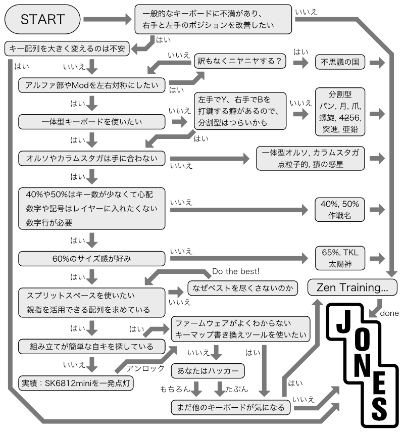
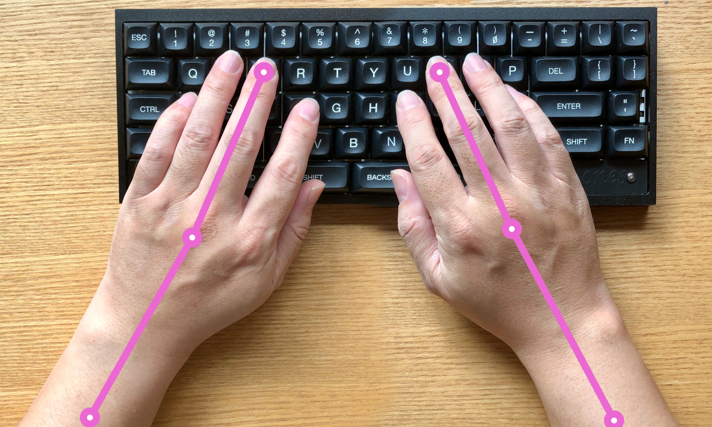
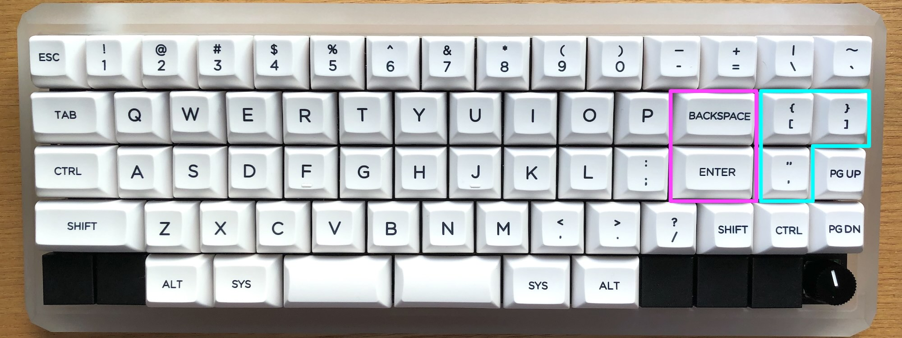
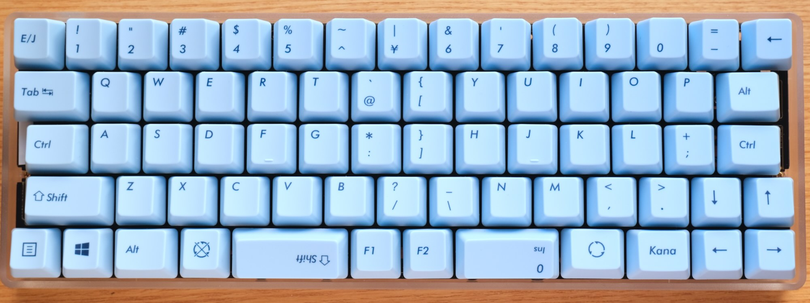
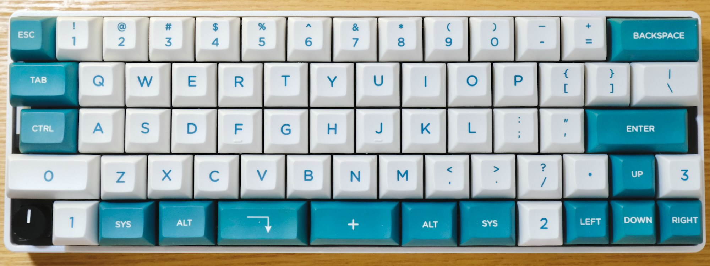
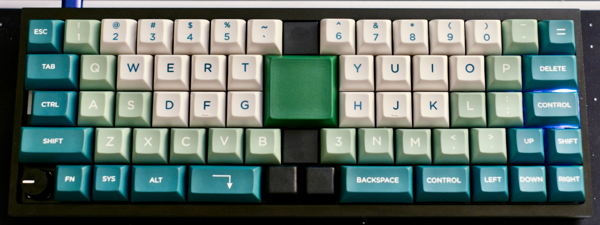
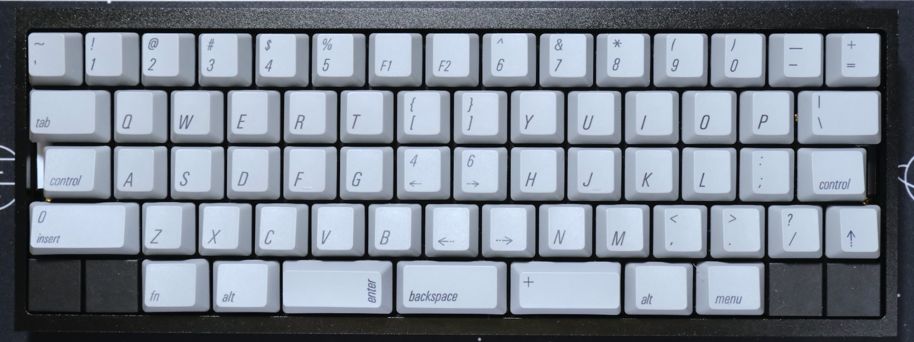
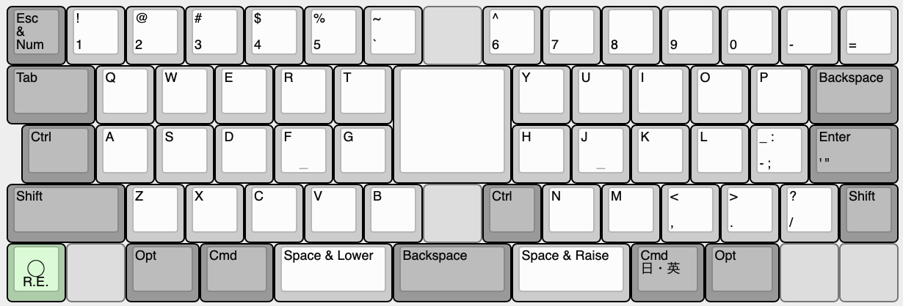
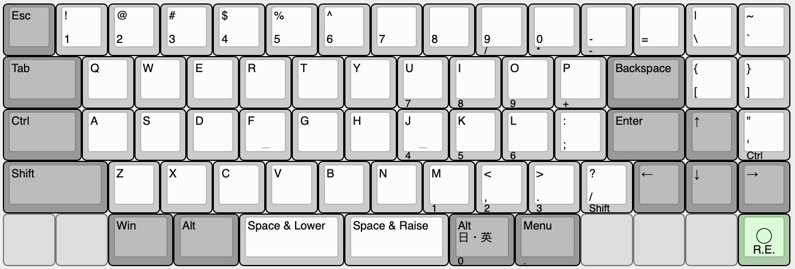

# Jones（ジョーンズ）とは


Jones（ジョーンズ）は、2行目と3行目にずれのない、ロースタッガードとオルソリニアを組み合わせた60%キーボードです。  
左右対象のアルファ部と、右手側Modキーをホームポジションのすぐ隣へ配置したレイアウトが特徴です。  

40%や50%キーボードのコンパクトで軽快な運指の心地良さと、レイヤーに数字や記号を押し込まなくてよい十分なキー数を兼ね備えています。

GH60型やPoker型に互換性のあるケースと組み合わせて使用できます。

名前の由来は、ロースタガとオルソリニアをつなぐ”橋”という意味を込めて…

``` text
橋（ブリッジ）　→　ブリッジド　→　ブリジット　→　ブリジット・ジョーンズ　→　ジョーンズ

Bridge --> Bridged --> Bridget --> Bridget Jones --> Jones
```

という具合の言葉遊びで、ジョーンズ（Jones）に決まりました。

---

Jones is a 60% keyboard combined with Ortho-linear and Row-staggered. It has gapless R2-R3 row.  
Symmetrical alpha-keys and nearby right side mod-keys provide natural typing position.  

It has compact and light fingering which like 40% and 50% keyboards.
And also, it has enough keys, no need to push numeric and symbol keys into layers.

It can be used with GH60 and Poker compatible cases.

## 対象とするユーザー

Jonesキーボードは、  
*一般的なキーボードのキー配列に不満があり、より良いタイピングポジションを求めている方*  
を対象に作られています。

参考までに、冗談半分で以下のチャートにまとめました。



## コンセプト

このキーボードのコンセプトや実現したい要件は次の通りです。

- 基本的には、一般的なキーボードのロースタガレイアウトでそこそこ満足という気持ち。
- 左手の肘、手首、指先を直線状に並べて、ポジションを改善したい。  
  一般的なロースタガでは左手首の角度がおかしい。
- 右手のModが遠いと打鍵がつらくなるのを改善する。
- アルファ部が左右対称じゃないと話にならない。
- サイズは60%。  
  レイヤーに数字や記号を押し込まなくてもよいキー数と、筐体サイズのコンパクトさのバランス。
- GH60型のケースに対応させ、ケース設計をメイン作業に含めない。
  キーレイアウトを提案したい。
- HHKB的な何かを目指しつつ、スプリットスペースが使いたい。
- たまに一般的なキーボードを使うときにも、戸惑うことなく使えるようなレイアウトにとどめておく。
- 標準的なキーキャプですべて埋められるレイアウトを用意する。

## 特徴

### キーレイアウト

#### 独自のずれ幅をもつ左右対象のアルファ部

2行目と3行目にずれの無い、ロースタッガードとオルソリニアを組み合わせたキー配列です。  
分類上は、左右対称ロースタッガードや変則ロースタッガードと呼んでも良いかもしれません。  
左手と右手が同じずれ幅となる左右対象のアルファ部により、肘、手首、指先が直線上に並んだ自然なポジションにします。  

  
Jones, Wideレイアウト: 左手、右手ともに、肘、手首、指先が直線上に並ぶ

  
一般的なレイアウト: 左手の手首から先、指先が外側へ向く

#### 右手のホームポジションに近づけたModキー

40%や50%キーボードのコンパクトなレイアウトにならい、Modキーを右手のホームポジションのすぐ隣に配置しました。  
打鍵しやすい位置に使用頻度の高いキーを配置したことで、右手の負担を軽減できます。  

使用頻度の低い記号キーは、Wideレイアウトではキーボードの中央へ、Narrowレイアウトでは右端へ移動しています。

  
右手のホームポジションすぐ隣のModキーと、移動した記号キー（Wideレイアウト）

  
右手のホームポジションすぐ隣のModキーと、移動した記号キー（Narrowレイアウト）

#### キーレイアウトのバリエーション

Wide（ワイド）, Narrow（ナロー）, Normal（ノーマル）の、3つのレイアウトを選べます。

- Wide（ワイド）レイアウト `Custom` `JP108` `US104`  
  右手ホームポジションを右側へずらしてModキーに近づけ、キーボード中央に2キー分の間隔をもたせたレイアウトです。  
  キーボード全体を左右対称にすることができます。  
  左手と右手のホームポジションが離れるため、肩への負担を軽減できます。
    

- Narrow（ナロー）レイアウト `Custom`  
  右側Modキーをキーボード中央側へずらし、ホームポジションに近づけたレイアウトです。  
  40%キーボードに、上へ1行、右に2列増やしたようなレイアウトになっています。  
  アルファ部とModを左右対称にしつつ、右端2列の非シンメトリカルな存在を楽しむことができます。  
  カスタムキーキャップを使って構成します。
    

- Normal（ノーマル）レイアウト `JP108` `US104`  
  Wideレイアウトのキーマップを一部調整し、一般的な英語配列や日本語配列のキーボードとして使えるようにしたレイアウトです。  
  WideやNarrowレイアウトへの移行（習得）に不安のある方や、一般的なキーボードの配列でアルファ部を左右対称にしたい方におすすめです。
    

最下行はスペースキーとModキーの組み合わせを選択でき、左右の端はロータリーエンコーダにすることもできます。

すべてのレイアウトは、[Keyboard Layout Editor: Jones v04_1](http://www.keyboard-layout-editor.com/#/gists/5c8ac0bbee831ac1463e579fabf9d351)で確認できます。

### 機能

#### RemapやVIAなどのキーマップ書き換えツールに対応

[Remap](https://remap-keys.app)や[VIA](https://caniusevia.com)などのキーマップ書き換えツールに対応しており、ファームウェアを書き換えることなく、手軽にキーとロータリーエンコーダの割り当てを変更することができます。  

Remapにはキーボード定義を登録済みですので、サイトへアクセスしてキーボードを接続すれば、すぐにキーの割り当てを変更することができます。  
VIAを使用する場合は、以下のキーボード定義ファイルを読み込ませてください。  
キーボード定義ファイル：[jones.json](./VIA/jones_v04_1.json)

#### より多くのレイヤーを使用可能（外部EEPROMの搭載）

外部EEPROMの搭載により、RemapやVIAでより多くのレイヤーを使用することができます。

出荷時に書き込まれているファームウェアでは、6レイヤーまで使用可能です。  
使わない機能を無効化したファームウェアを用意すれば、さらに多くのレイヤーを使用できます。  
（例：スピーカーの機能を無効化した場合、10を超えるレイヤーを使用可能）

#### レイヤーインジケータLED（オプション）

レイヤーの状態を表示するインジケータLEDを、右側または左側に2個、もしくは左右両方に4個設置できます。

基板上にはLEDの信号ピンを用意してあるので、DIYでアンダーグローLEDを追加することもできます。

#### ロータリーエンコーダ（オプション）

ロータリーエンコーダを、最下行の左端または右端に1個、もしくは左右両端に2個設置することができ、OSのボリューム操作やマウスホイールの上下などの機能を割り当てて使用ます。  

#### スピーカー（オプション）

キーボードの起動音やキー入力のクリック音を再生できるスピーカーを設置できます。

#### ケース

GH60型やPoker型に互換性のあるケースに対応しています。

<details>
<summary>取り付け確認済みのケース（2021年7月1日現在）</summary>

- [KBDfans TOFU 60% Aluminum Case](https://kbdfans.com/products/kbdfans-tofu-60-aluminum-case)  

- [KBDfans 5° FROSTED ACRYLIC CNC 60% CASE](https://kbdfans.com/products/pre-order-kbdfans5-transparent-acrylic-cnc-60-case)  

- [60% プラスチックケース](https://yushakobo.jp/shop/60-plastic-case/)（※ケースの一部加工が必要）

また、ケースを使用する代わりに、”Jones用ボトムプレートキット”を使用すれば、ケースレスのサンドイッチマウントとして使用できます。  
ケースを使用する場合に比べてキーボードの高さを低く抑えることができるため、手首の負担軽減などに有効です。  

</details>

## ビルドガイド

- [v.0.4.1](./docs/BuildGuide_v.0.4.1_JA.md)

<details>
<summary>以前のビルドガイド</summary>

- [v.0.4.x](./docs/BuildGuide_v.0.4_JA.md)
- [v.0.3.1 / v.0.3.2](./docs/BuildGuide_v.0.3.1_JA.md)
- [v.0.3](./docs/BuildGuide_v.0.3_JA.md)
- [v.0.2](./docs/BuildGuide_v.0.2_JA.md)
- [v.0.1](./docs/BuildGuide_v.0.1_JA.md)

</details>

## ビルド例

<!--
〓
NormalのUS, JP
その他、レイアウトのところに載せてないもの（v04で実現可能なものに限る）
-->

| ビルド例 | 詳細 |
| --- | :-- |
| [](./assets/_DSF0088.jpeg) | Wide 英語配列, カスタムキーキャップ<br>case: TOFU Aluminum, Black<br>keycaps: KAT Lucky Jade, SP DSA 2x2 (Block) Key, SP G20, SP Blocker<br>rotaly encoder: EC12E24204A2, K-2605 |
| [](./assets/_DSF0406.jpeg)| Wide 英語配列, 英語104キーキャップ<br>case: TOFU Aluminum, Black<br>keycaps: Qisan PBT Keycaps 108, SP Blocker |
| [](./assets/IMG_2798.jpeg) | Narrow 英語配列, カスタムキーキャップ<br>case: 5° Frosted Acrylic CNC 60%<br>keycaps: GMK Pulse, GMK Mitolet, SP Blocker<br>rotaly encoder: EC12E24204A2, K-2605 |
|||
|||

Twitterのハッシュタグ[#Jones_kbd](https://twitter.com/search?q=%23Jones_kbd&f=live)にも、作例が集まっています。

## 私の使用環境

私は、このJonesキーボードを、自宅と会社で2台使用しています。  
2020年7月から試作段階のものを使い始め、多少の変更はあるものの、2行目と3行目にずれのないレイアウトをメインキーボードとして使い続けています。

試作の初期段階から1年近くNarrowレイアウトで使ってきましたが、現在（2021年7月）は親指を活用できるWideレイアウトをUS配列で使っています。

私がどのようにJonesキーボードを使っているのかを共有することで、このキーボードがどういうものなのかを、少しでも共有できたらと思います。

<details>
<summary>私の使用環境</summary>

### 自宅における私的使用

<!--
〓更新
  
-->
自宅ではMacを使用しており、主な用途は次のとおりです。

- キーボードファームウェアの作成。C言語など。（VS Code）
- 各種ドキュメント執筆。Markdown。（VS Code）
- 回路・基板の設計（KiCad）
- グラフィックソフトウェアを用いた、ケースやプレートの設計（Affinity Designerなど）
- 写真編集

カーソルキーが単独で存在しなくても問題ないため、レイアウトから外しています。

私は肘から少し先までを机に乗せて、手をあまり浮かせずに打鍵するタイプなので、小指の付け根付近が最下行のキーに当たりやすく、誤打鍵はしないものの、少し不快に感じます。  
そのため、最下行の左右端から2キーは[Pimpmykeyboard: Switch Blocker](https://pimpmykeyboard.com/switch-blocker-pack-of-10/)を使ってブロッカーにしています。  
プログラムの動作や文章の表現を考えながらキーボードを使うときは、このちょっとした心地よさが大切な気がします。

左手でマウスを使用するため、マウス主体のアプリケーションを使用する際に右手でModキーが操作できるよう、右手側のModキー（Cmd, Opt, Shift, Ctrl）をそれぞれ単独で配置しています。

### 会社における業務使用

<!--
〓更新
  
-->
Windows XPのPCで、主な使用用途は次のとおりです。

- 何らかのデータの集計やリストの管理など（Excel）
- 作業効率化ツールの作成、保守（Excelマクロ（VBA））
- 数値データの大量入力（独自ソフト）
- 掲示物の作成（Word, Excel）

作業量的には、Excel関連が7割、数値データの入力が2割、その他が1割という割合です。  

独自ソフトでカーソルキーを使うことが多いので、カーソルキーを単独で配置している点が自宅との大きな違いです。  
また、Windows PCのため、Windows向けのベースレイヤーに切り替えています。

数値データの大量入力は、専用のNumericレイヤーでおこなっており、以前Realforceを使っていたときと変わらない速度で入力できています。  

共用PCで作業することが日に何度もあり、そのときは一般的なキーボードを打鍵することになりますが、Jonesのレイアウトが特殊すぎない範囲に収まっているので、特に違和感なく打鍵できています。

</details>

## 試作歴

これまでの試作歴は、[試作歴](./docs/trials.md)にまとめています。


