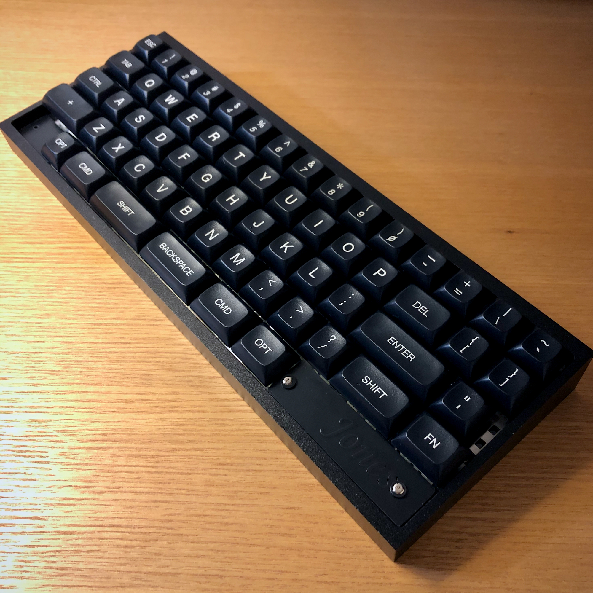

# ジョーンズ / Jones

## について / About

ジョーンズ（Jones）とは、R2とR3にずれがない、独自のずれ幅のロースタッガードな60%キーボードです。  
左右対象のアルファ部により両手を自然なポジションにすることができ、右手側のModキーの配置を変えたことで入力の負担を軽減できます。  
GH60互換のケースに対応しており、市販のケースと組み合わせて、好みに合わせたレイアウトで使用できます。  

名前の由来は、ロースタガとオルソリニアをつなぐというところから”橋”が思い浮かび、次のような具合に決まりました。

橋　→　ブリッジ　→　ブリッジド　→　ブリジット　→　ブリジット・ジョーンズ　→　ジョーンズ

Bridge --> Bridged --> Bridget --> Bridget Jones --> Jones

Jones is a Row-staggered 60% keyboard with gapless R2-R3 row.  
GH60 compatible PCB and keyplate.

## コンセプト / Concept

このキーボードで実現したい要件は次の通りです。

- 基本的には、通常のロースタガレイアウトで十分という気持ち。
- 左手の肘、手首、指先を直線状に並べて、ポジションを改善したい。
- 右手のModを近くに持ってきたい。
- サイズは60%。
- GH60型のケースに対応させ、ケース設計をメイン作業に含めない。
- HHKB的な何かを目指しつつ、スプリットスペースが使いたい。
- ProMicroを使わずにキーボードを作る。

## 特徴 / Features

### キーレイアウト

キーレイアウトは、[Keyboard Layout Editor : Jones](http://www.keyboard-layout-editor.com/#/gists/62a2e13a54e2d129532bc8758cfc1e79 "Keyboard Layout Editor : Jones") を参照してください。

- 独自のずれ幅をもつ、左右対象のアルファ部。  
R2とR3ずれの無い、ロースタガとオルソリニアを組み合わせたキー配列です。  
左手と右手が同じずれ幅となる左右対象のアルファ部により、肘、手首、指先が直線上に並ぶ、自然なポジションにします。  
  

- 右手のホームポジションに近づけたMod  
BSキーを1行下げ、Enterキーと合わせて、右手のホームポジションのすぐ隣へ移動しました。  
打鍵しやすい位置に使用頻度の高いModキーを配置したことで、右手の負担を軽減できます。  

- キーレイアウトのバリエーション  
スプリット、またはロングスペースキー（※）が選択でき、組み合わせるModキーを数パターンから選択できます。  
※ロングスペースキー版のキープレートを使用します。  
右手側のModは内側へ移動した位置がデフォルトですが、一般的なキーボードと同様の右端へ配置するパターンも選べます。  
最下行は両端にキーを配置しないHHKB風のレイアウトなども選択でき、キーの無い部分をカバーするためのブロッカーを用意しています。  
右下にはロータリーエンコーダを搭載できます。  
[Keyboard Layout Editor : Jones](http://www.keyboard-layout-editor.com/#/gists/62a2e13a54e2d129532bc8758cfc1e79 "Keyboard Layout Editor : Jones")  

- 一般的なキーキャップセットに対応  
104キーのキーキャップで違和感なく埋められるキーレイアウトを選択できます。  
GMK Coreに相当するセットを用意すれば、すべてのキーを想定サイズで埋めることができます。  
  
一般的な104キーキャップの装着例  
Keycap: Qisan / Magicforce PBT Keycaps

### 機能 / Functions

- ロータリーエンコーダを搭載可能  
右下の銘板との入れ替えで、ロータリーエンコーダを搭載することができます。

- インジケータLED  
R3右端に基板上のLEDが見える切り欠きを設けており、レイヤー等のインジケータLEDとして使用できます。

- アンダーグローLEDへの対応（未完成）  
LEDテープ用端子などは未設置ですが、MCUの余剰ピンを基板上に引き出しているので、配線すれば可能です。

- トラックボールモジュールへの対応（未完成）

### ケース / Case

以下に示すケースに対応しています。

- GH60型  
確認済みのケース：[KBDfans TOFU 60% Aluminum Case](https://kbdfans.com/collections/60-layout-case/products/kbdfans-tofu-60-aluminum-case)

- ケースレス簡易サンドイッチプレート（未完成）

- オリジナルトップマウントケース（未完成）

## 制作例 / Example

Keycap: TEX ADA, Case: KBDfans TOFU 60% Aluminum Black

Keycap: Tai-Hao Sakura Michi PBT, Case: KBDfans TOFU 60% Aluminum Black
## 制作歴 / Revision

### v.0.1

R2とR3にずれが無いレイアウトが決定。  
KLE、基板、キープレートを制作。  
MCUを乗せた基板の組み立て、動作に成功。

### v.0.0

机上でレイアウトを検討したのち、モックアップを作成。  
QAZのAが一番外側に来るレイアウトだったが、打鍵具合がイマイチだったため、ボツ。
