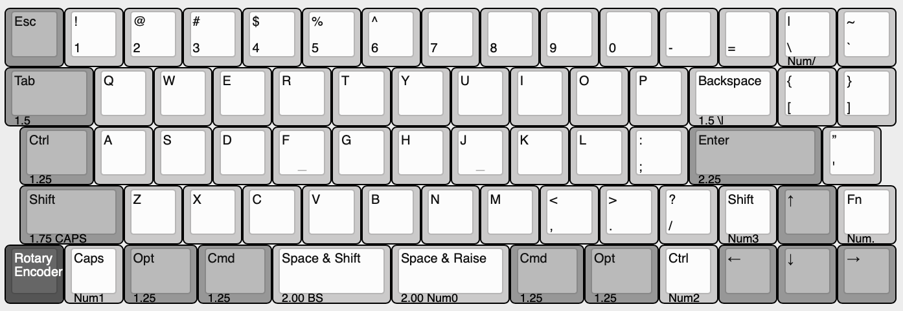
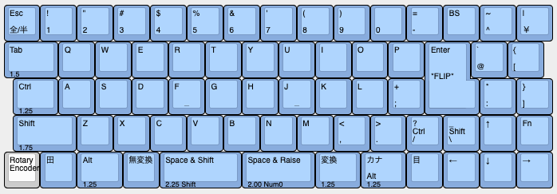

# ジョーンズ（Jones）とは

ジョーンズ（Jones）は、2行目と3行目のずれをなくし、ロースタッガードとオルソリニアを組み合わせた60%キーボードです。  
左右対象のアルファ部と、右手ホームポジションのすぐ隣へ配置されたModキーにより、両手が自然なポジションで打鍵できます。  

40%〜50%のキーボードが60%のケースに収まったような配列になっており、コンパクトで軽快な運指の心地良さと、必要十分なキー数（レイヤーに全部押し込まなくて良い！）を兼ね備えています。  
ANSIまたはJPスタイルのレイアウトが選択でき、PCBとキープレートはGH60型のケースと組み合わせて使用できます。  

左右2個のロータリーエンコーダと2音同時発音のスピーカーを使用することができ、DIYで機能を拡張することもできます。

名前の由来は、ロースタガとオルソリニアをつなぐ”橋”という意味を込めて…

    橋　→　ブリッジ　→　ブリッジド　→　ブリジット　→　ブリジット・ジョーンズ　→　ジョーンズ

    Bridge --> Bridged --> Bridget --> Bridget Jones --> Jones

という具合で、ジョーンズ（Jones）に決まりました。

---

Jones is a 60% keyboard combined with Ortho-Linear and Row-staggered. It has gapless R2-R3 row.  
Symmetrical alpha-keys and nearby right side mod-keys provide natural typing position.  

ANSI and JP style layouts are supported.  
GH60 case compatible PCB and key-plate.

Jones can handle a speaker with two simultaneous audio voices, two rotary encoders and LED lightings together.  
You can expand functions by adding two or three parts and write firmware for it.

## コンセプト

このキーボードのコンセプトや実現したい要件は次の通りです。

- 基本的には、通常のロースタガレイアウトでそこそこ満足という気持ち。
- 左手の肘、手首、指先を直線状に並べて、ポジションを改善したい。
- 右手のModが遠いとつらい。
- アルファ部が左右対称じゃないと話にならない。
- サイズは60%。
- GH60型のケースに対応させ、ケース設計をメイン作業に含めない。
- HHKB的な何かを目指しつつ、スプリットスペースが使いたい。
- ProMicroを使わずにキーボードを作る。
- たまに一般的なキーボード（＝通常のロースタガ）を使うときにも普通に使えるような配列にとどめておく。  
→独自配列にしすぎない。
- 標準的なキーキャプですべて埋められるレイアウト。

## 特徴

### キーレイアウト

#### 独自のずれ幅をもつ左右対象のアルファ部。  
2行目と3行目にずれの無い、ロースタガとオルソリニアを組み合わせたキー配列です。  
左手と右手が同じずれ幅となる左右対象のアルファ部により、肘、手首、指先が直線上に並んだ自然なポジションにします。  

  
Jonesレイアウト: 左手、右手ともに、肘、手首、指先が直線上に並ぶ

  
一般的なレイアウト: 左手の手首から先、指先が外側へ向く

#### 右手のホームポジションに近づけたModキー  
40%キーボードのレイアウトにならい、Modキーを右手のホームポジションのすぐ隣へ移動しました。  
打鍵しやすい位置に使用頻度の高いキーを配置したことで、右手の負担を軽減できます。  

  
右手のホームポジションすぐ隣のModキー

#### キーレイアウトのバリエーション  
キーレイアウトは、基本的なレイアウトとしてANSIまたはJPスタイルを選択できます。  
最下行はスペースキーのサイズでいくつかバリエーションがあります。

[  
Keyboard Layout Editor: Jones v.3.5.4](http://www.keyboard-layout-editor.com/#/gists/ab35444150ef1aff63ed32bbe2b9a1ef)  

基本的なレイアウトは、一般的なキーキャップセットで全て埋められるようになっています。  

[  
基本的なレイアウト：ANSIスタイル](http://www.keyboard-layout-editor.com/#/gists/4b9d398551fc898d6d766054ebb30884)

[  
基本的なレイアウト：JPスタイル](http://www.keyboard-layout-editor.com/#/gists/3bc20c5810c8dc7985cc79059cf4c005)

GMK Coreに相当するセットや40%キーボード向けのセットを用意すれば、基本的なレイアウトから派生した個性的なレイアウトにすることもできます。  

### 機能

#### スピーカー
基板上にスピーカーを設置して、レイヤーキーなど特定のキー押下時にメロディを流したり、ピコピコと打鍵音を鳴らしたりできます。

[QMKの音楽モード](https://docs.qmk.fm/#/ja/feature_audio?id=音楽モード)を使って曲を演奏することもでき、組み立て時の設定で2音同時発音にも対応します。

#### ロータリーエンコーダ  
右下と左下へ、片方または両方にロータリーエンコーダを設置することができます。  
ALPS ALPINE製のEC11またはEC12と、その互換品が使用できます。

#### LED照明  
レイヤーインジケータやアンダーグロー照明として、LEDを設置できます。  

次の3箇所にLEDを設置でき、それぞれ使用／未使用が選べます。
- 右側：2行目に2個、または3行目に2個。  
- 左側：3行目と4行目にそれぞれ2個。合計4個。  
- 裏側：テープLED。

#### 追加使用できる機能

**組み合わせるパーツや作成するファームウェアなど、動作を保証しきれない部分があるため、機能拡張はDIYでお楽しみください。**

いくつかの部品を追加してファームウェアを作成すれば、以下の機能を使用できるようになります。  
なお、書き込めるファームウェアサイズに上限があるため、全ての機能を同時には使えない場合があります。  

##### OLED
右上2キーとは設置場所の都合で排他使用となります。  
[遊舎工房で販売されているOLEDモジュール](https://yushakobo.jp/shop/oled/)を使用し、レイヤー名やロゴの表示ができることを確認済みです。

##### 外部接続用端子
ピンヘッダやピンソケットを介し、本対外のデバイスを接続する目的の外部接続用端子を用意しています。  

キーマトリクスの未使用部分を含むピンやMCUの未使用ピンを外部へ引き出すことができます。  
テンキーやマクロパッドを追加したり、ロータリーエンコーダの増設に使用できます。
キーマトリクスは総当たりマトリクスを使用しているため、通常とは回路が少し異なります。

スピーカー2音同時発音のテストで動作確認済み。  

##### I2C接続

OLEDとはピンアサインの都合で排他使用となります。  
基板上に用意したプルアップ抵抗のパターンへ抵抗を追加して使用します。

動作未確認。

### ケース

以下に示すケースに対応しています。

- GH60型  
確認済みのケースは次の通り。
    - [KBDfans TOFU 60% Aluminum Case](https://kbdfans.com/collections/60-layout-case/products/kbdfans-tofu-60-aluminum-case)
    - [60% プラスチックケース](https://yushakobo.jp/shop/60-plastic-case/)（※ケースの一部加工が必要）

- ケースレス簡易サンドイッチプレート（未完成）

- オリジナルトップマウントケース（未完成）

## ビルドガイド

- [v.0.3.1](./docs/BuildGuide_v.0.3.1_JA.md)
- [v.0.2](./docs/BuildGuide_v.0.2_JA.md)
- [v.0.1](./docs/BuildGuide_v.0.1_JA.md)

## 製作歴

### v.0.3.1

- v.0.3の課題や不具合解消。
- オーディオの2音同時発音に対応。
- テープLEDのみ光らせるパターンを追加。

### v.0.3

- [レイアウト変更](http://www.keyboard-layout-editor.com/#/gists/ab35444150ef1aff63ed32bbe2b9a1ef)  
2U-Wide、Traditionalレイアウトを削除。  
もしかして日本語配列で使いたい人もいたりするの？との思いから、JPスタイルを追加。
- v.0.2の課題や不具合解消。
- キーマトリクスを、総当たりマトリクスに変更し、MCUのピン使用数を大幅削減（19 → 11）。  
余ったピンを、2個目のロータリーエンコーダ、スピーカー、外部接続、OLED、I2Cなどの機能で使用。
- 左側LED、裏側LEDテープ追加。
- USB Type-C。
- ブロッカー、銘板パーツ廃止。  
[PIMP MY KEYBOARDのSwitch Blocker](https://pimpmykeyboard.com/switch-blocker-pack-of-10/)がブロッカーとして良い出来だった。

  
Jones v.0.3  
Keycap: FILCO Majestouch 交換用カラーキーキャップセット 日本語108キー・かななし・ミルキーブルー  
Case: 60% Plastic Case, Clear

### v.0.2

- レイアウトの試行錯誤を続け、[2U-Wideレイアウト](http://www.keyboard-layout-editor.com/#/gists/3f5424e6560f5de6fa7c19e22f219831)を追加。  
2U-Wideのホームポジションは肩への負担も減るので気にいっていたが、このレイアウトを覚えると普通のキーボードをまともに打鍵できなくなったため、使用を封印。
- v.0.1の課題や不具合解消
- SMT Assemblyによる製造。  
SMTAに対応するため、部品サイズを変更。

  
Jones v.0.2  
Keycap: Tai-Hao PBT Backlit The Deep Forest Blue 132 Keys SKU#C22BF301  
Case: KBDfans TOFU 60% Aluminum, Silver

### v.0.1

- v.0のレイアウトを元に、[基板に乗せられるレイアウト](http://www.keyboard-layout-editor.com/#/gists/325aaaab8bd5e87bff89b81d67181bea)に調整。  
- ai03氏の[PCB Designer Guide](https://wiki.ai03.com/books/pcb-design/chapter/pcb-designer-guide)を参考に、基板を設計。  
- MCUを乗せた基板の組み立て、動作に成功。

  
Jones v.0.1  
Keycap: Tai-Hao Sakura Michi PBT  
Case: KBDfans TOFU 60% Aluminum, Black

### v.0

試行錯誤の末、2行目と3行目にずれが無いレイアウトが決定。  

KLEで作成したレイアウトを印刷して段ボールに貼り、両面テープでキーキャップを貼り付けたモックアップ。  
これをデスクに置いてエアータイプしまくって、違和感なく打鍵できることを確認。

  
Jones v.0 モックアップ

### Before v.0

物理配列について、[HHKB](https://happyhackingkb.com/jp/)、[Treadstoneシリーズ](https://github.com/marksard/Keyboards)、[Zinc（シンメトリカル版）](http://www.sho-k.co.uk/tech/735.html)、[Katana60](http://xahlee.info/kbd/katana60_keyboard.html)などを参考にしつつ、[Keyboard Layout Editor](http://www.keyboard-layout-editor.com)を使った机上検討を重ね、キーキャップを並べたモックアップをいくつか作成。  
1行目と2行目のずれをなくしたものや、[QAZの並びでAを一番外側にしたり](http://www.keyboard-layout-editor.com/#/gists/f530b44df7799fa4d14944566bb18dd2)したものを作成するが、いずれも打鍵に不自然さがあったため、ボツ。

  
Jones before v.0 作成したモックアップのひとつ
