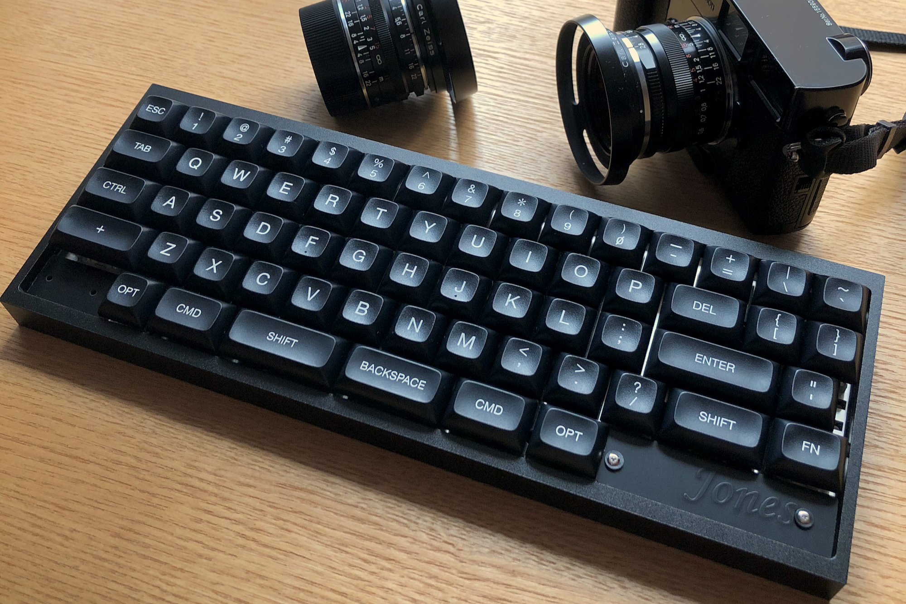
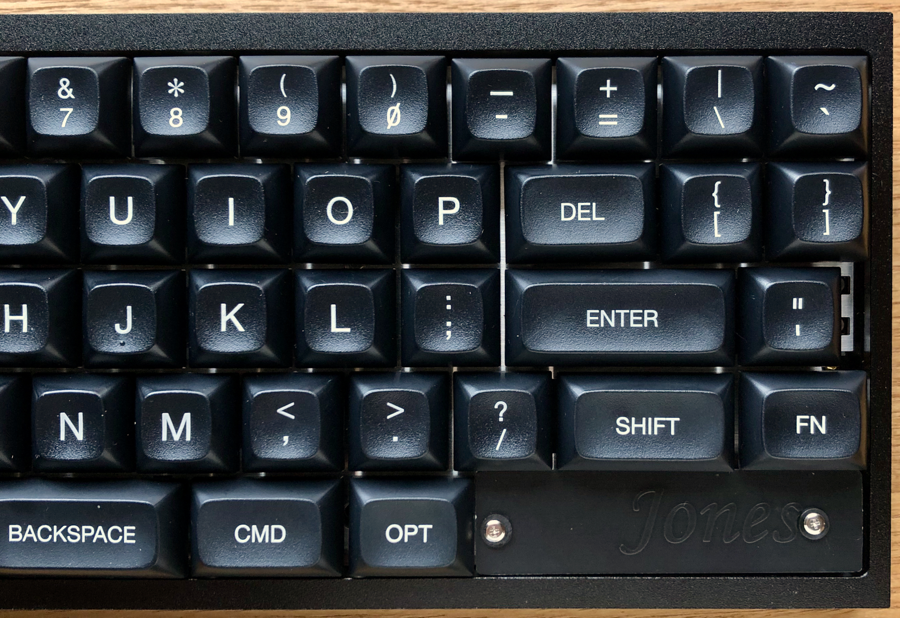
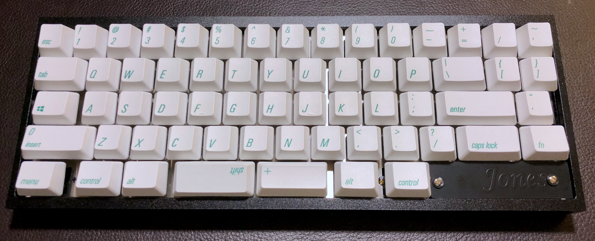
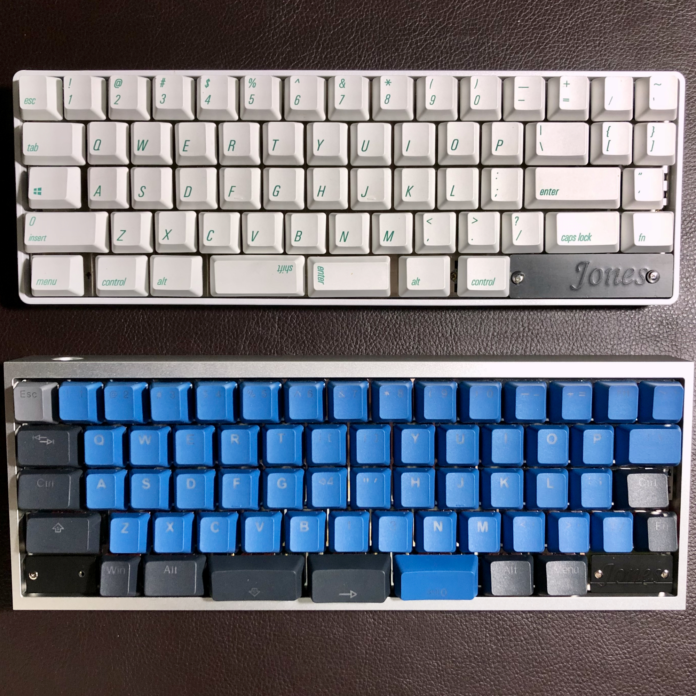

# ジョーンズ / Jones

## について / About

ジョーンズ（Jones）とは、R2とR3にずれがない、独自のずれ幅のロースタッガードな60%キーボードです。  

主要なキーを左右対象に配置したことで、両手を自然なポジションにすることができ、入力の負担を軽減できます。  
また、少しでも肩への負担を軽減できるよう、右手ホームポジションを2U外側へ移動したWideレイアウトを選ぶこともできます。  

GH60互換のケースに対応しており、市販のケースと組み合わせて使用できます。  

名前の由来は、ロースタガとオルソリニアをつなぐというところから”橋”が思い浮かび、次のような具合に決まりました。

橋　→　ブリッジ　→　ブリッジド　→　ブリジット　→　ブリジット・ジョーンズ　→　ジョーンズ

Bridge --> Bridged --> Bridget --> Bridget Jones --> Jones

Jones is a Row-staggered 60% keyboard with gapless R2-R3 row.  
GH60 case compatible PCB and keyplate.

## コンセプト / Concept

このキーボードで実現したい要件は次の通りです。

- 基本的には、通常のロースタガレイアウトで十分という気持ち。
- 左手の肘、手首、指先を直線状に並べて、ポジションを改善したい。
- 右手のModを近くに持ってきたい。
- 左右対称のアルファ部。
- サイズは60%。
- GH60型のケースに対応させ、ケース設計をメイン作業に含めない。
- HHKB的な何かを目指しつつ、スプリットスペースが使いたい。
- ProMicroを使わずにキーボードを作る。

## 特徴 / Features

### キーレイアウト

キーレイアウトは、[Keyboard Layout Editor : Jones](http://www.keyboard-layout-editor.com/#/gists/62a2e13a54e2d129532bc8758cfc1e79 "Keyboard Layout Editor : Jones") を参照してください。

#### 主要なキーを、独自のずれ幅で左右対象に配置。  
R2とR3ずれの無い、ロースタガとオルソリニアを組み合わせたキー配列です。  
アルファ部の左右対象レイアウトにより、肘、手首、指先が直線上に並ぶ、自然なポジションにします。  

  
Jonesレイアウト: 左手、右手ともに、肘、手首、指先が直線上に並ぶ

一般的なレイアウト: 左手の手首から先、指先が外側へ向く

#### 右手のホームポジションに近づけたMod  
BSキーを1行下げ、Enterキーと合わせて、右手のホームポジションのすぐ隣へ移動しました。  
打鍵しやすい位置に使用頻度の高いModキーを配置したことで、右手の負担を軽減できます。  

<!-- 〓v.0.2の写真に差し替え予定〓 -->  

#### キーレイアウトのバリエーション  
主なレイアウトは次の3通り。

- Wide：  
右手側を2U外側へ移動したレイアウト。Jonesのデフォルト。
- Narrow：  
右手側アルファ部は通常の位置。右手側Modキーを2U内側へ移動。
- Traditional：  
右手側アルファ部、Modキーともに通常の位置。  

最下行のレイアウトはスプリット、またはロングスペースキー（※）が選択でき、組み合わせるModキーを数パターンから選択できます。  
※ロングスペースキー用のキープレートが別途必要です。  

最下行は両端にキーを配置しないHHKB風のレイアウトなども選択でき、キーを配置しない部分をカバーするためのブロッカーを用意しています。  

右下にはロータリーエンコーダを搭載できます。  

<!-- 〓v.0.2以降のレイアウトに差し替え予定〓 -->
[Keyboard Layout Editor : Jones](http://www.keyboard-layout-editor.com/#/gists/62a2e13a54e2d129532bc8758cfc1e79 "Keyboard Layout Editor : Jones")  

#### 一般的なキーキャップセットに対応  
一般的な104キーのキーキャップ（最下行のModがすべて1.25U）で違和感なく埋められるキーレイアウトを選択できます。  
GMK Coreに相当するセットを用意すれば、すべてのキーを想定サイズで埋めることができます。  

  
一般的な104キーキャップの装着例  
Jones v.0.1 w/ Qisan (Magicforce) PBT Keycaps

### 機能 / Functions

#### ロータリーエンコーダを搭載可能  
右下にロータリーエンコーダを搭載することができます。  
ALPS EC11, EC12、またはその互換品に対応しています。

#### インジケータLEDをオンボードに設置可能  
R3右端にレイヤーインジケータLEDを2個設置できます。

#### アンダーグローLEDへの対応  
LEDテープ用端子は未設置ですが、LED用端子を基板上に用意しています。  
v.0.2からは、オンボードのインジケータLEDと共存できるようになりました。

#### トラックボールモジュールへの対応  
右下にトラックボール用の端子を用意してあります。  
設置方法やソフトウェア面については準備中です。

### ケース / Case

以下に示すケースに対応しています。

- GH60型  
確認済みのケースは次の通り。
    - [KBDfans TOFU 60% Aluminum Case](https://kbdfans.com/collections/60-layout-case/products/kbdfans-tofu-60-aluminum-case)
    - [60% プラスチックケース](https://yushakobo.jp/shop/60-plastic-case/)（※ケースの一部加工が必要）

- ケースレス簡易サンドイッチプレート（未完成）

- オリジナルトップマウントケース（未完成）

## 制作例 / Example

Jones v.0.1  
Keycap: Tai-Hao Sakura Michi PBT  
Case: KBDfans TOFU 60% Aluminum Black

Jones v.0.1(above)  
Keycap: Qisan (Magicforce) PBT Keycaps  
Case: Plastic case White

v.0.2(below)  
Keycap: Tai-Hao Sakura Michi PBT  
Case: KBDfans TOFU 60% Aluminum Silver

## ビルドガイド

- [v.0.1](./assets/BuildGuide_v.0.1_JA.md)

## 制作歴 / Revision

### v.0.3

開発中

### v.0.2

v.0.1の課題や不具合解消に加え、Wideレイアウトをデフォルトとして追加。  
キーの配置に沿った配線に変更。
SMT Assemblyに対応するため、部品サイズを変更。

### v.0.1

R2とR3にずれが無いレイアウトが決定。  
KLE、基板、キープレートを制作。  
MCUを乗せた基板の組み立て、動作に成功。

### v.0.0

机上でレイアウトを検討したのち、モックアップを作成。  
QAZのAが一番外側に来るレイアウトだったが、打鍵具合がイマイチだったため、ボツ。
