# Jones v.0.1 ビルドガイド

**Jones v.0.1は試作版です。**

*キーボード基板としての機能には問題ありませんが、ブロッカーのネジ位置が合わず取り付けできないものがあります。*

## 注意事項、制限など

製作にあたり、次のような注意事項、制限があります。

- 試作版のため、ブロッカーのネジ穴位置が合わず、取り付けられないものがあります。
- コンデンサC1とSW19のソケットが干渉するため、コンデンサを少しずらして設置し、ソケットを削って回避してください。
- ケースのネジ穴とスイッチの足が干渉する箇所があり、スイッチの加工が必要です。
- レイアウトによっては、スイッチソケットに非対応の箇所があります。
- 左シフトのスタビライザーが、ケース取り付けネジと干渉する場合があります。

## 部品リスト

### 基本部品

キーボードとして動作させるのに必要な部品は次の通り。

| 部品名 | 個数 |
| ----- | -----: |
| Jones 基板 | 1 |
| USBコネクタ<br>Hirose UX60SC-MB-5S8(80)| 1 |
| リセットスイッチ<br>RS-187R05A2-DS MT RT | 1 |
| リセッタブルヒューズ<br>500mA トリップ1A 1206 | 1 |
| AVRマイコン<br>ATmega32U4-AU 44TQFP 10x10mm | 1 |
| クリスタル 16MHz 3225 | 1 |
| セラミックコンデンサ 0.1uF 1206 | 3 |
| セラミックコンデンサ 10uF 1206 | 1 |
| セラミックコンデンサ 1uF 1206 | 1 |
| セラミックコンデンサ 22pF 1206 | 2 |
| 抵抗 10k 1206 | 2 |
| 抵抗 22 1206 | 2 |
| ダイオード 1N4148 SOD-123 | 64 |
| MXソケット | 最大62(\*) |
| MXスイッチ | 最大63(\*) |
| スタビライザー 2U | 最大5(\*) |

\* レイアウトによって使用数が変わります。


### オプション部品

追加機能を使用する場合に必要となる部品は次の通り。

| 部品名 | 個数 | 目的 |
| ----- | -----: | ----- |
| Mill-Maxソケット | 必要数 | MXソケット非対応箇所のソケット化 |
| LED SK6812MINI | 2 | インジケータLED |
| ロータリーエンコーダ<br>EC11、EC12互換 | 1 | ロータリーエンコーダの設置 |
| キープレート（下記参照）| 1 | キースイッチをさらにしっかりと固定 |


#### キープレート

プレートマウントの5pinスイッチを使用すればある程度しっかりと固定できますが、さらにしっかりと固定したい場合は、キープレートを使用してください。

[切断堂](https://setsudando.jp)さんの1.5mmステンレスなら、4000円程度で作成できます。（2020年8月現在）

厚さが1.5mmを超えるとキースイッチの爪が引っ掛からなくなりますが、FR-4で作成したものは実用可能です。  
他にも、MDFやアクリルでも作成できると思います。(未作成)  


キープレートは以下のデータを使用して作成できます。  
[キープレート（SVG）](../assets/keyplate_SplitSpace_Merged_14x14.svg)  
[キープレート（DXF）](../assets/keyplate_SplitSpace_Merged_14x14.dxf)

自分好みのキープレートを作成したい場合は、Keyboard Layout Editorの[Jones v.0.1](http://www.keyboard-layout-editor.com/#/gists/62a2e13a54e2d129532bc8758cfc1e79)を参照してください。


## 組み立てに必要な工具
ドライバー、ピンセット、はんだ付け関連用品など、一般的な電子工作向け工具が必要です。  
また、MCUやUSBコネクタ取り付け後の確認にテスターが必要です。

以上に加え、やすりがあると仕上がりがきれいになります。  
また、ヘッドマウント型のルーペがあると細かいはんだ付けが楽になります。


## 基板概要

### 基板 表面

左上にUSBコネクタ部分の出っ張りがあるように置いた状態が表面。

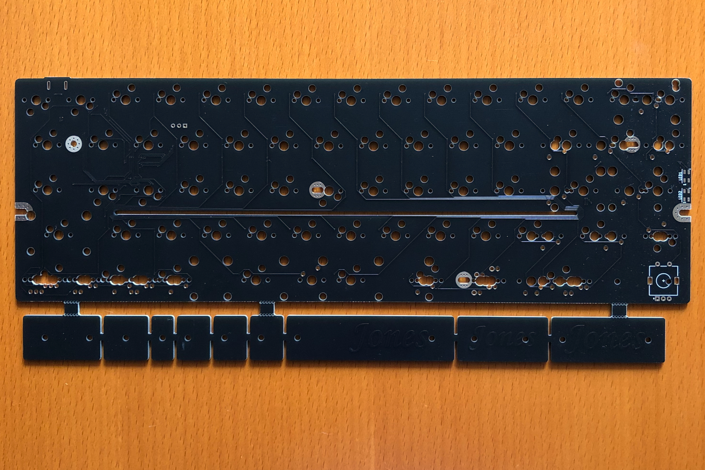  

### 基板 裏面

右上にUSBコネクタ部分の出っ張りがあるように置いた状態が裏面。  
裏面には、シルク印刷がたくさんあります。

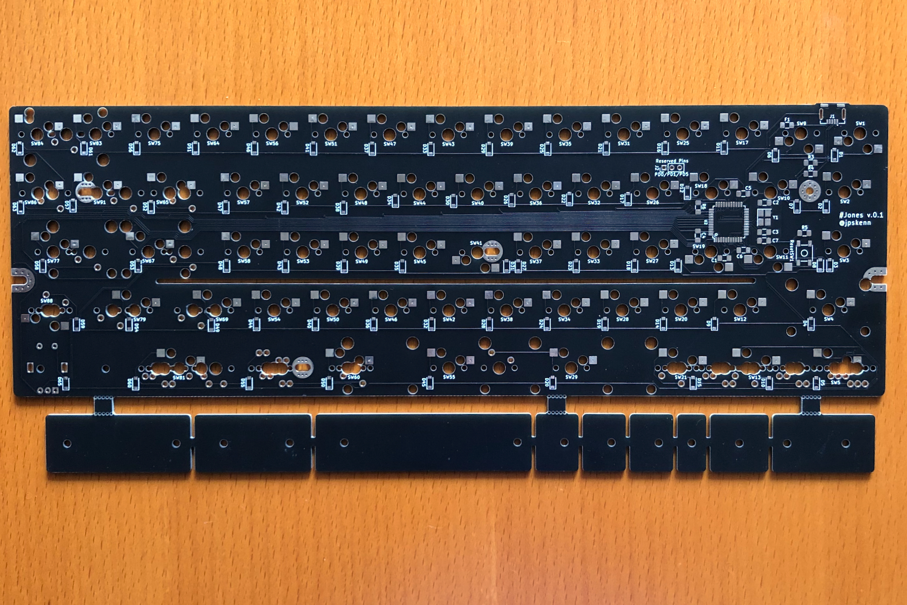  

### ブロッカー部

基板の下部に連結されている細長い部分。

### 回路図
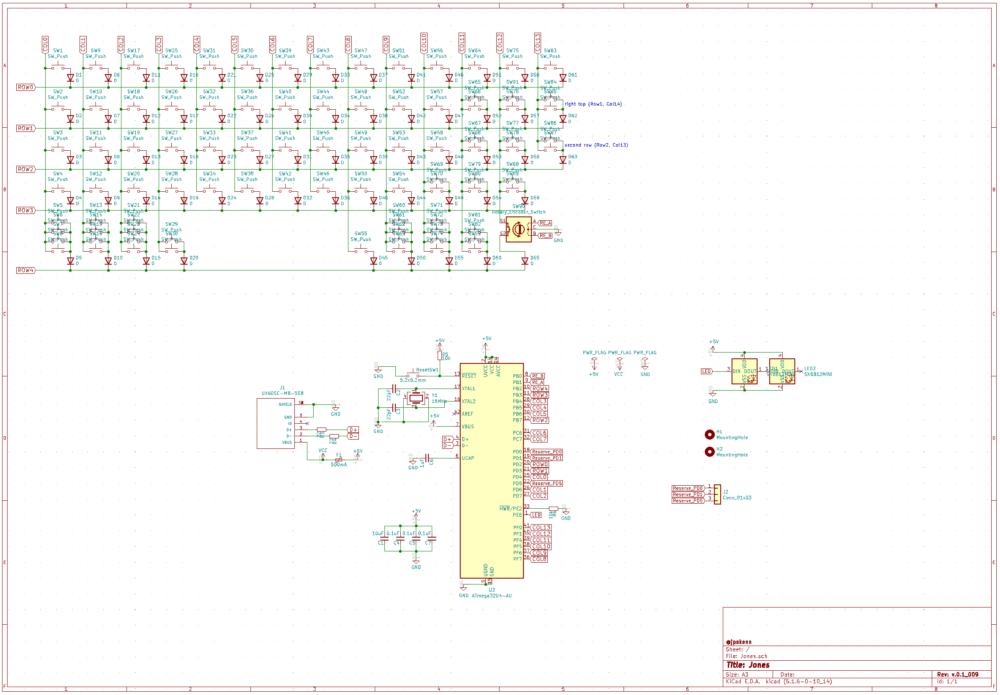  

[回路図 PDF](../assets/Jones_v.0.1_schematic.pdf)  

## 組み立て手順

部品の実装は、特に記載がない限り、基板裏面へ取り付けます。  

以下の部品のみ、表面から取り付けます。
- スタビライザー
- MXスイッチ
- インジケータ用のLED
- ロータリーエンコーダ

### 基板の切り離し

ブロッカー部を切り離します。  

マウスバイトの両側を指でつまみ、折り曲げて切り離します。  

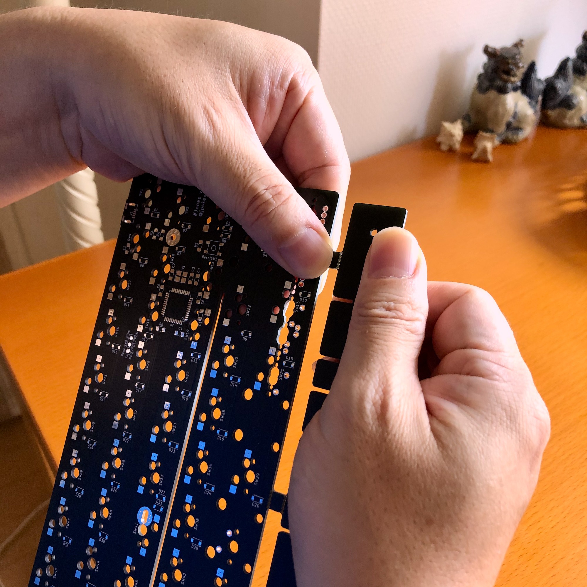  

切り離した箇所はとがっているので、ニッパーでカットしたり、やすりで削っておきます。  

### MCU、USBコネクタ関連部品の取り付け

各部品の取り付け説明と、部品の取り付け例の写真を参考に作業してください。

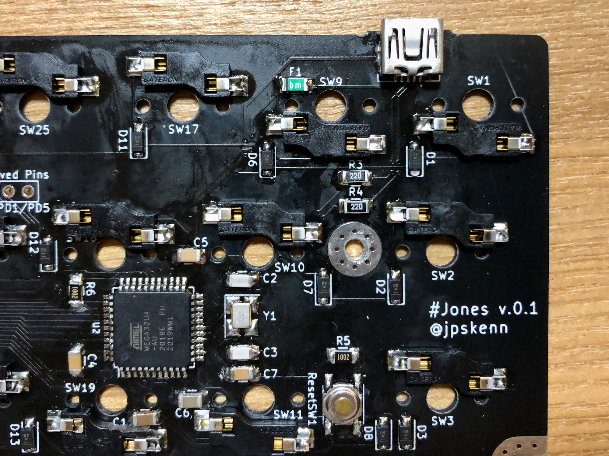  
部品の取り付け例

  
MCU, クリスタル、ダイオードの取り付け方向

#### MCU
U2へ、MCU上面の●印を、基板のマークに合わせて取り付けてください。  
取り付け後、テスターで端子がショートしていないか確認します。


#### クリスタル
Y1へ、クリスタルに書かれた文字の左下が、基板のマークに合うように取り付けます。  
取り付け後、テスターで端子（基板上のパッド）がショートしていないか確認します。

#### コンデンサ、抵抗、リセッタブルヒューズ
これらの部品はどちら向きに取り付けてもかまいません。  
以下の部品記号に対応する部品を取り付けます。  

| 部品記号 | 取り付け部品 |
| ----- | ----- |
| C1(*) | セラミックコンデンサ 10uF 1206 |
| C2, C3 | セラミックコンデンサ 22pF 1206 |
| C4, C5, C7 | セラミックコンデンサ 0.1uF 1206 |
| C6 | セラミックコンデンサ 1uF 1206 |
| F1 | リセッタブルヒューズ<br>500mA トリップ1A 1206 |
| R5, R6 | 抵抗 10k 1206 |
| R3, R4 | 抵抗 22 1206 |

\* v.0.1では、コンデンサC1とSW19のソケットが干渉する箇所があるため、コンデンサC1をMCU側へ少しずらして取り付けます。

#### リセットスイッチ
どちら向きに取り付けても大丈夫です。

#### USBコネクタ
コネクタを基板裏面から差し込み、端子が基板のパッドの真上にように位置を調整してマスキングテープなどで仮固定しておきます。  
その状態で、コネクタの足を基板の表面からはんだ付けします。

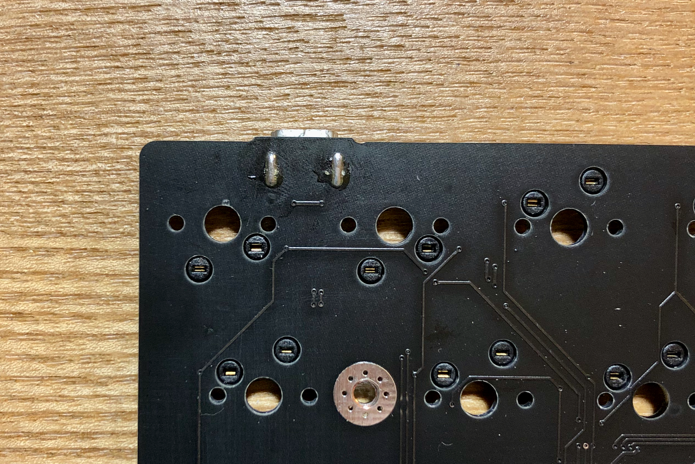  
はんだ付けしたUSBコネクタの足（基板表面）

端子と基板のパッドがずれていないことを確認し、端子をはんだ付けします。

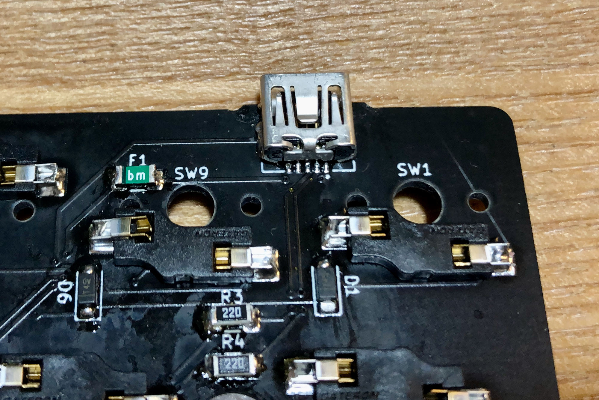  
はんだ付けしたUSBコネクタの端子


取り付け後、テスターで端子がショートしていないか確認します。  
端子と端子の間隔が狭いため、ケーブルを接続してケーブル反対側のコネクタで確認するのもひとつの方法です。

### PCやMacへの接続確認と、ファームウェアの書き込み
PCやMacで認識されるかを確認するため、ファームウェアを書き込みます。  

#### 初回接続時にデバイスが認識されていることを確認する
QMK ToolboxでDFUデバイスが接続されたことを確認するか、OSの機能を使用して確認してください。

##### Mac
Jonesを初めてUSB接続したとき、システムレポートのUSBに、`Atmega32U4DFU`というデバイス名が表示されることを確認します。

なお、ファームウェア書き込み後は、`jones`というデバイス名で表示されます。  


##### Windows
どのように認識されるか未確認です。

#### ファームウェアを書き込む。

ファームウェアは以下よりダウンロードし、QMK Toolboxや、QMKのmakeコマンドなどで書き込んでください。  

- QMK Toolbox用hexファイル：[jones_v.0.1_default.hex](../assets/jones_v.0.1_default.hex)  
- QMKコマンド用キーボード関連ファイル：[qmk_firmware/keyboards/jones/](https://github.com/jpskenn/qmk_firmware/tree/master/keyboards/jones)


##### QMK Toolbox
ダウンロードしたhexファイル`jones_v.0.1_default.hex`を指定し、MCUは`atmega32u4`を選択しておきます。  
キーボードのリセットスイッチを押して、  

`*** DFU device connected`  

というメッセージが表示されたら、Flashボタンを押して書き込みます。

##### QMKコマンド
ダウンロードしたファイルをQMKのkeyboardsディレクトリ配下へ配置し、下記のコマンドを実行します。  

`make jones/v.0.1:default:dfu`  

ファームウェアが作成され、

```
dfu-programmer: no device present.
ERROR: Bootloader not found. Trying again in 5s.
```

というメッセージが表示されたら、キーボードのリセットスイッチを押すと書き込みが行われます。


### キースイッチ関連部品、オプション部品の取り付け

#### ダイオードの取り付け

※v.0.1では取り付け方向のシルクがありません。  
基板の手前側がカソード（奥→手前）になるように取り付けてください。  

  
ダイオード取り付け方向

#### LEDの取り付け（オプション）
基板表面のLED1、LED2へ取り付けます。  

このLEDは熱に弱いため、270℃程度で数秒内に取り付けるなどして、LEDが壊れないよう注意してください。

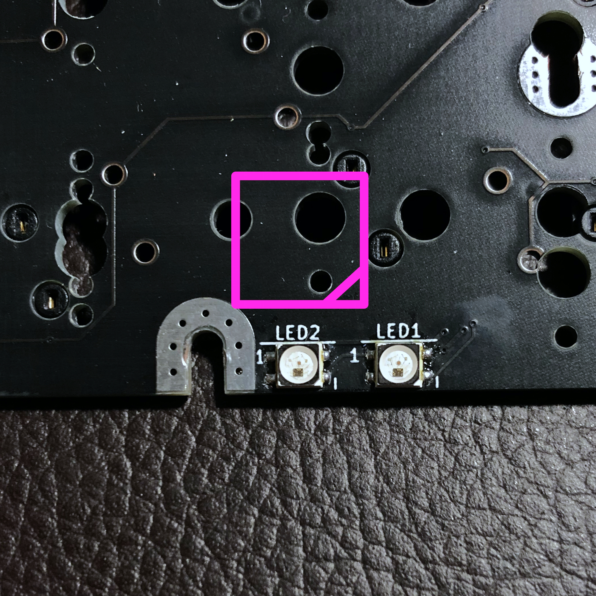  
LED2 LED1がこのように見える方向に基板を置いたとき、右下にLEDの切り欠きを合わせます。

#### スイッチソケットの取り付け
使用するレイアウトに合わせて取り付けます。  

以下に示すキーのうち、×印以外のキーレイアウトがMXソケットに対応しています。  
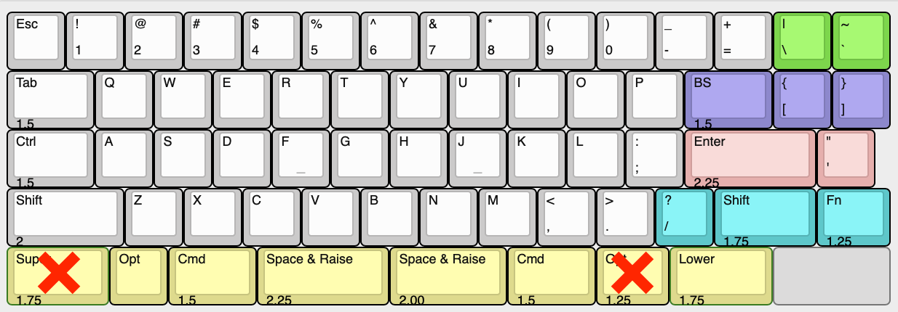

スイッチソケット非対応の箇所は、mill-maxソケットでソケット化するか、スイッチを直接はんだ付けしてください。

※SW19のソケットとコンデンサC1が干渉する場合は、ソケットをやすりで削るなどして対処します。  

#### ロータリーエンコーダの取り付け（オプション）

基板表面の右下の枠内へ取り付けます。


#### スタビライザーの取り付け
使いたいレイアウトに合わせて、取り付けるスタビライザーの位置を確認してください。  

なお、左シフトキーのスタビライザーがケースネジと干渉する場合があります。  
ネジ止めしなくても問題なく使用できますが、気になる場合はスタビライザーを装着しないなどの工夫が必要です。  


#### キースイッチ、キープレート（オプション）の取り付け

※ケース中央、ケース右上のネジ穴にキースイッチが重なるレイアウトの場合は、その部分だけケースへ取り付けた後にスイッチを取り付けます。

オプションのキープレートを使用する場合は、上から  
スイッチ → キープレート → 基板  
の順に取り付け、スイッチとキープレートがきっちりはまるようにします。
4隅のスイッチを取り付けてから、残りを1個ずつ確認しながら取り付けていくのがおすすめです。

ソケット化していない箇所は、スイッチを取り付けたらはんだ付けします。


##### ケース中央、ケース右上のネジ穴に重なるキースイッチ  

ケース中央のねじ穴に重なるスイッチは、3pinのスイッチを使用するか、片方の足をカットした5pinスイッチを使用してください。  

ケース右上のねじ穴に重なるスイッチは、上記の対応に加え、スイッチ中央の足（でっぱり部分）をネジに当たらないよう1/4～1/3ほどカットしてください。  

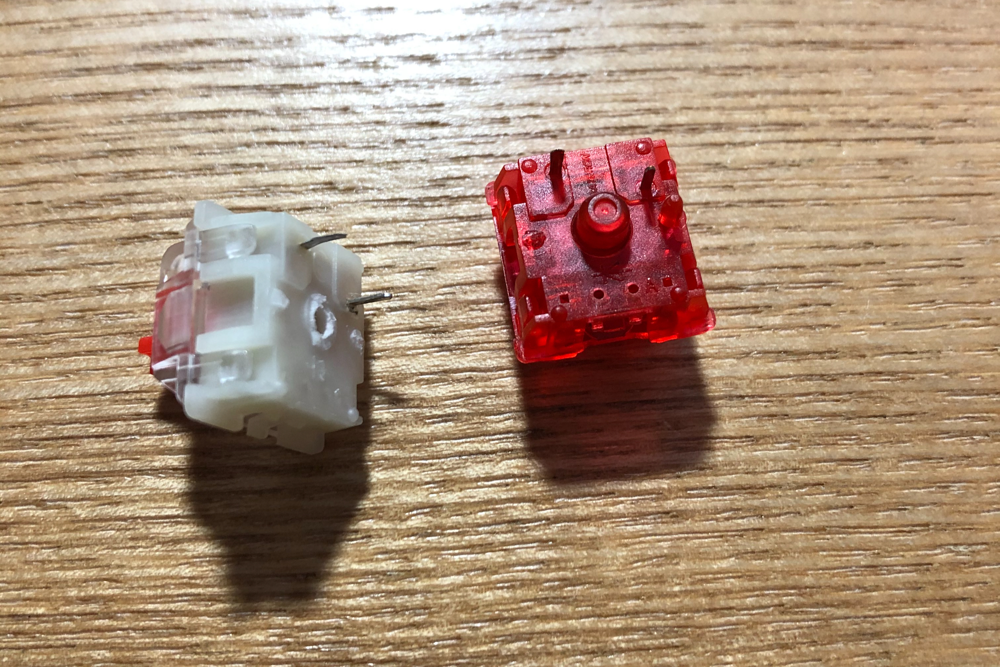  
キースイッチの加工  
左：足を全てカットしたGateron Silent Red  
右：片方の足をカットしたGateron Ink Red

スイッチによっては　装着できない場合もありますので、ひとつふたつダメにするくらいの気持ちで作業してください。


#### ブロッカーの取り付け（オプション）

※v.0.1ではネジ穴の位置が合わない箇所があるため、加工が必要になります。  
M2ネジとスペーサーでブロッカーを取り付けます。  
場合によってはワッシャーなどを使用してください。


### 基板のケースへの取り付け

基板奥側をケースへ入れ、USBコネクタをケースの穴に合わせるようにして、基板全体をケースに納めます。

USBコネクタがケースの穴に入れば、基板全体がスッとケース内に入ります。  
ぐいぐいと力をかけて押し込むようなことはしません。

KBDfansのTOFUでは問題ありませんが、お安いプラスチックケースの場合は、基板がケース内のリブに干渉して、ぐらつくことがあります。  
この場合は、次の写真のように、リセットスイッチの穴とねじ穴のポストの間のリブ（○で囲んだ箇所）をカットします。  
写真では○で囲んでいない箇所もカットしてありますが、そちらのカットは不要です。

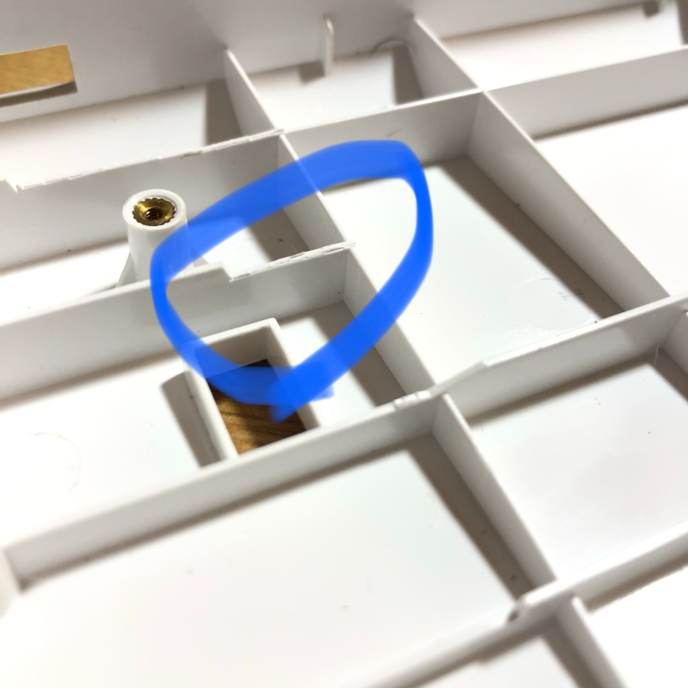  


ケースと基板のネジ穴が合うように位置を調整し、ネジ止めします。  
キースイッチと重なる箇所は低頭ネジを使います。

### 動作確認

最後に、キースイッチの動作確認をして完成です。
