# Jones v.0.4.x ビルドガイド

〓EEPROMリセット5秒をどっかに書く
購入していただいた方、リポジトリから製造していただいた方、その他の皆様、Jonesに興味を持っていただきありがとうございます。

このドキュメントは、Jones v.0.4.xを組み立てるためのビルドガイドです。  
Jonesのコンセプトや特徴などについては、[Jones README](https://github.com/jpskenn/Jones/blob/master/README.md)をご覧ください。

ビルドガイド全体に目を通して作業手順を把握しておくとミスの防止につながりますので、ぜひ、一度お読みになってから組み立て作業を始めてください。

## 目次

## 注意事項、制限など

### キースイッチ取り付け時の加工

ケースのネジ穴とスイッチ足の干渉を避けるため、中央ネジ穴の上に位置するスイッチは足を加工して取り付けます。

また、Narrowレイアウトを使用する際は、右上ネジ穴の上に位置するスイッチも、足を加工して取り付けます。

### キースイッチの取り付け方向

一部のキーは上下逆向きや横向きに取り付けるため、キーキャップが取り付けにくかったり、キーキャップとスイッチが干渉し打鍵感が悪くなることがあります。

### 左シフトキー

左シフトキーの2Uスタビライザーは、ケースネジに干渉するため使用を避けてください。

### スピーカー

スピーカーは、左シフトキーが1.75uまたは2uの場合にのみ取り付けることができます。

### ケース

GH60型, Poker型に対応する基板とキープレートですが、もしかしたら取り付けできないケースがあるかもしれません。  
取り付け確認済みのケースは次の通りです。

- [KBDfans TOFU 60% ALUMINUM CASE](https://kbdfans.com/products/kbdfans-tofu-60-aluminum-case)

- [KBDfans 5° FROSTED ACRYLIC CNC 60% CASE](https://kbdfans.com/products/pre-order-kbdfans5-transparent-acrylic-cnc-60-case)

- [60% プラスチックケース](https://yushakobo.jp/shop/60-plastic-case/)（簡単な加工が必要）

上記以外のケースへの取り付けの成功／失敗の報告を募集しております。

## 部品リスト

このキットを組み立てるためには、”キット内容物”に加え、”別途用意が必要な部品”が必要です。  
好みに合わせて必要な数をお買い求めください。

”オプション部品”は使いたい機能などに合わせて用意してください。  

### キット内容物
〓説明・写真更新〓
〓小物類は同じ写真にすべて置いて、それぞれに◯をつける
| 部品名 | 個数 | 備考 |
| ----- | :-----: | ----- |
| ご案内リーフレット | 1 | |
| Jones 基板 v.0.4.x | 1 | [おもて側<br>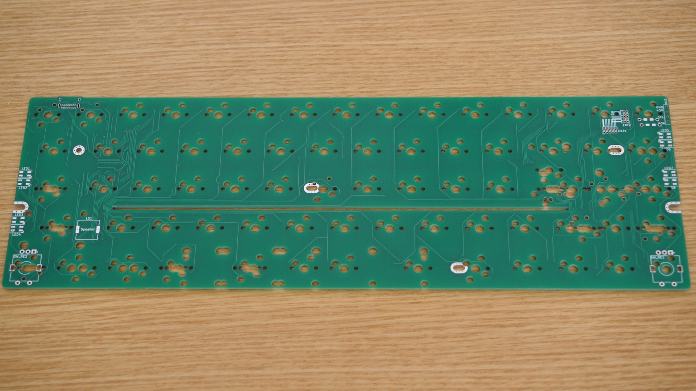](../assets/BuildGuide_v.0.3.1/DSC_6972.jpeg)<br>[裏側<br>](../assets/BuildGuide_v.0.3.1/DSC_6972.jpeg) |
| Jones キープレート v.4.0.x | 1 | [おもて側<br>](../assets/BuildGuide_v.0.3.1/DSC_6972.jpeg) |
| Kailh MXソケット | 75(\*) | [](../assets/BuildGuide_v.0.3.1/DSC_6972.jpeg) |
| PCBマウント スタビライザー<br>2u, ねじ止め式 | 2 | [](../assets/BuildGuide_v.0.3.1/DSC_6972.jpeg)<br>2.25uのキーにも使用できます。 |
| 低頭ネジ, M2 4mm | 3(\*) | [](../assets/BuildGuide_v.0.3.1/DSC_6972.jpeg) |
| 低頭ネジ, M2 5mm | 3(\*) | [](../assets/BuildGuide_v.0.3.1/DSC_6972.jpeg) |
| プラ板, 約5mm\*約40mm | 1 | [](../assets/BuildGuide_v.0.3.1/DSC_6972.jpeg) |
| ナット, M1.4 | 2 | [](../assets/BuildGuide_v.0.3.1/DSC_6972.jpeg) |

\* 予備を含む

### 別途用意が必要な部品

| 部品名 | 個数 | 備考 |
| ----- | :-----: | ----- |
| MXスイッチ | 最大 70 | 取り付け安定性が高い5pinタイプを推奨。<br>いくつか予備があると安心。 |
| PCBマウント スタビライザー, 2u | 必要数 | キット付属の2個では足りない場合。<br>確実に固定できるねじ止め式を推奨。 |
| キーキャップ, MXスイッチ用 | 必要数 | |
| ケース（GH60型, Poker型）<br>または<br>Jones用ボトムプレートキット(\*) | 1 | |
| USBケーブル （Type-C） | 1 | |

\* Jones用ボトムプレートキットの内容物は次の通り
| 部品名 | 個数 | 備考 |
| ----- | :-----: | ----- |
| ご案内リーフレット | 1 ||
| Jones用ボトムプレート | 1 | [おもて側<br>](../assets/BuildGuide_v.0.3.1/DSC_6972.jpeg)<br>[裏側<br>](../assets/BuildGuide_v.0.3.1/DSC_6972.jpeg) |
| スペーサー, M2 3mm | 8 | [](../assets/BuildGuide_v.0.3.1/DSC_6972.jpeg) |
| ネジ, M2 3mm | 16 | [](../assets/BuildGuide_v.0.3.1/DSC_6972.jpeg) |
| ネジ, M2 3mm, 低頭 | 1 | [](../assets/BuildGuide_v.0.3.1/DSC_6972.jpeg) |
| ゴム足 大 | 2 | [](../assets/BuildGuide_v.0.3.1/DSC_6972.jpeg) |
| ゴム足 小 | 6 | [](../assets/BuildGuide_v.0.3.1/DSC_6972.jpeg) |

### オプション部品

| 部品名 | 個数 | 備考 |
| ----- | :-----: | ----- |
| LED<br>SK6812MINI | 最大 4 | 左側2個、右側2個、または左右両側4個。 |
| ロータリーエンコーダ<br>ALPS EC11, ALPS EC12またはその互換品 | 最大 2 | |
| ロータリーエンコーダ用ノブ（つまみ）| 最大 2 | ロータリーエンコーダの軸の形状に合ったもの。
| スピーカー<br>Murata PKMCS0909E4000-R1 | 1 | |

## 組み立てに必要な工具

先の小さなドライバー、ピンセット、はんだ付け関連用品など、一般的な電子工作向け工具を使用します。  
[遊舎工房の工具セット](https://yushakobo.jp/shop/a9900to/)を参考に用意してください。

また、キースイッチの取り外し用の工具も用意してください。  
[TALP KEYBOARDで売っているこのタイプ](https://talpkeyboard.net/items/601362fe2438601925ad0692)は、1本でキースイッチとキーキャップの両方に使えるので便利です。

なお、無くても組み立てはできますが、何か不具合があった場合の原因調査ではテスターが必要になることがあります。

## 組み立て前の確認

組み立てを開始する前に、同梱物と基板についての基本的な確認をおこないます。  
何か問題があった場合は作業を中止し、キット同梱のリーフレットに記載された連絡先へ問い合わせてください。

*組み立て手順の開始後は初期不良として対応できかねる場合がありますので、しっかりと確認してください。*

### 同梱物の確認

- 同梱物に不足がないこと

- 基板に配線が切れるような大きく深い傷や割れなどの破損がないこと

- 梱包の中に小さな部品が落ちていないこと（基板に実装された部品が外れている）

### 接続の確認

MacやPCに接続した際に、キーボードとして認識されるかを確認します。

ファームウェアを書き込み済みですので、正常であれば、USBケーブルで接続するとキーボードとして認識されます。  
下記の方法を参考に確認してください。

#### Mac, macOS Big Sur 11.4

*充電用ではないUSBケーブル*（できれば他の機器を接続して使用した実績のあるもの）を使って、キーボードとMacをUSB接続します。

メニューバーから、``　→　`このMacについて`を選び、表示された画面で`システムレポート…`をクリックします。  
システム情報が表示されたら、左側の`ハードウェア`から`USB`を選択します。

右側の`USB装置ツリー`に`Jones`というデバイスが表示されていれば、正しく認識されています。

  
システム情報の表示

#### Windows, 10 Pro 1909(18363.1082)

*充電用ではないUSBケーブル*（できれば他の機器を接続して使用した実績のあるもの）を使って、キーボードとPCをUSB接続します。

`スタートボタン`から`設定`を開いて`デバイス`を選択し、  
`マウス、キーボード、ペン`の項目に`Jones`が表示されていれば、正しく認識されています。

  
デバイスの表示

### ソケット用パッドの確認

キースイッチのソケットをはんだ付けするソケット用パッド（ソケットをはんだ付けする基板上の金属部分）が、電気的に正しく反応するかを確認します。  
全てのパッドを確認しなくてもかまいませんが、少なくとも組み立てようとしているレイアウトのパッドは確認しておいてください。
〓写真、ソケット用パッド、これがパッドです

キーマップ書き換えツール”Remap”のテスト機能を使った確認方法について説明していますが、OSのキーボードビューアや、[Keyboard Checker](https://keyboardchecker.com)、[QMK Configrator](https://config.qmk.fm/)のキーボード入力テストを使用して確認することもできます。

#### Remapを使った確認方法

基板の裏面が上側になるように置き、PCやMacとUSBケーブルで接続します。

Google Chromeブラウザ（Web HID対応のバージョン89以降）で、[Remap](https://remap-keys.app/)を開きます。

`START REMAP FOR YOUR KEYBOARD`をクリックしてキーボード接続画面に進みます。

[](../assets/BuildGuide_v.0.4/Remap_start.png)

`+ KEYBOARD`をクリックしてデバイスへの接続要求画面を開きます。

[](../assets/BuildGuide_v.0.4/Remap_connect.png)

デバイスへの接続要求画面で`Jones`を選択して`接続`をクリックすると、画面にキーボードのレイアウトが表示されます。

[](../assets/BuildGuide_v.0.4/Remap_connect2.png)

レイアウト右側の`Layout Option`で、組み立てようとしているレイアウトに設定します。  

[](../assets/BuildGuide_v.0.4/Remap_LayoutOption.png)

レイアウト右側の`…`をクリックし、`Test Matrix mode`を選択します。

[](../assets/BuildGuide_v.0.4/Remap_TestMatrix.png)

ピンセットなどの電気を通すものを使い、基板裏面のソケット用パッドをショートさせます。

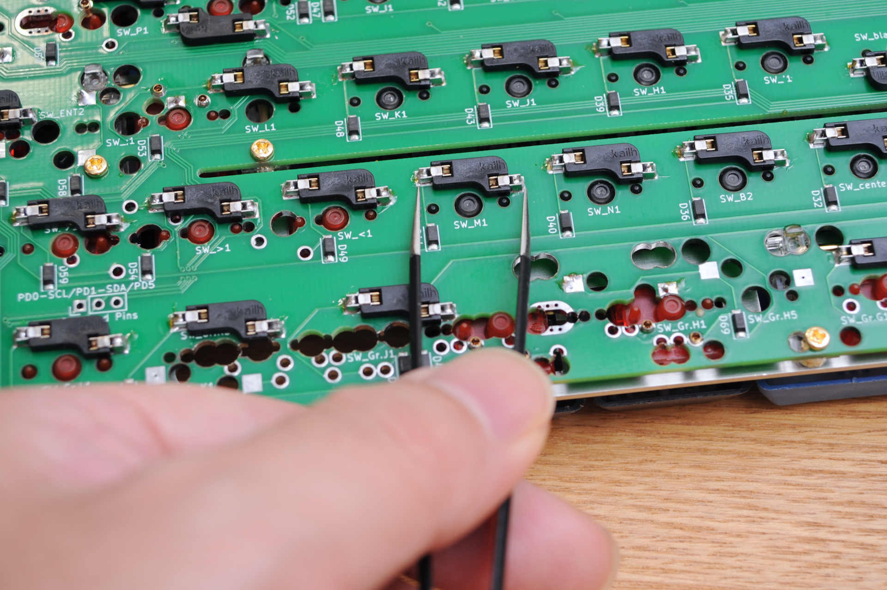
〓差し替え〓ピンセットを使ってパッド部分をショートさせるようす

Remapの画面で、ショートさせたパッドに対応するキーの色が変わることを確認します。  

[](../assets/BuildGuide_v.0.4/Remap_TestMatrix2.png)

ソケット用パッドを順にショートさせ、全てのキーの色が変わることを確認します。

余裕があれば、他のレイアウトでも同様に確認します。

## 組み立て手順

以下の手順に沿って組み立ててください。

### スイッチ用ソケットの取り付け

基板裏側へソケットを取り付けます。

#### 取り付け位置の確認

使用するレイアウトに合わせて、基板裏側のソケットの取り付け位置を確認します。  
レイアウトは[Keyboard Layout Editor: Jones v04_1](http://www.keyboard-layout-editor.com/#/gists/5c8ac0bbee831ac1463e579fabf9d351)を参考にしてください。

基板にはソケットの枠が描かれており、1uよりも大きなキーと、ソケットが重なる箇所に適合キーサイズ（1uや2uなど）が表記されています。  
また、キーサイズの表記に`N`がついてものはNarrowレイアウトのみで使用するキーを意味していますので、それらの表記を参考に取り付け位置を確認します。  
わかりにくいときは、実際にスイッチやキーキャップを置いてみるとよいでしょう。  


ソケット取り付け位置の表記

#### 予備はんだとソケットの設置

先ほど確認したソケット用パッドの*片方だけ*に、予備はんだ（はんだをちょっとつけておく）します。

 <details>
<summary>初心者向け作業ヒント</summary>
はんだごてを320℃程度に設定します。

利き手にはんだごて、もう一方の手にはんだを持ちます。

パッドにこて先をあてて、1、2と数えて加熱します。

こて先にはんだをあてて溶かし、  
溶けたはんだがパッド全体に広がったらはんだを離し、  
続いてこて先をパッドから離します。
</details>

<!-- 〓販売版で写真更新〓 -->
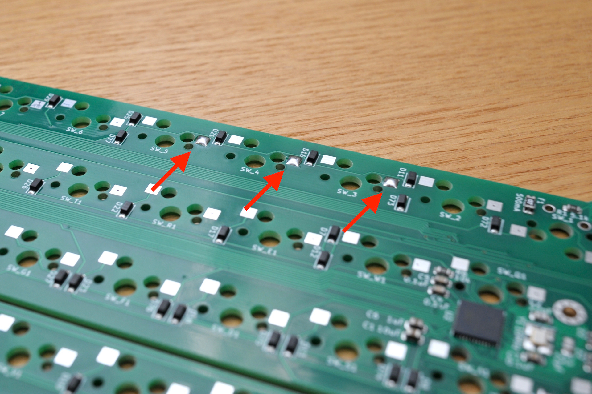
ソケット用パッドへの予備はんだ

ソケットを基板に描かれた枠に合わせ、プラスチックの突起が穴にはまるように仮置きします。  
この段階では、ソケットの片方の端子が予備はんだの上に乗り、基板から少し浮いて傾いた状態です。

〓写真追加、ソケット仮置き〓

ソケットがスイッチ中央の穴をふさがない方向で置かれていることを確認します。

<!-- 〓販売版で写真更新〓 -->
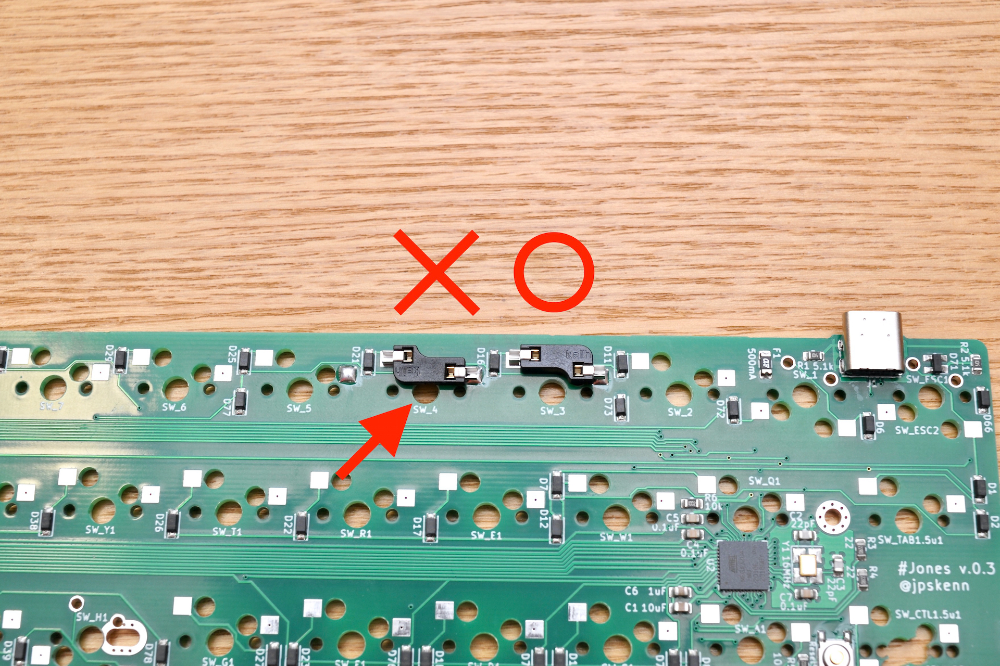
ソケットの方向

#### 予備はんだした端子のはんだ付け

はんだごてを320℃程度に設定します。

利き手にはんだごて、もう一方の手にピンセットを持ちます。

ピンセットでソケット中央のプラ部分を押さえ、端子の隙間にこて先を押し込みます。

〓写真更新、ピンセットで押さえてるのも入れる〓

金属部分へコテ先を押し込む

1、2と数えたくらいで予備はんだが溶け始めます。  
ソケットを押さえていたピンセットを軽く押し込むと、ソケットのプラスチックの突起が基板の穴にはまり、浮いていた端子が基板に接します。

端子とパッドをしっかりと加熱するため、端子が基板に接してから、1、2と数えてこて先を離します。  
さらに1、2と数えて、はんだが冷えて固まるのを待ってから、ソケットを押さえていたピンセットを離します。

ソケットが枠に沿ってまっすぐに取り付けられ、傾いていないことを確認します。  
傾いている場合は端子部分を再加熱し、こて先とピンセットで傾きを修正します。
〓写真追加、ソケットの傾き〓

### 残りの端子のはんだ付け

利き手にはんだごて、もう一方の手にはんだを持ちます。

残りの端子の隙間にこて先を押し込み、1、2と数えて加熱します。

次の手順を、1、2、3、4と数える間におこないます。

1、基板のパッドと端子の隙間あたりへはんだを押しつけます。
2、はんだを溶かしながら隙間へ流し込みます。  
3、溶けたはんだがパッド全体に広がる程度まで流し込んだら、はんだを離します。  
4、ソケットを動かしてしまわないよう、静かにこて先を離します。

はんだがパッド全体に広がり、端子の間にポコっと盛り上がって固まっているのが良好な状態です。

〓写真、はんだの状態。NGとしてはんだの足りないものも載せる

ソケットが枠に沿ってまっすぐに取り付けられていることを確認します。  
また、ソケットのプラスチックの突起が基板の穴にぴったりとはまり、基板から浮いていないことを確認します。  

<!-- 〓販売版で写真更新〓 -->
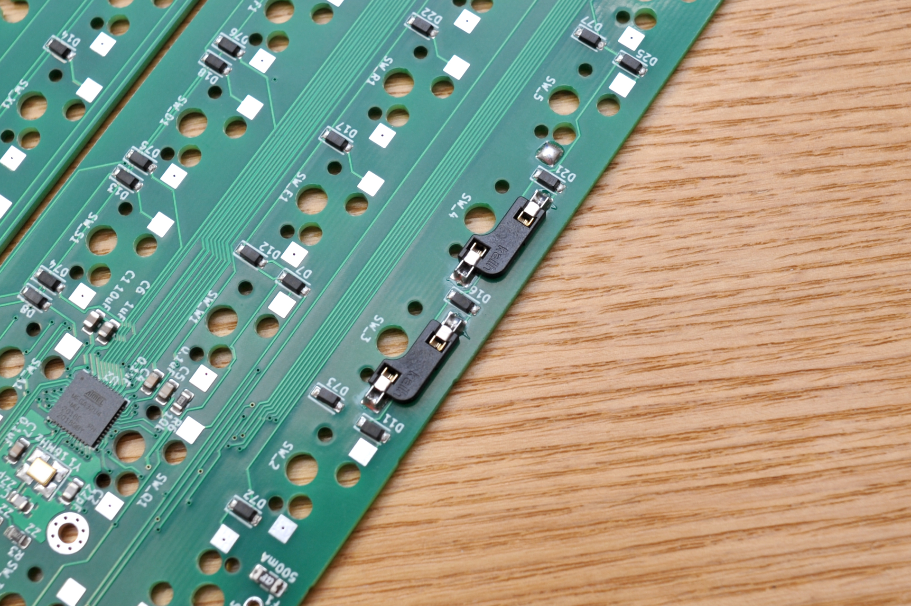
取り付けたソケット〓NGの浮いてるのも載せる

#### すべてのソケットの取り付け

作業を繰り返して、すべてのソケットを取り付けます。

取り付けが終わったら、**はんだ付けし忘れた箇所がないか、十分に確認します**。

特に`残りの端子のはんだ付け`を忘れることがよくあるため、この段階でよく確認しておきます。

### （オプション）インジケータLEDの取り付け

*インジケータLEDを使用しない場合、この手順は不要です。*

基板裏側でジャンパし、おもて側へLEDを取り付けます。

#### インジケータLEDの組み合わせとジャンパの設定

LED未使用も含め、4通りの組み合わせがあります。  

| 組み合わせ | 左側<br>LED1, 2 | 右側<br>LED3, 4 | ジャンパ<br>Left LEDs | ジャンパ<br>Right LEDs |
| :--: | :--: | :--: | :--: | :--: |
| LED未使用 | なし | なし | 不要 または Off | 不要 または Off |
| 左側のみ | あり | なし | On | 不要 または Off |
| 右側のみ | なし | あり | Off | On |
| 左右両方 | あり | あり | On | On |

#### ジャンパ

基板裏側のジャンパ`Right LEDs`と`Left LEDs`を、インジケータLEDの組み合わせに応じて`On`または`Off`にジャンパ（隣同士のパッドにはんだをつけてつなげる）する手順です。  
`不要 または Off`となっている箇所は、ジャンパしなくてもかまいません。

〓写真追加、基板裏面全体で、左右のパッド位置を矢印とか○で囲んだりしたもの〓

3個あるパッドのうち、中央と`On`の2個、または中央と`Off`の2個を同時に温め、  
こて先にはんだを押し付けて、たっぷり目に溶かし、  
こて先を、基板をなでるようにスッと横へずらしてパッドから離し、2個のパッドをはんだでつなげます。

最初のうちはうまくつなげられないことが多いですが、はんだをチョンチョンとつけたりしていると、そのうちつながります。  
はんだをつけすぎて、3個あるパッドがすべてつながってしまわないように気をつけてください。
また、パッドをこて先でグリグリいじりすぎると基板から剥がてしまうため、こて先はパッドにそっと乗せて温めて、スッと横へずらすだけにしてください。

〓写真追加、どこかをジャンパした状態〓

#### 予備はんだ

基板おもて側から、インジケータLEDの組み合わせに応じた取り付け場所を確認します。

LED1個につき4箇所のパッドがあり、そのうち1箇所だけに予備はんだします。  
スイッチソケット用のパッドに比べてLEDのパッドはとても小さいため、はんだをつけすぎないようにします。

〓写真、予備はんだした状態

#### LEDの仮固定

LEDの1箇所だけ欠けた角が、基板に描かれた▲マークに合うように、LEDを基板に置きます。  
この段階では、LEDが予備はんだした箇所に乗り、基板から少し浮いています。


LED取り付け方向。基板に描かれた▲マークと、LEDの方向、

LEDは高温ではんだ付けすると壊れるため、こて先温度を220-270℃に設定します。  
使用するはんだの種類や加熱時間にもよりますが、220℃では加熱不足によるはんだ不良（表面上ははんだ付けされたように見えるが、内部はしっかりとくっついていない状態）に注意してください。  
[加熱不足による、はんだ不良の例](https://twitter.com/jpskenn/status/1291328876283478016)

フラックスを予備はんだに塗っておくと、作業しやすくなります。

ピンセットでLEDをつまみ、位置がずれないように保持します。

はんだごてのこて先を、LEDの横方向からパッドとLEDの端子にあてて、予備はんだを溶かします。  
こて先温度を220℃に設定したときは、はんだが溶けるまでに少し時間がかかります。〓こういうところをヒントにしたいかも〓

予備はんだが溶けたら、LEDが設置位置の中心になるように微調整し、1、2と数えてこて先を離します。  
さらに1、2と数えて、はんだが固まったらLEDをつまんでいたピンセットを離します。  

はんだが、直径1mmくらいの小さな球のようになっていれば良い仕上がりです。

〓写真、1箇所だけはんだ付けしたもの

LEDの取り付け位置が大きくずれていたり基板から浮いている場合は、はんだ付けした箇所を再加熱し、ピンセットで修正します。  
再加熱する際も、フラックスを塗っておくと作業がしやすくなります。

#### LEDの取り付け

次の順番で残り3箇所のパッドをはんだ付けします。

1. 予備はんだしたパッドとLEDの発光部を挟んだ反対側のパッド

1. 1の隣のパッド

1. 残ったパッド（予備はんだしたパッドの隣）

〓写真、取り付け順序〓

フラックスを残り3箇所のパッドに塗っておくと、作業しやすくなります。

はんだをこて先にあてて溶かし、少量のはんだをこて先につけます。  
こて先をパッドとLED側面の端子に軽く押しあてて、1、2と数えてこて先を離します。

はんだが、直径1mmくらいの小さな球のようになっていれば良い仕上がりです。

<!-- 〓販売版で写真更新〓 -->
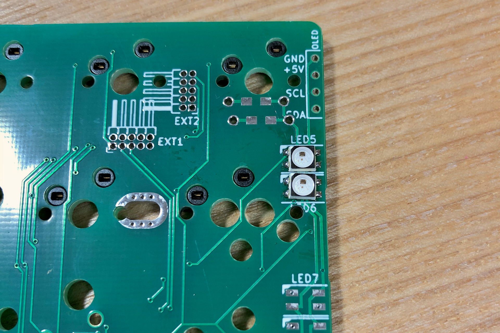
取り付けたLED

作業を繰り返し、必要な数のLEDを取り付けます。

#### LEDの動作確認

LEDの動作確認のため、次の3箇所へ一時的にスイッチを取り付けます。  
スイッチの端子が、折れたり曲がったりしていないことを確認してから、基板おもて側からソケットに差し込みます。

- 左スペースキー
- 右スペースキー
- 左シフトキー

USBケーブルを接続します。

以下のように、スイッチの状態に応じてLEDが点灯することを確認します。  
LEDを左右両方に取り付けている場合も、左側と右側で同じ光り方になります。

| スイッチの状態 | LEDの点灯<br>手前, 奥 | 備考 |
| :-- | :--: | :-- |
| 何も押さない | 白, 白 | |
| 左スペースを押し続ける | 白, 緑 | |
| 右スペースを押し続ける | 白, 水 | |
| 左と右のスペースを押し続ける | 白, 赤 | |
| 左と右のスペースを押しながら、左シフトを押し、<br>すべてのスイッチから手を離す | 紫, 白 | 操作するたびに、<br>”白, 白”と”紫, 白”<br>が切り替わる。|

確認が終わったら、USBケーブルを抜き、スイッチを取り外します。

光らないLEDがある場合は、[参考：LEDの取り付け不良調査](〓リンク)を参考にして調査します。

### （オプション）スピーカーの取り付け

*スピーカーを使用しない場合、この作業は不要です。*  
*なお、スピーカーは、左シフトキーが1.75uまたは2uの場合にのみ取り付けることができます。*

基板おもて側にスピーカーを取り付けます。

#### スピーカーの取り付け

基板おもて側、`Speaker`の枠内へ取り付けます。

〓写真、取り付け場所、裏側写真を流用

2箇所のパッドうち、1箇所だけに予備はんだします。

スピーカーを枠とパッドに合わせて置きます。  
スピーカーの端子に極性はないため、どちらの方向に置いてもかまいません。  
スピーカー上面の小さな穴が、左方向になるように取り付けるとキープレートの枠から音が抜け、聞こえやすくなります。

予備はんだした箇所の端子をはんだ付けします

スピーカーが枠に沿ってまっすぐに取り付けられていることを確認します。

残りの1箇所をはんだ付けします。


〓写真更新〓取り付けたスピーカー

#### スピーカーの動作確認

USBケーブルで接続した際、`♪ピッ`という音が聞こえることを確認します。

確認が終わったら、USBケーブルを抜きます。

<!--〓デフォで起動音が出るはずなので、ここいらんぽい
スピーカーの動作確認のため、次の3箇所へ一時的にスイッチを取り付けます。  
- 左スペースキー
- 右スペースキー
- Aキー

音が聞こえない場合は、`左スペース` `右スペース` `A`を同時に押して、スピーカー機能のON/OFFを切り替えます。  
切り替えた時に`♪ピロッ`という音が聞こえることを確認します。
〓ここまで-->

音が聞こえない場合は、スピーカーが正しくはんだ付けされているか確認します。

### （オプション）ロータリーエンコーダの取り付け

*ロータリーエンコーダを使用しない場合、この作業は不要です。*

基板おもて側からロータリーエンコーダ（ALPS EC11, ALPS EC12とその互換品）を取り付けます。  
取り付け確認済みのロータリーエンコーダは次の通りです。

- ALPS
  - EC11E09244AQ
  - EC11E153440D
  - EC11E18244AU
  - EC12E24204A2
- Bourns
  - PEC11R-4315F-S0012
  - PEC11R-4015F-S0024

右下と左下のどちらか片方、または両方へ取り付けできます。  
なお、キースイッチとは排他取り付けとなります。

〓写真、全体で取り付け位置を示したもの〓

ロータリーエンコーダのピン（上3本または上下5本）と、左右の固定足を、基板の設置位置に合わせて差し込みます。  
固定足が差し込みにくいときは、足を横から少し押さえ、先端を基板の穴に入れます。  

左右の固定足である程度しっかりと基板に固定されるはずですが、固定がゆるく、基板から外れたり浮いたりする場合はマスキングテープなどで仮固定します。

基板を裏側が上になるように置き、いずれかのピンを*1本だけ*はんだ付けします。

ロータリーエンコーダが基板に描かれた枠に沿ってまっすぐ取り付けられていることを確認します。

ロータリーエンコーダが基板から浮かないように気をつけながら、残りのピンをはんだ付けします。

<!-- 〓販売版で写真更新〓 -->
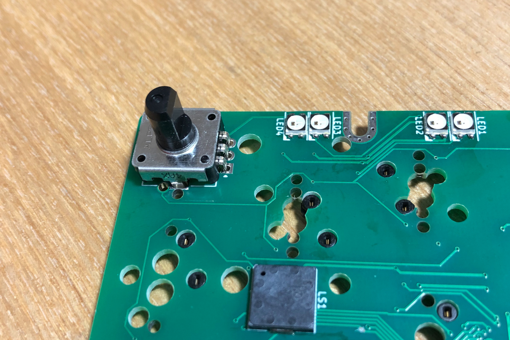
取り付けたロータリーエンコーダ（基板おもて側）

<!-- 〓販売版で写真更新〓 -->
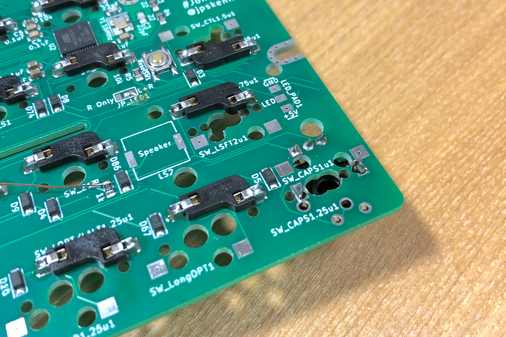
取り付けたロータリーエンコーダ（基板裏側）

### スタビライザーの取り付け

#### スタビライザーの取り付け位置の確認

使用するレイアウトに合わせて、スタビライザーの取り付け位置を確認します。  
なお、左シフトキーの2uスタビライザーは、ケースネジに干渉するため使用を避けてください。

〓写真：取り付け位置〓

#### スタビライザーの組み立て

次のようにスタビライザーを組み立てます。
〓主に写真だけ〓

#### スタビライザーの基板への取り付け

基板おもて側から、スタビライザーを取り付けます。

スタビライザーの棒がある方の突起部分を、大きい方の穴に斜めに差し込んで引っ掛けます。

スタビライザーの反対側のねじ止めする部分を、小さい方の穴にはめ込んでねじ止めします。

〓写真：取り付け方向、引っ掛けるところ〓

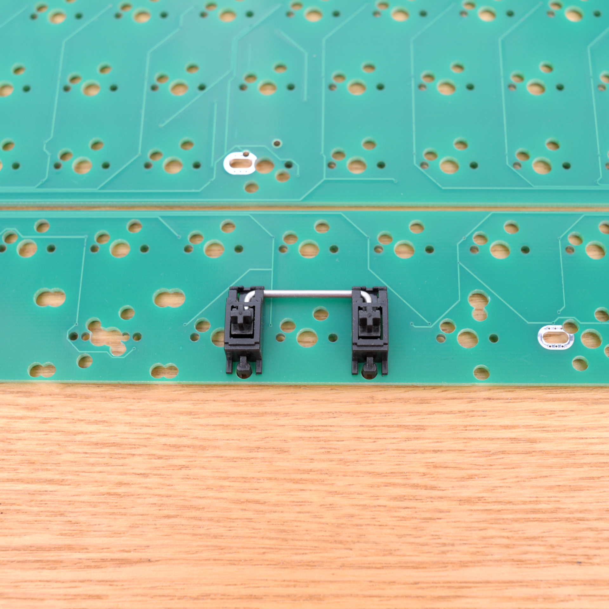
取り付けたスタビライザー

#### 左スペースキーのスタビライザーがゆるい場合

左スペースキーのスタビライザーは2u用と2.25u用のものが隣り合って並んでいるため、取り付けが横方向にゆるい場合があります。  
このような場合は、キット付属のナット（M1.4）を基板の穴にはめて、ゆるみ防止に使用してください。

左スペースキーのスタビライザーが、通常通り取り付けられている状態から作業を始めます。

スタビライザーをつけない方の大きい穴に、基板の裏側からマスキングテープを貼ります。

キット付属のナット（M1.4）1個を、スタビライザーの大きい穴にはめこみます。  
スタビライザーとの間に隙間があるようなら、ナットにマスキングテープを巻いて隙間が埋まるように調節します。

基板のおもて側からマスキングテープを貼って、ナットを止めます。
〓一連の写真〓

### スイッチの取り付け

スイッチを、キープレートを介して基板に取り付けます。

打鍵感向上に興味のある方は、次の項目をお読みになると何かヒントがあるかもしれません。

- [参考：打鍵感向上：キープレートと基板間のパテ埋め](〓リンク)

#### スイッチ取り付け前の確認

スイッチの端子を見て、折れたり、曲がったりしていないことを確認します。  
少しだけ曲がっているものは、まっすぐに戻します。

折れてしまっているものは使用できません。  
また、大きく曲がっているものは、まっすぐに戻しても折れやすくなっているため、使用を避けてください。

〓写真：端子曲がり〓

#### キープレートの取り付け

キープレートをおもて側が上になるように置きます。

使用するレイアウトに合わせ、キープレートの4隅にスイッチをはめ込みます。  
ロータリーエンコーダを取り付けている場合は、その隣へはめ込みます。

スイッチの取り付け方向がソケットの方向に合うようにしてください。  
例えば、左上のキーは上下逆向きにはめ込みます。

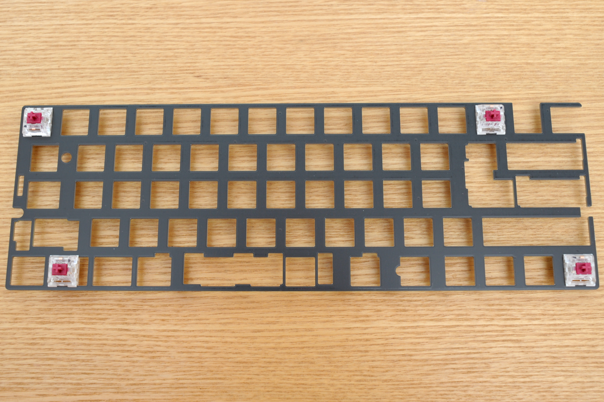
キープレート4隅につけたスイッチ

スイッチがキープレートの枠にぴったり密着してはまっていることを確認します。
〓写真、スイッチのはまり具合。OKとNG

基板を表側が上になるように置きます。

4隅にスイッチをはめ込んだプレートを基板に乗せ、スイッチの端子とソケットの位置を合わせます。
スタビライザーを取り付けているときは、キープレートの枠にはまるように位置を調整します。

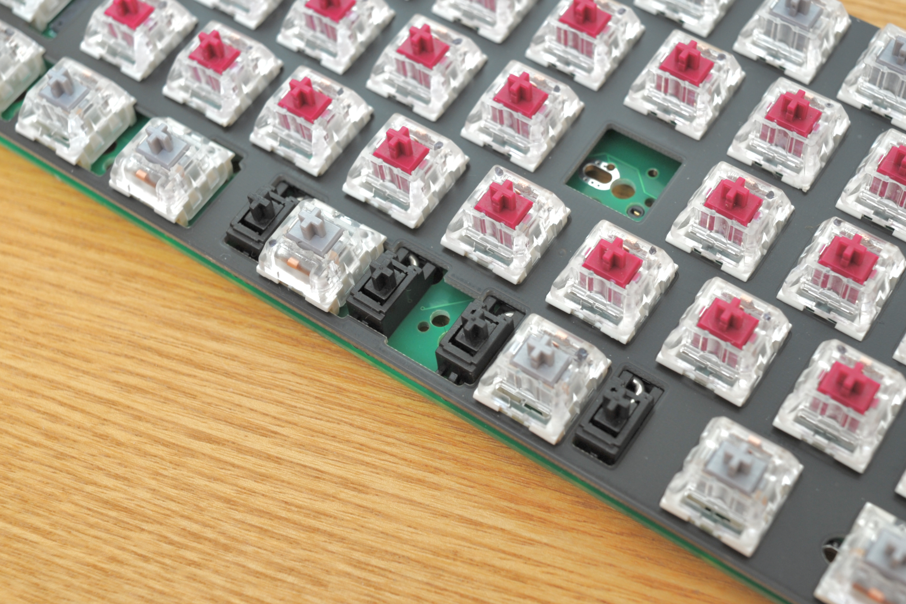
キープレートの枠にはまったスタビライザー

4隅のスイッチを、1個ずつ基板のソケットに押し込んでいきます。  
スイッチの端子が奥まで差し込めるように、基板裏側のソケットを押さえながら、少しだけ力を入れて（\*）スイッチを押し込みます。  
※：洗濯バサミをつまんで開くよりも、もう少し強いくらいの力。

#### ケースネジ穴に干渉するスッチの取り付け

ケースのネジ穴とスイッチ足の干渉を避けるため、スイッチの足を加工して取り付ける箇所があります。

##### 中央ネジ穴の上に位置するスイッチ, Gの右隣のキー

すべてのレイアウトにおいて、中央ネジ穴の上に位置するスイッチは、スイッチの足を加工して取り付けます。

5pinスイッチは、中央ネジ穴と干渉する片方の足を、ニッパーなどで切断して取り付けます。  

3pinスイッチは干渉しないため、そのまま取り付けできます。


5pinスイッチの片方の足を切断

##### 右上ネジ穴の上に位置するスイッチ, Narrowレイアウトのみ、上から2行目、右から2個目のキー

Narrowレイアウトを使用する場合のみ、右上ネジ穴の上に位置するスイッチも足を加工して取り付けます。

5pinスイッチ、3pinスイッチのいずれも、スイッチ中央の足（出っ張り）を、ネジ穴に当たらない程度に一部切断して取り付けます。  
中央の足をすべて切断しても良いですが、スイッチ固定の安定性が下がるため、1/4〜1/3に切り込みを入れて一部だけ切断する方がおすすめです。


中央の足の1/4くらいに切り込みを入れる


中央の足の一部だけを切断する

なお、押下時にスイッチの軸がネジに当たる場合は、軸の下端を少しだけ切断します。

〓写真：軸の下端をカット〓

#### 残りのスイッチの取り付け

スイッチの取り付け方向がソケットの方向に合うようにして、残りのスイッチを取り付けます。

スイッチの端子が曲がらないよう、真上からまっすぐに押し込みます。

取り付けたら、スイッチがキープレートの枠にぴったりとはまっていることを確認します。  
スイッチがキープレートから浮いているような場合は、プレートを指で引っ張り、スイッチと密着させます。

### 動作確認

ケースへ取り付ける前に、キーボードをPCやMacに接続して動作確認を行います。

#### スイッチの動作確認

組み立て前におこなった[Remapを使った確認方法](〓リンク)でスイッチの動作確認をおこないます。  
以前はピンセットでソケット用パッドをショートさせましたが、この手順ではスイッチを押して正常に入力されるかを確認します。

正常に入力できないスイッチがあった場合は、[参考：正常に入力できないスイッチの原因調査](〓リンク〓)の手順に沿って調査します。

#### ロータリーエンコーダの動作確認

ロータリーエンコーダのつまみを左右に回し、OSの音声出力ボリュームが変化することを確認します。  
また、プッシュボタンスイッチ付きのロータリーエンコーダでは、プッシュするとOSの音声出力のミュート状態が切り替わることを確認します。

何か問題があった場合は、正しくはんだ付けされているかを確認してください。

### ケースへの取り付け

#### （該当者のみ）Jones用ボトムプレートキットの取り付け

*Jones用ボトムプレートキットを使用しない場合、この手順は不要です。*

Narrowレイアウトで組み立てている場合は、ボトムプレートへ取り付ける前に、右上ネジ穴にかぶさるスイッチを取り外します。
〓写真とりはずすスイッチ

ボトムプレートにスペーサーを取り付けます。  
ボトムプレート裏面から、ネジ（M2 3mm）を使い、スペーサー（M2 3mm）をねじ止めします。  
以下の写真のように、8箇所をねじ止めします。
〓中央はねじ止めしない
〓NarrowとWideでねじ止め位置ちがう→最下行
〓写真：スペーサーねじ止め箇所

基板を、ボトムプレートのスペーサーの位置に合うように乗せます。  
基板裏側の部品やソケットが、スペーサーにぶつからないように気をつけてください。

基板おもて側から、ネジ（M2 3mm）を使ってねじ止めします。  
Narrowレイアウトの場合は、スイッチとの干渉を避けるため、右上のネジ穴にネジ（M2 3mm 低頭）を使用します。

取り外していたスイッチを取り付けます。

ボトムプレート底面に、次のように滑り止めのゴム足を貼り付けます。  

- キーボードに傾斜をつける場合
    奥の左・右の2箇所：ゴム足 大
    手前の左・中・右の3箇所：ゴム足 小

- キーボードをフラットにする場合
    手前と奥の左・中・右の6箇所：ゴム足 小

### （該当者のみ）60% プラスチックケースの加工

*60% プラスチックケースを使用しない場合、この手順は不要です。*

60% プラスチックケースへ取り付ける際は、基板裏側の部品がケース内リブと干渉するため、干渉箇所を切り取る加工を行います。

切り取る箇所は〓場所〓です。

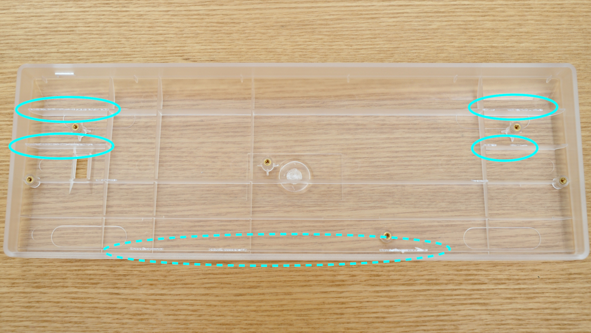
切り取る箇所


切り取る箇所（横から）

写真で示した部分を、ニッパーやカッターなどを使って切り取ります。  
ニッパーで切り取る際は、1-2mmくらいずつ切り進んでください。  
それ以上の長さを一気に切断しようとすると、意図しないところが割れることがあります。

### （該当者のみ）GH60型, Poker型ケースへの取り付け

*GH60型, Poker型ケースを使用しない場合は、この手順は不要です。*

打鍵感向上に興味のある方は、次の項目をお読みになると何かヒントがあるかもしれません。

- [参考：打鍵感向上：ケースへの基板取り付け方法](〓リンク)
- [参考：打鍵感向上：ケース内部の制振と静音化](〓リンク)

ケースへ取り付ける前に、ケースネジ穴にかぶさるスイッチを取り外します。

- 中央ネジ穴にかぶさるスイッチ
- Narrowレイアウトで、右上ネジ穴にかぶさるスイッチ
- 〓右下？

〓写真とりはずすスイッチ

基板の奥側（USBコネクタ側）からケース内へ入れていきます。

基板の奥側を水平から30度くらいの角度でケースへ差し込むと、USBコネクタがケースの穴にスッとはまります。  
その状態で基板の手前側を静かに下ろして水平にすると、力をかけることなく、基板全体がストンとケースに入ります。  
力を入れてグリグリとこじったり、ググググッと押し込むようなことはせず、角度を合わせて差し込むだけです。

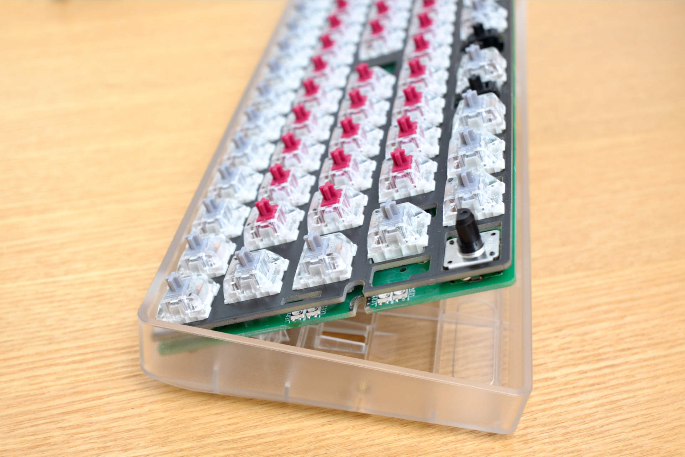
30度で差し込む

ケースネジ穴と基板のネジ穴の位置を合わせ、ケースに付属しているネジで仮止めします。
ネジ穴とスイッチがかぶさる箇所は、キット付属の低頭ネジを使用します。  
低頭ネジは、ケースに付属しているネジの長さと同じか、より短いものを使用します。

ケースに対して上下左右の真ん中になるように、基板の位置を調整します。

ネジを締めて基板を固定します。

取り外していたスイッチを取り付けます。

ケース底面に、滑り止めのゴム足を貼り付けます。

### 仕上げ

PCやMacに接続し、各部の動作を簡単に確認します。

ロータリーエンコーダのノブを取り付けます。

キーキャップを取り付けます。

Remapで自分好みのキーマップに変更して、完成です。

写真を撮影し、`#Jones_kbd` のタグをつけてツイートすると設計者が喜んだりします。  
[Twitter: #Jones_kbd](https://twitter.com/search?q=%23Jones_kbd)

### 参考

#### 参考：打鍵感向上：ケースへの基板取り付け方法

GH60型, Poker型ケースへの基板取り付け方法を変更し、打鍵感の向上を目指すための資料です。  

通常であれば、左2, 右2, 中央1, 中央下1の合計6本のネジで基板をケースに固定しますが、基板を改造して固定方法を変えることで、打鍵感の向上を狙います。

なお、通常の手順で組み立てた後、気が向いたときにこれらの改造をおこなうことができます。

**この加工による基板の破損や、ケースへの取り付け不良などの不具合が発生することが考えられるため、加工者の責任でお楽しみください。**  
**また、改造を行なった基板は元には戻せませんので、それを理解した上でおこなってください。**

```aside
今のところ、これらの改造をおこなって不具合が発生したことはありません。
```

##### 改造1：基板中央のフレックス加工

基板から中央と中央下のネジ穴を切り取り左右のネジだけでケースに固定することで、基板を適度にしならせて、打鍵感を柔らかくする改造です。

組み立て済みの場合は、切り取り箇所付近のスイッチを取り外します。

基板裏側、中央と中央下のネジ穴を、周りに描かれた白い点線に沿ってニッパーなどを使って切り離します。  
まわりの部品を傷つけないように注意しながら、一度にカットしようとせず、基板の裏側とおもて側から少しずつ切り進めていきます。  
ケースねじ穴に当たらないよう、切り取った箇所のバリをやすりやカッターなどを使ってきれいにします。

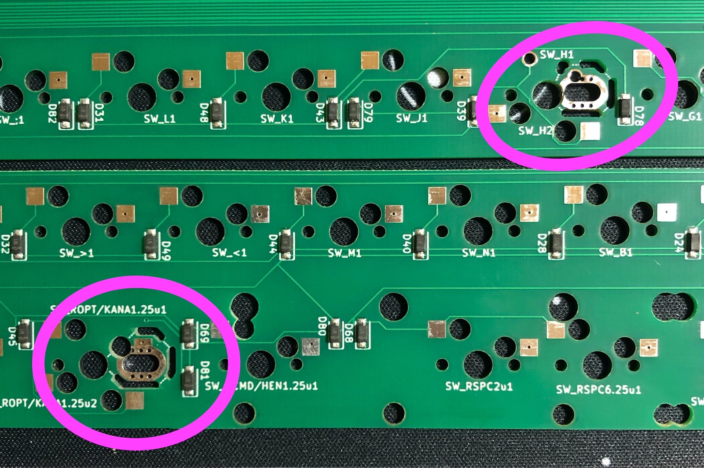  
基板裏側、中央と中央下のネジ穴

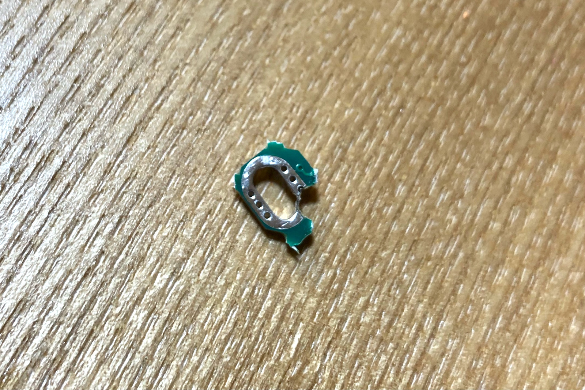  
切り取ったネジ穴

〓写真、TOFUと60%ケースに基板入れて、切り取ったところの拡大写真

##### 改造2：ネジを使わずにケースへ固定

基板からすべてのネジ穴を切り取り、制振スポンジによってケース内側側面に固定することで、打鍵時の衝撃がケースのネジ穴へ直接伝わるのを抑える改造です。  
制振スポンジは、PORON（衝撃吸収の良いマイクロセルウレタンフォーム）などを使用します。

基板を支えるため、ケース内側に制振スポンジを敷き詰めます。  
ケースネジ穴と同じくらいの高さになるようにします。

基板裏側、すべてのネジ穴を、周りに描かれた白い点線に沿ってニッパーなどを使って切り離します。  
まわりの部品を傷つけないように注意しながら、一度にカットしようとせず、基板の裏側とおもて側から少しずつ切り進めていきます。

基板4辺の側面に、両面テープなどを使い、1.5mm厚の制振スポンジを貼り付けます。  
基板外形には0.5mmの凹みがついている箇所があるので、その部分へ貼り付けます。  
基板とケース内側との隙間が広い場合は、現物合わせで、凹みのない部分へ貼り付けます。

基板をケースへ入れます。

#### 参考：打鍵感向上：ケース内部の制振と静音化

ケース内部底面におもり（10円玉, 真鍮板, 自動車のホイールバランスウェイト, 鉛シート, etc.）を入れておくと、ケースの共振が

ポロンスポンジ
ウェイト

#### 打鍵感向上：キープレートと基板のパテ埋め

#### 参考：USBコネクタ接続図

USBコネクタの配線は次の通りです。

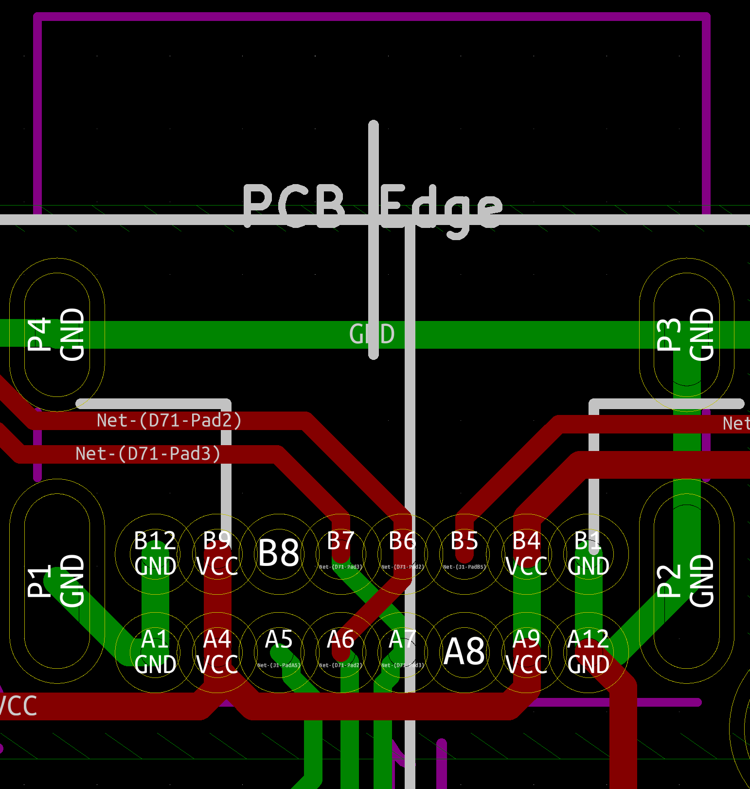
USBコネクタ接続図〓更新

#### 参考：スピーカーの2音同時再生

基板裏側のジャンパ`simultaneous audio`をジャンパすると、2音同時再生できるようになります。  
ジャンパしない場合は単音で再生されます。

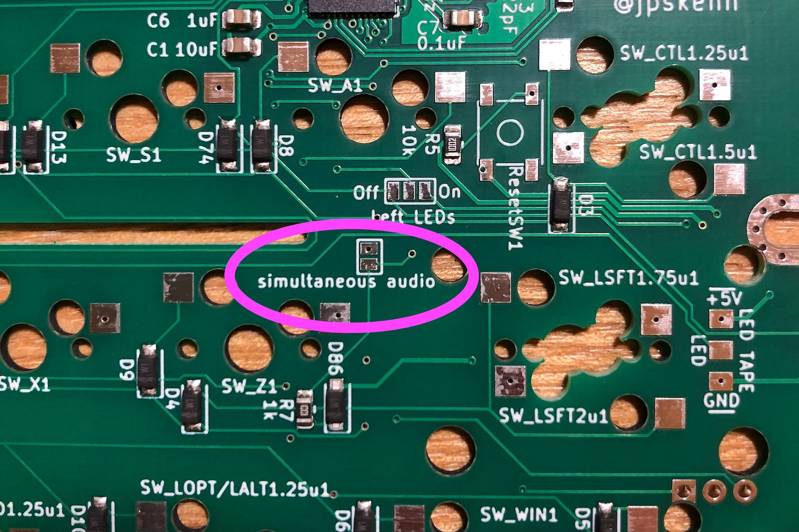  
ジャンパ箇所

#### 参考：正常に入力できないスイッチの原因調査

もっとも多い原因は、スイッチの取り付け不良です。  
スイッチを取り外し、端子が曲がったり折れたりしていないか確認します。  
端子の曲がりを修復するか、新しいスイッチに交換して、もう一度キー入力を確認します。

次いで多いのが、ソケットのハンダ不良です。  
ソケットのはんだ忘れや、はんだが適切に行われていないことが原因のため、ソケットのはんだ状態を確認します。  
必要であれば再度はんだ付けし直して、もう一度キー入力を確認します。

上記で解決できなかった場合は、基板のソケット用パッドをピンセットなどを使ってショートさせ、もう一度キー入力を確認します。  
キー入力が確認できた場合は、パッド自体は正常ですので、スイッチとソケットを再度調査します。

ソケット用パッドをショートしてもキー入力が確認できない場合は、組み立て途中に基板の配線や部品がダメージを受けたことが原因と考えられ、これ以降の調査と修復の難易度は、かなり高くなります。

電子工作に詳しい方であれば、[JonesのKiCadプロジェクト](https://github.com/jpskenn/Jones/tree/master/PCB)を参考にテスター等を用いて調査を進められると思います。

自分ではどうにもできない方は、キット同梱のリーフレットに記載された連絡先へ問い合わせてください。  
状況に応じて、できる限りのサポートをいたします。  

#### 参考：LEDの取り付け不良調査

##### ジャンパの確認

LEDの組み合わせに応じて、基板裏側のジャンパが正しく行われていることを確認します。

| 組み合わせ | 左側<br>LED1, 2 | 右側<br>LED3, 4 | ジャンパ<br>Left LEDs | ジャンパ<br>Right LEDs |
| :--: | :--: | :--: | :--: | :--: |
| LED未使用 | なし | なし | 不要 または Off | 不要 または Off |
| 左側のみ | あり | なし | On | 不要 または Off |
| 右側のみ | なし | あり | Off | On |
| 左右両方 | あり | あり | On | On |

##### LEDの確認

ジャンパが正しく行われても点灯しない場合は、LEDに原因があると考えられますので、以下の順に対処します。  

``` aside
なお、基板の配線へのダメージなど、他の要因も考えられますが、確率はかなり低いです。  
「組み立て中に工具で基板をガリっとやってしまった…」などの心当たりがあれば、また別ですが…
```

1. 光らないLEDのはんだ不良を修復する
    光らないLEDが正しくはんだ付けされていない、と仮定した対処です。
    光らないLEDの側面の端子部分にフラックスを塗り、こて先につけたはんだを押しあてて、はんだ付けをやり直します。

1. 光らないLEDの*ひとつ前*のLEDのはんだ不良を修復する
    光らないLEDのはんだは正常だが、ひとつ前のLEDのはんだ不良が原因で配線がつながっていない、と仮定した対処です。
    LEDは組み合わせによって、以下に示す順番で並んでいます。
    ひとつ前のLEDのはんだ付けをやり直します。
    | 組み合わせ | LEDの並び |
    | :--: | :-- |
    | 左側のみ | 左上（LED1） → 左下（LED2） |
    | 右側のみ | 右上（LED3） → 右下（LED4） |
    | 左右両方 | 左上（LED1） → 左下（LED2） → 右上（LED3） → 右下（LED4） |

1. 光らないLEDを新しいものに交換する
    220-270℃で1、2と数える程の加熱ではそう簡単にはLEDは壊れないと考えますが、何度かはんだをやり直しても点灯しない場合は、LEDが壊れていると判断して新しいものに交換します。
