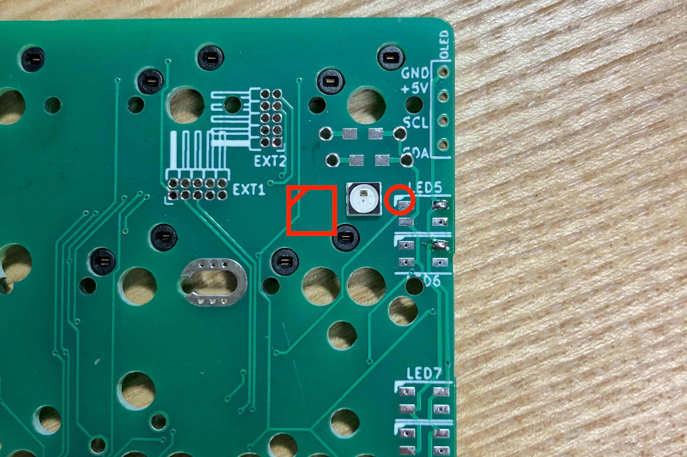
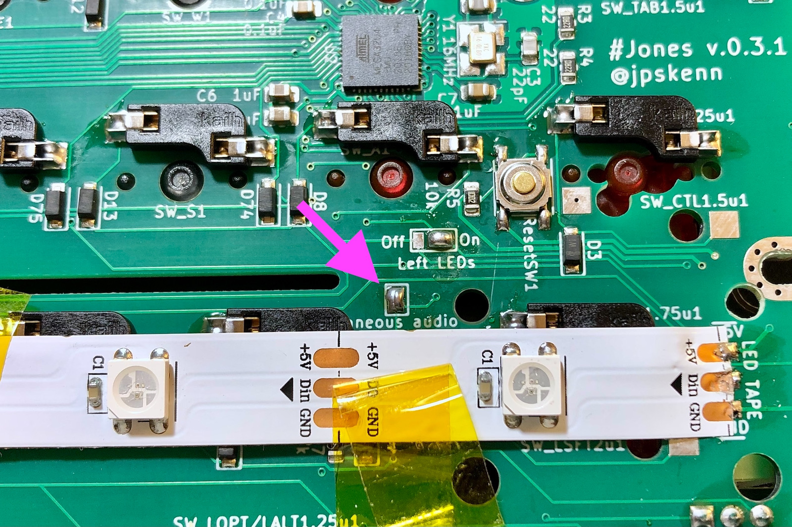
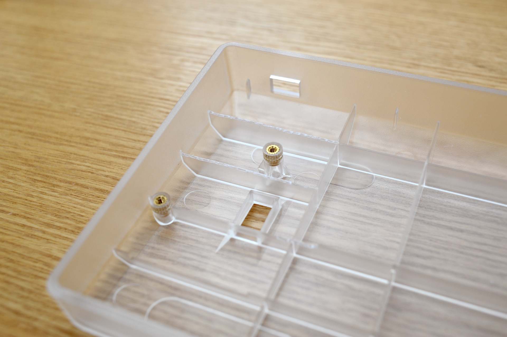
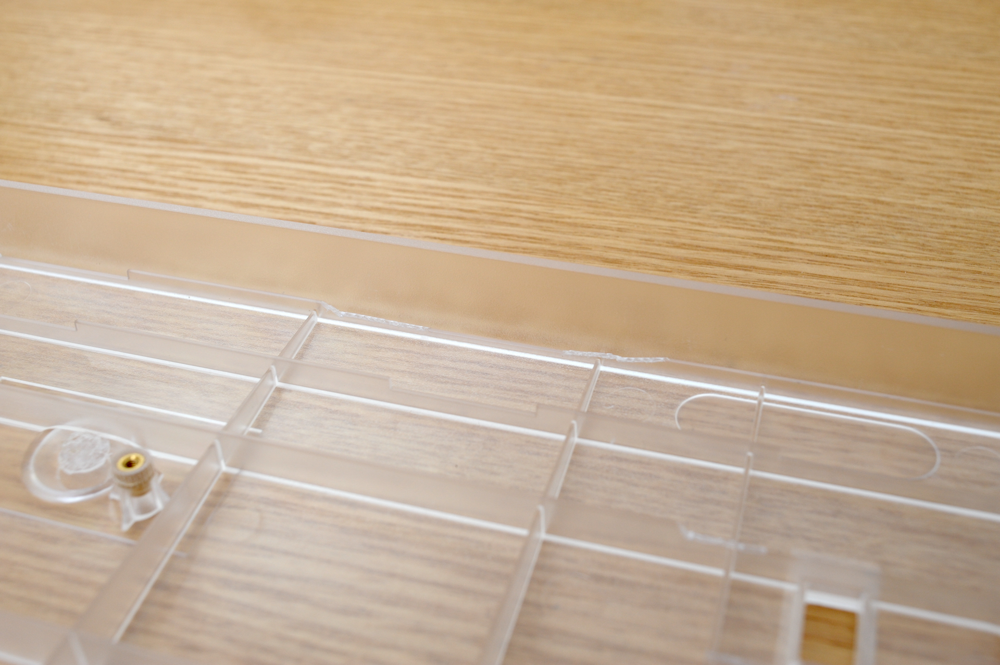

# Jones v.0.4.x ビルドガイド

購入していただいた方、リポジトリから製造していただいた方、その他の皆様、Jonesに興味を持っていただきありがとうございます。

このドキュメントは、Jones v.0.4.xを組み立てるためのビルドガイドです。  
Jonesのコンセプトや特徴などについては、[Jones README](https://github.com/jpskenn/Jones/blob/master/README.md)をご覧ください。

ビルドガイド全体に目を通して作業手順を把握しておくとミスの防止につながりますので、ぜひ、一度お読みになってから組み立て作業を始めてください。

## 注意事項、制限など

### キースイッチ取り付け時の加工

ケースのネジ穴とスイッチ足の干渉を避けるため、中央と右上のネジの上に配置されるスイッチの足を加工して取り付けてください。

- 中央ネジ穴：Gの右隣のキー
5pinスイッチの片方の足を切断。（3pinスイッチは影響なし）

- 右上ネジ穴：Narrowレイアウト2行目の、右から2個目のキー
スイッチ中央の足（出っ張り）を切断。

### キースイッチの取り付け方向

一部のキーは上下逆向きや横向きに取り付けるため、キーキャップが取り付けにくかったり、キーキャップとスイッチが干渉し打鍵感が悪くなることがあります。

### 左シフトキースタビライザー

左シフトキーの2Uスタビライザーは、ケースネジに干渉するため使用を避けてください。

### スピーカー

スピーカーは左シフトキーが1.75uまたは2uの場合にのみ、取り付けることができます。

### ケース

GH60型に対応する基板とキープレートですが、もしかしたら取り付けできないケースがあるかもしれません。  
取り付け確認済みのケースは次の通りです。

- [KBDfans TOFU 60% ALUMINUM CASE](https://kbdfans.com/products/kbdfans-tofu-60-aluminum-case)

- [KBDfans 5° FROSTED ACRYLIC CNC 60% CASE](https://kbdfans.com/products/pre-order-kbdfans5-transparent-acrylic-cnc-60-case)

- [60% プラスチックケース](https://yushakobo.jp/shop/60-plastic-case/)（簡単な加工が必要）

上記以外のケースへの取り付けの成功／失敗の報告を募集しております。

## 部品リスト

このキットを組み立てるためには、”キット内容物”に加え、”別途用意が必要な部品”が必要です。  
好みに合わせて必要な数をお買い求めください。

”オプション部品”は使いたい機能などに合わせて用意してください。  

### キット内容物
〓説明・写真更新〓
| 部品名 | 個数 | 備考 |
| ----- | :-----: | ----- |
| ご案内リーフレット | 1 | |
| Jones 基板 v.0.4.x | 1 | [おもて側 ](../assets/BuildGuide_v.0.3.1/DSC_6972.jpeg) [裏側 ](../assets/BuildGuide_v.0.3.1/DSC_6972.jpeg) |
| Jones キープレート v.4.0.x | 1 | [おもて側 ](../assets/BuildGuide_v.0.3.1/DSC_6972.jpeg) |
| Kailh MXソケット | 75(\*) |  |
| 低頭ネジ, M2 4mm | 3(\*) |  |
| 低頭ネジ, M2 5mm | 3(\*) | ^ |
| プラ板, 5mm\*40mm | 1 | ^ |
| ナット, M1.4 | 4 | ^ |

\* 予備を含む

### 別途用意が必要な部品

| 部品名 | 個数 | 備考 |
| ----- | :-----: | ----- |
| MXスイッチ | 最大 70 | 取り付け安定性が高い5pinを推奨 |
| PCBマウント スタビライザー：2Uサイズ | 2U以上のキー数 | 確実に固定できるねじ止め式を推奨 |
| キーキャップ | 必要数 | |
| ケース（GH60型） または Jones用ボトムプレートキット(\*) | 1 | |
| USBケーブル （Type-C） | 1 | |

\* Jones用ボトムプレートキットの内容物は次の通り
| 部品名 | 個数 |
| ----- | :-----: |
| ご案内リーフレット | 1 |
| Jones用ボトムプレート | 1 |
| スペーサー, M2 3mm | 8 |
| ネジ, M2 3mm | 16 |
| ゴム足 大 | 2 |
| ゴム足 小 | 6 |

### オプション部品

| 部品名 | 個数 |
| ----- | :-----: |
| LED SK6812MINI | 2 または 4 |
| ロータリーエンコーダ, ノブ（つまみ） EC11, EC12またはその互換品 | 最大 2 | ロータリーエンコーダ |
| スピーカー Murata PKMCS0909E4000-R1 | 1 | スピーカー |

## 組み立てに必要な工具

先の小さなドライバー、ピンセット、はんだ付け関連用品など、一般的な電子工作向け工具を使用します。  
[遊舎工房の工具セット](https://yushakobo.jp/shop/a9900to/)を参考に用意してください。

また、キースイッチの取り外し用の工具も用意してください。  
[TALP KEYBOARDさんで売っているこのタイプ](https://talpkeyboard.net/items/601362fe2438601925ad0692)は、1本でキースイッチとキーキャップの両方に使えるので便利です。

なお、無くても組み立てはできますが、何か不具合があった場合の原因究明のため、テスターを用意しておくと安心です。

## 組み立て前の確認

組み立てを開始する前に、同梱物と基板についての基本的な確認をおこないます。  
問題がないことを確認してから、組み立て手順を開始してください。

何か問題があった場合は作業を中止し、〓連絡先〓同梱のリーフレットに記載された連絡先へ問い合わせてください。

*組み立て手順の開始後は初期不良として対応できかねる場合がありますので、しっかりと確認してください。*

### 同梱物の確認

- 同梱物に不足がないこと

- 基板に配線が切れるような大きく深い傷や割れなどの破損がないこと

- 梱包の中に小さな部品が落ちていないこと（基板に実装された部品の剥がれ落ち）

### 接続の確認

MacやPCに接続した際に、キーボードとして認識されるかを確認します。

ファームウェアを書き込み済みですので、正常であれば、USBケーブルで接続するとキーボードとして認識されます。  
下記の方法を参考に確認してください。

#### Mac, macOS Big Sur 11.4

*充電用ではないUSBケーブル*（できれば他の機器を接続して使用した実績のあるもの）を使って、キーボードとMacをUSB接続します。

メニューバーから、``　→　`このMacについて`　→　`システムレポート…` を開いて、  
左側の`ハードウェア`から`USB`を選択し、  
右側の`USB装置ツリー`に`Jones`というデバイスが表示されていれば、正しく認識されています。

  
システムレポートの表示

#### Windows, 10 Pro 1909(18363.1082)

*充電用ではないUSBケーブル*（できれば他の機器を接続して使用した実績のあるもの）を使って、キーボードとPCをUSB接続します。

`スタートボタン`から`設定`を開いて`デバイス`を選択し、  
`マウス、キーボード、ペン`の項目に`Jones`が表示されていれば、正しく認識されています。

  
デバイスの表示

### ソケット用パッドの確認

キースイッチのソケットをはんだ付けするソケット用パッドが、電気的に正しく反応するかを確認します。

次のいずれかの方法で確認してください。
〓どっちか一方だけでもいいかも〓

#### Remapなどのツールを使った確認方法

〓書く〓

#### キー入力による確認方法

ソケット用パッドをショートして、実際に入力された結果を確認します。

〓書く〓

## 組み立て手順

以下の手順に沿って組み立ててください。

### スイッチ用ソケットの取り付け

基板裏側へソケットを取り付けます。

#### 取り付け位置の確認

使用するレイアウト（→[Keyboard Layout Editor: Jones v04_1](http://www.keyboard-layout-editor.com/#/gists/ab35444150ef1aff63ed32bbe2b9a1ef)）に合わせて、基板裏側のソケットの取り付け位置を確認します。

基板にはソケットの枠が描かれており、複数のソケットが集まっている箇所には適合キーサイズ（1uや2uなど）が表記されています。  
また、キーサイズの表記に`N`がついてものはNarrowレイアウトのみで使用するキーを意味していますので、それらの表記を参考に取り付け位置を確認します。  
わかりにくいときは、実際にスイッチやキーキャップを置いてみるとよいでしょう。
〓写真追加、サイズ表記、N表記〓

#### 予備はんだとソケットの設置

先ほど確認したソケット用パッドの*片方だけ*に予備はんだ（はんだをちょっとつけておく）します。

<!-- 〓販売版で写真更新〓 -->

ソケット用パッドへの予備はんだ

ソケットを基板に描かれた枠に合わせ、プラスチックの突起が穴にはまるように置きます。  
スイッチ中央の穴をソケットでふさがない向きが正しい方向です。  
逆にするとスイッチが取り付けられません。

<!-- 〓販売版で写真更新〓 -->

ソケットの方向

この段階では、片方の端子が予備はんだの上に乗り、ソケットが基板から少し浮いて傾いた状態です。

〓写真追加、ソケット仮置き〓

#### 予備はんだした端子のはんだ付け

はんだごてを320℃程度に設定します。

ピンセットでソケット中央のプラ部分を押さえ、端子の隙間にこて先を押し込みます。

〓写真更新、ピンセットで押さえてるのも入れる〓

金属部分へコテ先を押し込む

1、2と数えたくらいで予備はんだが溶け始めます。  
ソケットを押さえていたピンセットで軽く押し込むと、ソケットのプラスチックの突起が基板の穴にはまり、浮いていた端子が基板に接します。

端子とパッドをしっかりと加熱するため、端子が基板に接してから、1、2と数えてからこて先を離します。  
さらに1、2と数えて、はんだが固まるのを待ってから、ソケットを押さえていたピンセットを離します。

ソケットが枠に沿って取り付けられ、傾いていないことを確認します。  
傾いている場合は端子部分を再加熱し、こて先とピンセットで傾きを修正します。
〓写真追加、ソケットの傾き〓

### 残りの端子のはんだ付け

残りの端子の隙間にこて先を押し込み、1、2、3と数えて加熱します。

次の手順を、1、2、3と数える間におこないます。

1、基板のパッドと端子の隙間あたりへはんだを押しつけ、溶かしながら隙間へ流し込みます。  
2、溶けたはんだがパッド全体に広がる程度まで流し込んだら、はんだを離します。  
3、ソケットを動かしてしまわないよう、静かにこて先を離します。

はんだがパッド全体に広がり、端子の間にポコっと盛り上がって固まっていれば完了です。

<!-- 〓販売版で写真更新〓 -->

取り付けたソケット

最後に、ソケットが傾いていないことと、プラスチックの突起が基板の穴にぴったりとはまっていることを確認します。

#### すべてのソケットの取り付け

作業を繰り返して、すべてのソケットを取り付けます。

取り付けが終わったら、**はんだ付けし忘れた箇所がないか、十分に確認します**。

特に`残りの端子のはんだ付け`を忘れることがよくあります。  
キー入力できたり、できなかったり、ケースに入れたらキーが反応しなくなったりするなどの症状が出るため、この段階でよく確認しておきます。

### （オプション）インジケータLEDの取り付け

*インジケータLEDを使用しない場合、この手順は不要です。*

基板裏側でジャンパし、おもて側へLEDを取り付けます。

#### インジケータLEDの組み合わせとジャンパの設定

未使用も含めて4通りの組み合わせがあります。  

| 組み合わせ | 左側（LED1, 2） | 右側（LED3, 4） | ジャンパ Left LEDs | ジャンパ Right LEDs |
| :--: | :--: | :--: | :--: | :--: |
| A | なし | なし | 不要 または Off | 不要 または Off |
| B | あり | なし | On | 不要 または Off |
| C | なし | あり | Off | On |
| D | あり | あり | On | On |

#### ジャンパ

基板裏側のジャンパ`Right LEDs`と`Left LEDs`を、インジケータLEDの組み合わせに応じて`On`または`Off`にジャンパ（パッドにはんだをつけてつなげる）します。  
`不要 または Off`となっている箇所は、ジャンパしなくてもかまいません。

〓写真追加、基板裏面全体で、左右のパッド位置を矢印とか○で囲んだりしたもの〓

3個あるパッドのうち、中央と`On`の2個、または中央と`Off`の2個を同時に温め、  
こて先にはんだを押し付けて、少したっぷり目に溶かし、  
こて先を、基板をなでるようにスッと横へずらしてパッドから離し、2個のパッドをはんだでつなげます。

すぐにはつなげられないことが多いですが、何度かやっているとそのうちできます。  
パッドが剥がれないよう、こて先でパッドをグリグリいじりすぎないように気をつけてください。

〓写真追加、どこかをジャンパした状態〓

#### 予備はんだ

基板おもて側から、インジケータLEDの組み合わせに応じた取り付け場所を確認します。

基板の各LEDのパッドそれぞれ4箇所のうち、1箇所だけに予備はんだします。

〓写真、予備はんだ〓

<!-- 〓販売版で写真更新〓 -->

LED取り付け方向を示す縦線とLEDの方向、LED5およびLED6へ予備はんだした状態

#### LEDの仮固定

▲マークが設置方向を示す縦線〓三角？〓に合うように、LEDを基板に置きます。  

〓写真、LEDの設置方向〓

LEDは高温ではんだ付けすると壊れるため、こて先温度を220-270℃に設定します。
使用するはんだの種類や加熱時間にもよりますが、220℃では加熱不足によるはんだ不良（表面上ははんだ付けされたように見えるが、内部はしっかりとくっついていない状態）に注意してください。  
[加熱不足による、はんだ不良の例](https://twitter.com/jpskenn/status/1291328876283478016)

フラックスを予備はんだに塗っておくと、作業しやすくなります。

ピンセットでLEDをつまみ、位置がずれないように保持します。

はんだごてのこて先を、LEDの横方向からパッドとLEDの端子にあてて、予備はんだを溶かします。  
LEDが設置位置の中心に来るようにピンセットで位置を微調整し、1、2と数えてこて先を離します。  
さらに1、2と数えて、はんだが固まったらLEDをつまんでいたピンセットを離します。  

はんだが、直径1mmくらいの小さな球のようになっていれば良い仕上がりです。

LEDの取り付け位置が大きくずれていたり基板から浮いている場合は、はんだ付けした箇所を再加熱し、ピンセットで修正します。  
再加熱する際は、フラックスを塗っておくと作業がしやすくなります。

#### LEDの取り付け

次の順番で残り3箇所のパッドをはんだ付けします。

1. 予備はんだしたパッドとLEDの発光部を挟んだ反対側のパッド

1. 1の隣のパッド

1. 残ったパッド

〓写真、取り付け順序〓

フラックスを残り3箇所のパッドに塗っておくと、作業しやすくなります。

はんだをこて先にあてて溶かし、少量のはんだをコテ先につけます。  
こて先をパッドとLED側面の端子に軽く押し当てて、1、2と数えてこて先を離します。

はんだが、直径1mmくらいの小さな球のようになっていれば良い仕上がりです。

<!-- 〓販売版で写真更新〓 -->

取り付けたLED

### （オプション）スピーカーの取り付け

スピーカーを使用しない場合、この作業は不要です。

基板裏側でジャンパして、おもて側にスピーカーを取り付けます。

基板裏側のジャンパ`simultaneous audio`をジャンパすると、2音同時再生できるようになります。  
ジャンパしない場合は単音で再生されます。

  
ジャンパ箇所

  
ジャンパした状態

基板おもて側、`Speaker`のパッド2箇所のうち、1箇所だけに予備はんだしておきます。

スピーカーをパッドに合わせて置きます。  
どちらの方向に取り付けても大丈夫です。  
〓右か左か知りたい〓スピーカーの穴がキープレートの空き部分にくるような方向に取り付けると音が聞こえやすくなります。

予備はんだした箇所をはんだ付けします

スピーカーがまっすぐ取り付けられていることを確認します。

残りの1箇所をはんだ付けします。

取り付けたスピーカー

#### （オプション）ロータリーエンコーダの取り付け

ロータリーエンコーダを使用しない場合、この作業は不要です。

基板おもて面から取り付けます。

〓写真、全体で取り付け位置を示したもの〓

右下と左下のどちらか片方、または両方へ取り付けできます。

〓使用できるロータリーエンコーダの仕様とか〓

上3本のピンと下2本のピン（プッシュボタン付きの場合のみ）と、左右の固定足の位置を合わせて基板に差し込みます。  
固定足が差し込みにくいときは、横から少し押さえて差し込みます。  
固定がゆるい場合は、マスキングテープなどでしっかりと固定します。

基板裏側から、何本かあるピンのうち1本だけをはんだ付けします。

ロータリーエンコーダがまっすぐ取り付けられていることを確認します。  
傾きや浮きがある場合は、再加熱して修正します。

残りのピンをはんだ付けします。

<!-- 〓販売版で写真更新〓 -->

取り付けたロータリーエンコーダ（基板おもて側）

<!-- 〓販売版で写真更新〓 -->

取り付けたロータリーエンコーダ（基板裏側）

### スタビライザーの取り付け
基板おもて側から取り付けます。  
なお、2U幅の左シフトキー用のスタビライザーはケースネジに干渉するため、使用には工夫が必要です。

使用するレイアウトに合わせて、スタビライザーの取り付け位置を確認します。  
スタビライザーの棒が大きい穴の側にくる方向に取り付けます。

引っ掛ける部分を斜めに差し込んで引っ掛けてから、反対側の差し込み部分を押し込みます。

取り付けたスタビライザー

### キースイッチの取り付け
キープレートおもて面からスイッチを取り付けます。

使用するレイアウトに合わせ、キープレートの4隅にスイッチをはめ込みます。  
右上は枠の切れた2箇所を避け、3番目の枠へはめ込みます。  
左下、右下にロータリーエンコーダを取り付けている場合は、その隣へはめ込みます。

キープレート4隅につけたスイッチ

4個のスイッチをはめ込んだキープレートを、基板に合わせて乗せます。  
スタビライザーがキープレートの枠にはまるように、位置を調整します。

キープレートの枠にはまったスタビライザー（他のスイッチも取り付けた状態で撮影）

4隅のスイッチを基板のソケットに差し込みます。  
スイッチが奥まで差し込めていないときは、なるべくソケットの後ろ側を押さえながら、少しだけ力を入れて（※）押し込みます。  
※：洗濯バサミを開くよりもちょっと強いくらいの力

残りのスイッチを取り付けます。  
スイッチのピンを曲げないように気をつけます。

ソケットを使用しない箇所は、この時点でスイッチをはんだ付けします。

**注意：  
ネジ穴の上に位置するキーは、直接はんだ付けしてはいけません。  
ソケットを使用し、ネジ止めした後にスイッチを取り付けられるよう、ソケットを使用します。**

スイッチの足がケースネジ穴に干渉する箇所は、スイッチの足をカットして取り付けます。  
例えば、Hキーに5pinスイッチを使用する場合は、片方の足をカットします。  

また、ANSIスタイルの[キーは、中央の足（でっぱり部分）がネジに当たらないよう、1/4-1/3ほどカットします。  
押下時に軸がネジに当たる場合は、軸の下端をカットしてください。  

足をカットしたスイッチ  
  
左から順に  
- Gateron Silent Red 5pin：片方の足をカット
- Gateron Ink Black 5pin：片方の足をカット
- Kailh Pro Burgundy 3pin：無加工
- Gateron Ink Red 5pin：片方の足をカット、中央の足を1/3カット
- Gateron Silent Red 5pin：両方の足をカット、中央の足を全てカット

ほとんどのスイッチがこの加工で取り付けられるはずですが、うまく取り付けられないことも考えられます。  
以下の取り付け確認済みスイッチを参考にしてください。  

取り付け確認済みスイッチ：  
- Gateron Silent Red
- Gateron Silent White
- Gateron Ink Black
- Gateron Ink Red

### 動作確認
ケースへ取り付ける前に、キーボードをPCやMacに接続して動作確認を行います。

#### キースイッチの動作確認
確認の前に、実際のキーボードの配列と、OSが認識するキーボードの配列を合わせておきます。  
実際のキーボードの配列がANSIスタイルで、OSが日本語キーボードと認識しているような組み合わせや、この逆のような組み合わせのような場合は、意図した通りの入力結果になりません。  
OSの設定方法に従い、OSが認識するキーボードの配列を変更します。

確認は、OSのキーボードビューアや、[Keyboard Checker](https://keyboardchecker.com)、[QMK Configrator](https://config.qmk.fm/)の入力テスト機能を使用して行います。  
全てのキーで正常に入力できることを確認します。

なお、初めてJonesキーボードを使用する際はMac向けのキーマップに設定されているため、WindowsではALTキーとWindowsキーが逆に認識されます。  
Windows向けのキーマップには`Lower + Raise + W`を、Mac向けのキーマップには`Lower + Raise + M`を押して切り替えます。

また、LowerキーはOSで認識されないので、Lowerキーと組み合わせたキー、たとえば、`Lower + 1`の組み合わせで`F1`キーが入力できることを確認します。  

正常に入力できないキーがあった場合は、原因を調査し、修復します。

もっとも多い原因は、スイッチとソケットの取り付け不良です。  
スイッチを取り外し、ピンが曲がったり折れたりしていないか確認し、ペンチなどでピンの曲がりを修復するか新しいものに交換します。  
また、ソケットのはんだ忘れや、はんだ不良もよくある原因のため、ソケットのはんだを確認し、必要であれば再度はんだ付けします。  
スイッチをソケットへ確実に差し込み直して、もう一度キー入力ができることを確認します。

上記で解決できなかった場合、基板のソケット用パッド部分の2箇所をピンセットなどを使ってショートさせ、キー入力されるか確認します。  
キー入力された場合は、ソケットまたはスイッチに問題があるため、再度確認します。  
それでも改善されない場合は、スイッチとソケットを交換します。

ピンセットを使ってパッド部分をショートさせる

あまり考えられないことですが、パッドをショートしてもキー入力されない場合は、基板や部品へのダメージなどが原因と考えられます。  
これまでの軽微な作業ミスが原因だった場合とは異なり、原因箇所の特定にはテスターを使った詳しい調査が必要となり、修復の難易度も高くなることが予想されます。  
[Jones v.0.3.1 KiCadプロジェクト](https://github.com/jpskenn/Jones/tree/PCB_v.0.3.1/PCB)のPCB設計を参照し、パッド、ダイオード、MCUのピンなどの導通を確認して調査します。  
なお、基板製造上の問題を含む場合も疑われますので、[Twitter: @jpskenn](https://twitter.com/jpskenn/)へご一報いただければ、何か情報共有できるかもしれません。

#### ロータリーエンコーダの動作確認

ロータリーエンコーダのつまみを回し、OSの音声出力ボリュームが変化することを確認します。  

また、プッシュボタンスイッチ付きのロータリーエンコーダでは、プッシュするとOSの音声出力がミュート／ミュート解除されることを確認します。

デフォルトのキーマップでは、左下、右下ともに、同じ機能が割り当てられています。

動作不良の場合は、はんだ付けをやり直してください。

#### LEDの動作確認

右側2個のLEDが点灯（Mac向けのキーマップでは白色、Windows向けのキーマップでは青色）していれば正常です。

左側とLEDテープは`Lower + Raise + L`で点灯オン／オフが切り替わり、全て点灯していれば正常です。

光らない箇所がある場合は、次の法則にしたがって調査、修復します。

LEDは`左側の上から下　→　右側（2行目または3行目）の上から下　→　LEDテープ`の順に並んでおり、取り付け不良のLEDより先は光らない。  
また、取り付け不良のLEDには以下の2パターンあります。  
A. そのLED自体のはんだ不良のため光らない  
B. そのLEDから次のLEDへつながる端子だけはんだ不良のため光らない

次の例は、どちらも光るLEDは同じですが、不良箇所が異なることに注意してください。  
例1：右側の2個目がパターンAの取り付け不良だった場合、左側4個と右側の1個目だけ光り、右側2個目とLEDテープは光らない。  
例2：右側の1個目がパターンBの取り付け不良だった場合、左側4個と右側の1個目だけ光り、右側2個目とLEDテープは光らない。

以上をふまえ、  
先頭から数えて最初の光らないLEDについて、
光っていないLED自体のはんだをやり直して、点灯するかどうか確認し、  
点灯しない場合は、一つ手前のLEDのはんだをやり直して、点灯するか確認する  
という調査、修復をおこないます。

220-270℃で1、2と数える程の加熱ではそう簡単にはLEDは壊れないと考えますが、何度かはんだをやり直しても点灯しない場合は、LEDが壊れていると判断して新しいものに交換します。

主なLED関連キーは次の通りです。

    Lower + Raise + L  LED点灯のオン／オフ
    Lower + Raise + Lの右隣のキー（;）　次の点灯モードに切り替え
    Lower + Raise + P　前の点灯モードに切り替え
    Lower + Raise + I　LEDの輝度増加
    Lower + Raise + K　LEDの輝度低下

#### スピーカーの動作確認
キーボードとPCやMacを接続した際、♪ピロリロという音が鳴っていれば確認OKです。

音が鳴らない場合は、スピーカーのはんだ付けをやり直します。

主なスピーカー関連キーは次の通りです。

    Lower + Raise + A　スピーカーのオン／オフ切り替え
    Lower + Raise + S　タイプ音のオン／オフ切り替え
    Lower + Raise + A　ミュージックモードのオン／オフ切り替え

### （該当者のみ）60% プラスチックケースの加工

60% プラスチックケースへ取り付ける際は、ネジ穴と同じ高さのケース内リブが基板上の部品と干渉するため、以下の加工を行います。

#### 干渉箇所のカット
カットする箇所を確認します。  
次の場所の、ケースネジ穴と同じ高さになっているリブです。  
- 左の上側ネジの上下。
- 右の上側ネジの上下。
- ケース一番下の長いリブのうち、ソケットに当たる部分。  
（スイッチが上下逆向きになって、ソケットが下側に来ている箇所）

カット箇所

カット例、左の上側ネジの上下

カット例、一番下の長いリブ

写真で示した部分を、ニッパーやカッターなどを使ってカットします。  
ニッパー使用時は、1-2mmくらいずつ切り進んでいきます。  
それ以上の長さをカットすると、意図しないところまで割れてしまうことがあります。

### ケースへの取り付け

取り付け前に、Hキーなどのネジ穴にかぶさるスイッチを外しておきます。

基板の奥側（USBコネクタ側）からケース内へ入れていきます。  
ケースに対して基板を30度くらいの角度で差し込むと、USBコネクタがケースの穴にスッとはまります。  
その状態で基板の手前側をおろして水平にすると、力をかけることなく、基板全体がストンとケースに入ります。  
力を入れてグリグリとこじったり、ググググッと押し込むようなことはせず、角度を合わせて差し込むだけです。

30度で差し込む

ケースネジ穴と基板のネジ穴の位置を合わせ、ネジで仮止めします。  

基板が上下左右の真ん中になるように位置を調整します。

左の上側のネジを固定してから、残りのネジを固定します。  
スイッチがかぶさる箇所は低頭ネジを使用します。  
なお、左右の4箇所だけネジ止めして、中央と中央下をネジ止めせずに使用しても特に問題ありません。

取り外してしていたスイッチを取り付けます。

### 仕上げ

PCやMacに接続し、各部の動作を簡単に確認しておきます。

ケース底面に滑り止めのクッションパッドを貼り付けます。  
60% プラスチックケースに付属するパッドが貼り付け部分よりも大きいときは、ハサミなどでカットして貼り付けます。

ロータリーエンコーダのノブを取り付けます。

キーキャップを取り付けます。

完成です。

写真を撮影し、`#Jones_kbd` のタグをつけてツイートすると設計者が喜んだりします。  
[Twitter: #Jones_kbd](https://twitter.com/search?q=%23Jones_kbd)

### 参考：基板のフレックス加工

基板から中央とスペースキー右側にあるネジ穴を切り取り、基板の左右だけでケースに固定することで基板を適度にしならせ、柔らかい打鍵感を得られる加工をおこなうことができます。  

打鍵感の好みは各個人で異なるため、一度組み立てて使ってみて、後から加工することもできます。  

なお、**この加工による基板の破損や、ケースへの取り付け不良が発生することが考えられるため、サポート外とします**。加工者の責任で作業をおこなってください。  
（KBDfans 5° FROSTED ACRYLIC CNC 60% CASEでは、特に問題なく快適に使用できています。）

加工箇所を確認します。  
加工すると正方向の`SW_ROPT/KANA1.25u` *`1`* のソケットは使えなくなるため、逆方向の`SW_ROPT/KANA1.25u` *`2`* のソケットを使用してください。（スイッチの位置は同じです）

  
基板裏側から見た加工箇所

ニッパーなどを使い、基板裏面に描かれた点線で切り離します。  
まわりの部品を傷つけないように気をつけながら、一度にカットせず、少しずつ切り進めていきます。

  
切り取ったネジ穴

### 参考：USBコネクタ接続図

USBコネクタ接続図