# Jones v.1 ビルドガイド

購入していただいた方、リポジトリから製造していただいた方、その他の皆様、Jonesに興味を持っていただきありがとうございます。

このドキュメントは、Jones v.1を組み立てるためのビルドガイドです。  
Jonesのコンセプトや特徴などについては、[Jones README](https://github.com/jpskenn/Jones/blob/master/README.md)をご覧ください。

ビルドガイド全体に目を通して作業手順を把握しておくとミスの防止につながりますので、ぜひ、一度お読みになってから組み立て作業を始めてください。

オプションのインジケータLEDの取り付け作業を除き、基本的な作業の難易度はそれほど高くありません。  
組み立て手順には要点だけが書いていますが、組み立て初心者の方や、しっかりと確認しながら組み立てたい方は、

<details>
<summary>《詳しい手順》</summary>

ここに詳しい手順が書かれています。
</details>

と書かれたところをクリックすると、追加の説明が表示されます。

---

## 目次

<!-- @import "[TOC]" {cmd="toc" depthFrom=2 depthTo=3 orderedList=false} -->

<!-- code_chunk_output -->

- [目次](#目次)
- [Jones v.1の機能](#jones-v1の機能)
- [注意事項、制限など](#注意事項-制限など)
- [部品リスト](#部品リスト)
  - [キット内容物](#キット内容物)
  - [別途用意が必要な部品](#別途用意が必要な部品)
  - [オプション部品](#オプション部品)
- [組み立てに必要な工具](#組み立てに必要な工具)
- [組み立て前の確認](#組み立て前の確認)
  - [同梱物の確認](#同梱物の確認)
  - [接続の確認](#接続の確認)
  - [ソケット用パッドの確認](#ソケット用パッドの確認)
- [組み立て手順](#組み立て手順)
  - [作りたいレイアウトを決める](#作りたいレイアウトを決める)
  - [スイッチ用ソケットの取り付け](#スイッチ用ソケットの取り付け)
  - [（オプション）インジケータLEDの取り付け](#オプションインジケータledの取り付け)
  - [（オプション）スピーカーの取り付け](#オプションスピーカーの取り付け)
  - [（オプション）ロータリーエンコーダの取り付け](#オプションロータリーエンコーダの取り付け)
  - [スタビライザーの取り付け](#スタビライザーの取り付け)
  - [スイッチの取り付け](#スイッチの取り付け)
  - [ケースへの取り付け](#ケースへの取り付け)
  - [仕上げ](#仕上げ)
- [参考](#参考)
  - [1個のスピーカーで2音同時再生する](#1個のスピーカーで2音同時再生する)
  - [打鍵感向上：ケースへの基板取り付け方法](#打鍵感向上ケースへの基板取り付け方法)
  - [打鍵感向上：ケース内部の制振と静音化](#打鍵感向上ケース内部の制振と静音化)
  - [打鍵感向上：キープレートと基板間のパテ埋め](#打鍵感向上キープレートと基板間のパテ埋め)
  - [USBコネクタ接続図](#usbコネクタ接続図)
  - [正常に入力できないスイッチの原因調査](#正常に入力できないスイッチの原因調査)
  - [LEDの取り付け不良調査](#ledの取り付け不良調査)
  - [ファームウェアの書き込み方法](#ファームウェアの書き込み方法)
  - [EEPROMを消去して、初期状態に戻す方法](#eepromを消去して-初期状態に戻す方法)
  - [アンダーグロー用LEDテープの使用](#アンダーグロー用ledテープの使用)

<!-- /code_chunk_output -->

## Jones v.1の機能

- 主要な部品を実装済み  
  はんだ付けが必要な部品は、MXソケットとオプションパーツのみ。

- 対応レイアウト
  [Keyboard Layout Editor: Jones v04_1](http://www.keyboard-layout-editor.com/#/gists/5c8ac0bbee831ac1463e579fabf9d351)

- ファームウェア  
  RemapやVIAなどのキーマップ書き換えツールに対応したファームウェアを書き込み済み  
  [develop_jones](https://github.com/jpskenn/qmk_firmware/tree/develop_Jones/keyboards/jones/v1)  

- 外部EEPROM（8KB）を搭載  
  書き込み済みのファームウェアで利用可能

- ケース
  - GH60型やPoker型に互換性のあるケース
  - Jones用ボトムプレートキット

- レイヤーインジケータLED（オプション）

- ロータリーエンコーダ（オプション）

- スピーカー（オプション）

## 注意事項、制限など

- キースイッチ取り付け時の加工

  GH60型, Poker型ケースを使用する場合、ケースのネジ穴とスイッチ足の干渉を避けるため、スイッチの足を加工して取り付けます。

  - 中央ネジ穴に重なるスイッチ
  - 右上ネジ穴に重なるスイッチ（Narrowレイアウトを使用する場合のみ）

- キースイッチの取り付け方向

  一部のキーは上下逆向きや横向きに取り付けるため、キーキャップが取り付けにくかったり、キーキャップとスイッチが干渉し打鍵感が悪くなることがあります。

- 左シフトキー

  左シフトキーの2Uスタビライザーは、ケースネジに干渉するため使用を避けてください。

- スピーカー

  スピーカーは、左シフトキーが1.75uまたは2uの場合にのみ取り付けることができます。

- ケースネジ

  中央下のネジはキースイッチやスタビライザーと干渉するため、ねじ止めせずに使用します。

- ケース

  GH60型, Poker型に対応する基板とキープレートですが、もしかしたら取り付けできないケースがあるかもしれません。  
  取り付け確認済みのケースは次の通りです。  
  （これら以外のケースへの取り付けの成功／失敗の報告を募集しております。）
  - [KBDfans TOFU 60% ALUMINUM CASE](https://kbdfans.com/products/kbdfans-tofu-60-aluminum-case)
  - [KBDfans 5° FROSTED ACRYLIC CNC 60% CASE](https://kbdfans.com/products/pre-order-kbdfans5-transparent-acrylic-cnc-60-case)
  - [60% プラスチックケース](https://yushakobo.jp/shop/60-plastic-case/)（簡単な加工が必要）

## 部品リスト

このキットを組み立てるためには、”キット内容物”に加え、”別途用意が必要な部品”が必要です。  
好みに合わせて必要な数をお買い求めください。

”オプション部品”は使いたい機能などに合わせて用意してください。  

部品の購入先は、Self-Made Keyboards in Japanの[ショップリスト](https://scrapbox.io/self-made-kbds-ja/ショップリスト)などを参考にしてください。

### キット内容物

| 部品名 | 個数 | 備考 |
| ----- | :-----: | ----- |
| ご案内リーフレット | 1 | |
| Jones 基板 v.0.4.1 | 1 | [おもて側<br>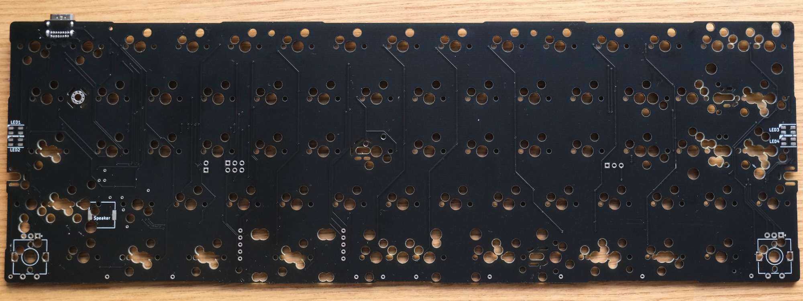](../assets/BuildGuide_v.0.4/_DSF0124.jpeg)<br>[裏側<br>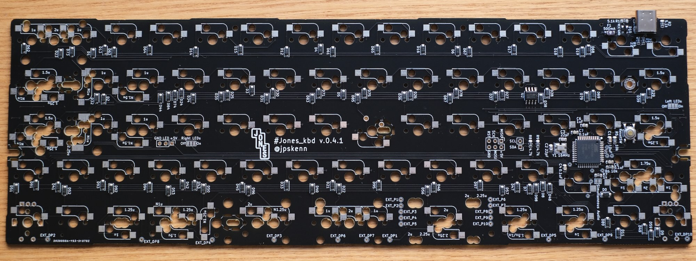](../assets/BuildGuide_v.0.4/_DSF0120.jpeg) |
| Jones キープレート v.4.0.2 | 1 | [おもて側<br>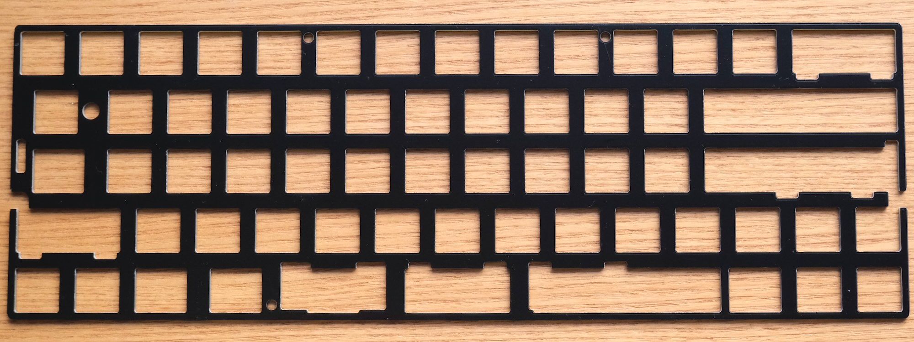](../assets/BuildGuide_v.0.4/_DSF0131.jpeg)<br>[裏側<br>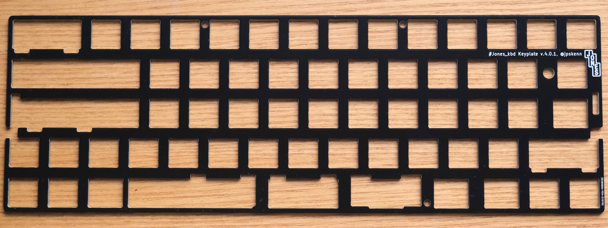](../assets/BuildGuide_v.0.4/_DSF0132.jpeg) |
| Kailh MXソケット | 75(予備含む) | [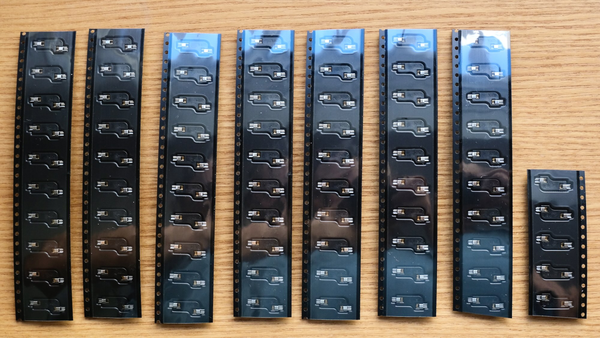](../assets/BuildGuide_v.0.4/_DSF0133.jpeg) |
| PCBマウント スタビライザー<br>2uサイズ, ねじ止め式 | 2 | [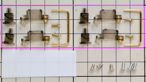](../assets/BuildGuide_v.0.4/_DSF0432_0.jpeg)<br>2.25uのキーにも使用できます。 |
| 低頭ネジ, M2 4mm | 3(予備含む) | [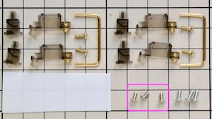](../assets/BuildGuide_v.0.4/_DSF0432_1.jpeg) |
| 低頭ネジ, M2 5mm | 3(予備含む) | [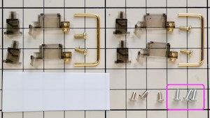](../assets/BuildGuide_v.0.4/_DSF0432_2.jpeg) |
| プラ板 | 1 | [](../assets/BuildGuide_v.0.4/_DSF0432_3.jpeg) <br>LEDインジケータ取り付け時のみ使用。|

※出荷時期によってメーカーや品番、色などが変わることがあります

### 別途用意が必要な部品

| 部品名 | 個数 | 備考 |
| ----- | :-----: | ----- |
| MXスイッチ | 最大 70 | 取り付け安定性が高い5pinタイプを推奨。<br>スイッチの端子折れや故障した場合に備えて、いくつか予備があると安心。 |
| キーキャップ<br>MXスイッチ用 | 必要数 | Wide, Normalレイアウトは、一般的な日本語108または英語104のキーキャップセットに対応。<br>Narrowレイアウトはカスタムキーキャップセットが必要。|
| PCBマウント スタビライザー<br>2uサイズ | 必要数 | キット付属の2個では足りない場合に必要。<br>確実に固定できるねじ止め式を推奨。<br>2.25uのキーにも使用できます。 |
| GH60型, Poker型ケース<br>または<br>Jones用ボトムプレートキット(\*) | 1 | |
| USBケーブル （Type-C） | 1 | |

\* Jones用ボトムプレートキットの内容物は次の通り
| 部品名 | 個数 | 備考 |
| ----- | :-----: | ----- |
| ご案内リーフレット | 1 ||
| Jones用ボトムプレート | 1 | [おもて側<br>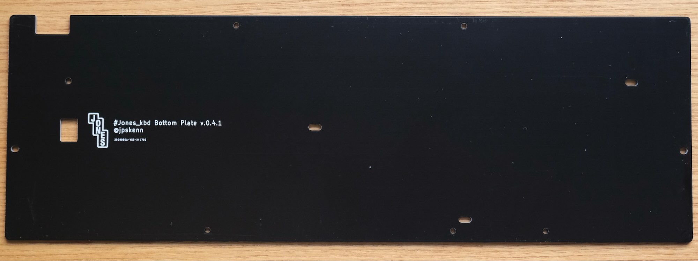](../assets/BuildGuide_v.0.4/_DSF0127.jpeg)<br>[裏側<br>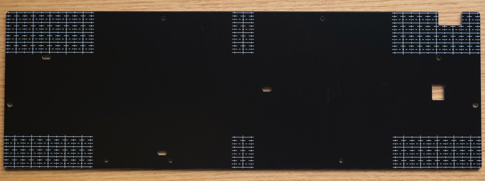](../assets/BuildGuide_v.0.4/_DSF0129.jpeg) |
| スペーサー, M2 3mm | 8 | [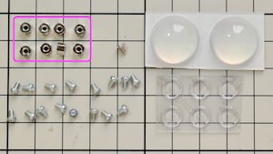](../assets/BuildGuide_v.0.4/_DSF0435_0.jpeg) |
| ネジ, M2 3mm | 16 | [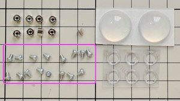](../assets/BuildGuide_v.0.4/_DSF0435_1.jpeg) |
| ネジ, M2 3mm, 低頭 | 1 | [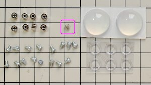](../assets/BuildGuide_v.0.4/_DSF0435_2.jpeg) |
| ゴム足 大 | 2 | [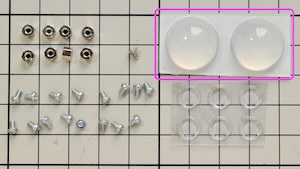](../assets/BuildGuide_v.0.4/_DSF0435_3.jpeg) |
| ゴム足 小 | 6 | [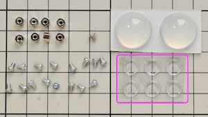](../assets/BuildGuide_v.0.4/_DSF0435_4.jpeg) |

※出荷時期によってメーカーや品番、色などが変わることがあります

### オプション部品

| 部品名 | 個数 | 備考 |
| ----- | :-----: | ----- |
| LED<br>SK6812MINI | 最大 4 | 左側2個、右側2個、または左右両側4個。 |
| ロータリーエンコーダ<br>ALPS EC11, ALPS EC12またはその互換品 | 最大 2 | 左側1個、右側1個、または左右両側2個。 |
| ロータリーエンコーダ用ノブ（つまみ）| 最大 2 | ロータリーエンコーダの軸の形状に合ったもの。 |
| スピーカー<br>Murata PKMCS0909E4000-R1 | 1 | |

## 組み立てに必要な工具

先の小さなドライバー、ピンセット、はんだ付け関連用品など、一般的な電子工作向け工具を使用します。  
[遊舎工房の工具セット](https://yushakobo.jp/shop/a9900to/)を参考に用意してください。

また、キースイッチの取り外し用の工具も用意してください。  
[TALP KEYBOARDで売っているこのタイプ](https://talpkeyboard.net/items/601362fe2438601925ad0692)は、1本でキースイッチとキーキャップの両方に使えるので便利です。

なお、無くても組み立てはできますが、何か不具合があった場合の原因調査ではテスターが必要になることがあります。

## 組み立て前の確認

組み立てを開始する前に、同梱物と基板についての基本的な確認をおこないます。  
何か問題があった場合は作業を中止し、キット同梱のリーフレットに記載された連絡先へ問い合わせてください。

*組み立て手順の開始後は初期不良として対応できかねる場合がありますので、しっかりと確認してください。*

### 同梱物の確認

- 同梱物に不足がないこと

- 基板に配線が切れるような大きく深い傷や割れなどの破損がないこと

- 梱包の中に小さな部品が落ちていないこと（＝基板に実装された部品が外れていないこと）

### 接続の確認

MacやPCに接続した際に、キーボードとして認識されるかを確認します。

ファームウェアを書き込み済みですので、正常であれば、USBケーブルで接続するとキーボードとして認識されます。  
下記のOS別の確認方法を参考に、確認してください。

<details>
<summary>《Mac, macOS Big Sur 11.4》</summary>

*充電用ではないUSBケーブル（できれば他の機器を接続して使用した実績のあるもの）*を使って、キーボードとMacをUSB接続します。

`キーボード設定アシスタント`が表示されることがありますが、この段階ではキーを押すことができないため、そのまま放っておくか、閉じるボタンで閉じておきます。  
後で`キーボード設定アシスタント`を使いたくなったときは、`システム環境設定` → `キーボード`と進み、`キーボード`タブ内の`キーボードの種類を変更…`ボタンで呼び出すことができます。

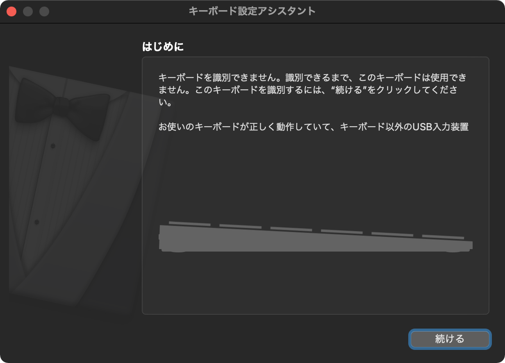  
キーボード設定アシスタント

メニューバーから、``　→　`このMacについて`を選び、表示された画面で`システムレポート…`をクリックします。  
システム情報が表示されたら、左側の`ハードウェア`から`USB`を選択します。

右側の`USB装置ツリー`のどこかに`Jones`というデバイスが表示されていれば、正しく認識されています。  
`USB装置ツリー`の下の方が見切れている場合があるため、スクロールして確認してください。

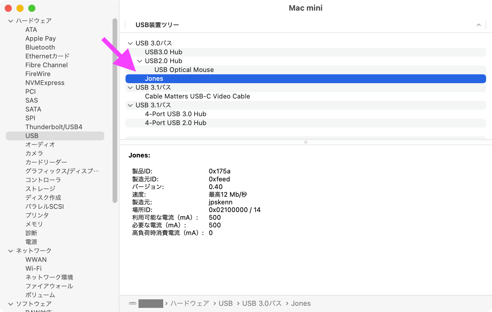  
システム情報の表示
</details>

<details>
<summary>《Windows, 10 Pro 1909(18363.1082)》</summary>

*充電用ではないUSBケーブル（できれば他の機器を接続して使用した実績のあるもの）*を使って、キーボードとPCをUSB接続します。

`スタートボタン`から`設定`を開いて`デバイス`を選択し、  
`マウス、キーボード、ペン`の項目に`Jones`が表示されていれば、正しく認識されています。

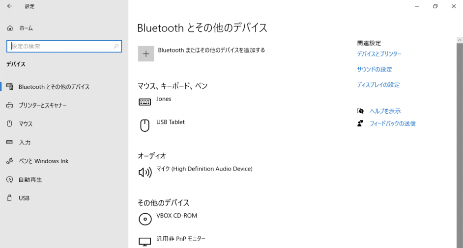  
デバイスの表示
</details>

### ソケット用パッドの確認

キースイッチのソケットをはんだ付けするソケット用パッド（ソケットをはんだ付けする基板上の金属部分）が、電気的に正しく反応することを確認します。  

<details>
<summary>《詳しい手順》</summary>

レイアウトを画面に表示させて確認できるのでキーマップ書き換えツール[Remap](https://remap-keys.app/)のテスト機能を使う方法がおすすめです。  

その他の方法として、OSのキーボードビューアや[Keyboard Checker](https://keyboardchecker.com)、[QMK Configrator](https://config.qmk.fm/)のキーボード入力テストを使用して確認することもできます。  
〓JSONリンク変更
VIAを使用する際は、[この定義ファイル（jones_v04_1_VIA_definition.json）](https://gist.github.com/jpskenn/db13901f72a58f6757ae0baf57bfa7ee)を読み込ませてください。

ここでは、キーマップ書き換えツール[Remap](https://remap-keys.app/)のテスト機能を使い、確認を行います。

基板の裏面が上側になるように置き、PCやMacとUSBケーブルで接続します。

Google Chromeブラウザ（Web HID対応のバージョン89以降）で、[Remap](https://remap-keys.app/)を開きます。

`START REMAP FOR YOUR KEYBOARD`をクリックしてキーボード接続画面に進みます。


`+ KEYBOARD`をクリックしてデバイスへの接続要求画面を開きます。

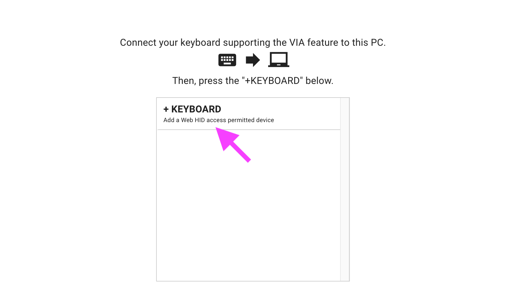

デバイスへの接続要求画面で`Jones`を選択して`接続`をクリックすると、画面にキーボードのレイアウトが表示されます。

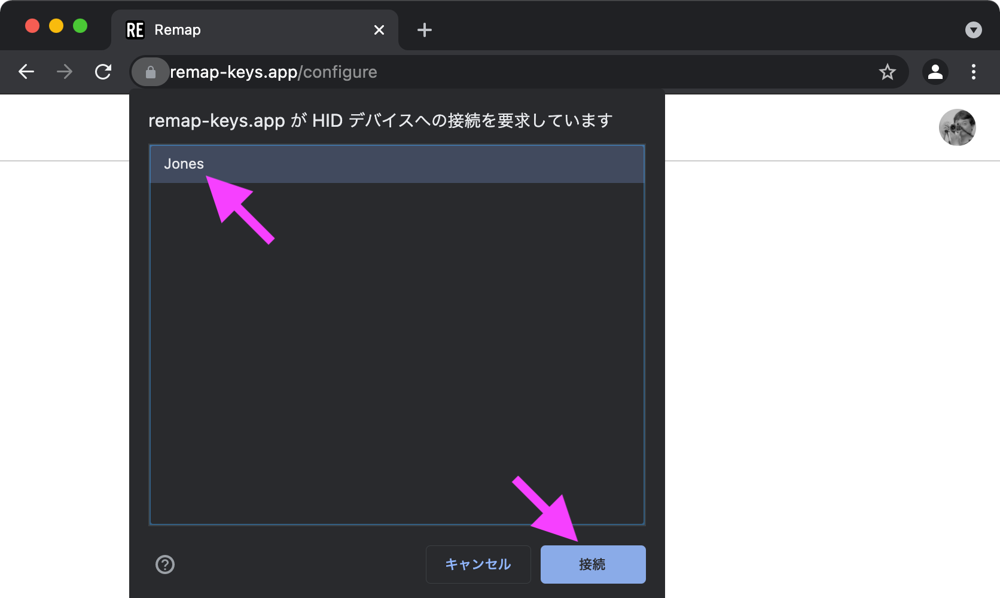

レイアウト右側の`Layout Option`で、組み立てようとしているレイアウトに設定します。  
キーマップは組み立て完了後に変更するため、ここではレイアウトだけ設定して先へ進みます。

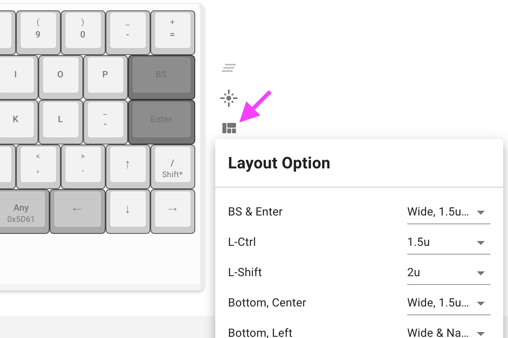

レイアウト右側の`…`をクリックし、`Test Matrix mode`を選択します。

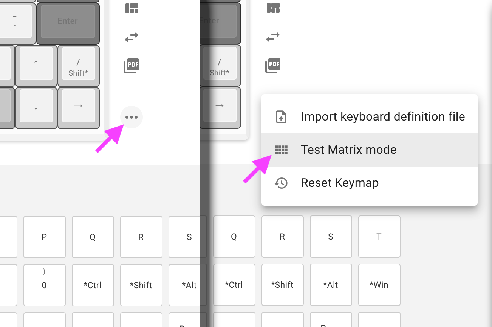

ピンセットなどの電気を通すものを使い、基板裏面のソケット用パッドをショートさせます。

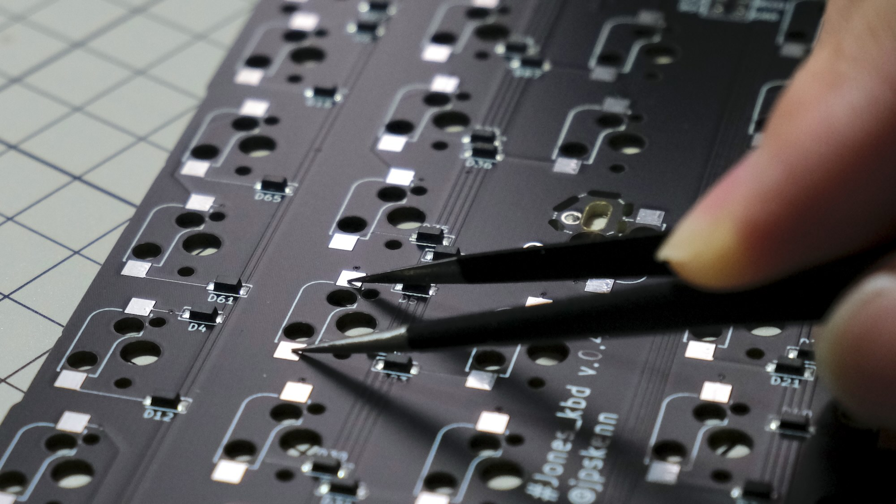
ピンセットを使ってパッド部分をショートさせる様子

Remapの画面で、ショートさせたパッドに対応するキーの色が変わることを確認します。  

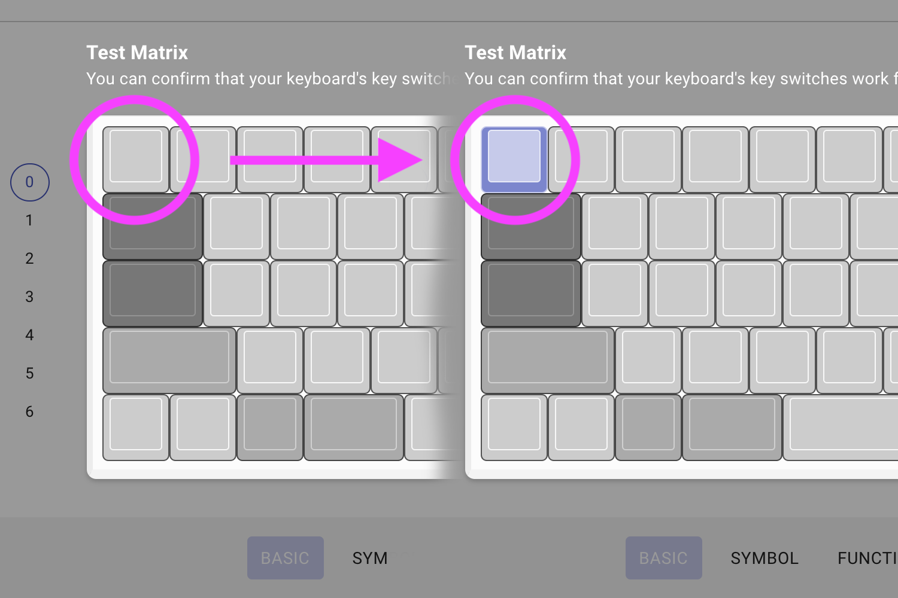

ソケット用パッドを順にショートさせ、全てのキーの色が変わることを確認します。  
なお、ロータリーエンコーダの回転に割り当てた箇所は、この手順では確認しません。
</details>

余裕があれば、すべてのレイアウトでも同様に確認します。

確認が終わったら、USBケーブルを抜きます。

## 組み立て手順

以下の手順に沿って組み立ててください。  
工具類や部品による怪我や、はんだ作業での火傷などに気をつけてください。

### 作りたいレイアウトを決める

Jonesのレイアウトは、大きく分けて次の3つから選ぶことができます。  

- Wide（ワイド）レイアウト

  右手ホームポジションを右側へずらしてModキーに近づけ、キーボード中央に2キー分の間隔をもたせたレイアウトです。  

- Narrow（ナロー）レイアウト

  右側Modキーをキーボード中央側へずらし、ホームポジションに近づけたレイアウトです。  

- Normal（ノーマル）レイアウト

  一般的な英語配列や日本語配列とほぼ同じになるように調整したレイアウトです。

Wide, Normalレイアウトは、一般的な日本語108または英語104のキーキャップセットで組み立てられます。  
Narrowレイアウトの組み立てには、カスタムキーキャップセットが必要です。  

レイアウトをまとめた[Keyboard Layout Editor: Jones v04_1](http://www.keyboard-layout-editor.com/#/gists/5c8ac0bbee831ac1463e579fabf9d351)を参考に、どのレイアウトを作るか決めてください。  

### スイッチ用ソケットの取り付け

基板裏側へソケットを取り付けます。

#### 取り付け位置の確認

使用するレイアウトに合わせて、基板裏側のソケットの取り付け位置を確認します。  

**v.0.4.1の基板において、左Ctrlのサイズ表記に間違いがあります。  
正しくは、上が1.25u、下が1.5uです。**
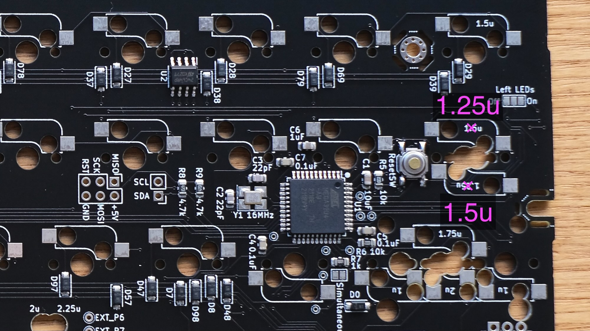

<details>
<summary>《詳しい手順》</summary>

基板にはソケットの枠が描かれており、1uよりも大きなキーと、ソケットが重なる箇所に適合キーサイズ（1uや2uなど）が表記されています。  
また、キーサイズの表記に`N`がついてものはNarrowレイアウトのみで使用するキーを意味していますので、それらの表記を参考に取り付け位置を確認します。  
わかりにくいときは、実際にスイッチやキーキャップを置いてみるとよいでしょう。  

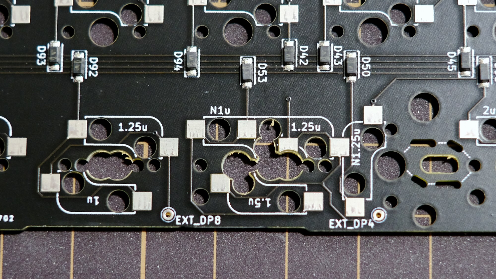
ソケット取り付け位置の表記
</details>

#### ソケット用パッドの予備はんだ

先ほど確認したソケット用パッドの*片方だけ*に、予備はんだ（はんだをちょっとつけておく）します。

<details>
<summary>《詳しい手順》</summary>

はんだごてを320℃程度に設定します。

利き手にはんだごて、もう一方の手にはんだを持ちます。

パッドにこて先をあてて、1、2と数えて加熱します。

こて先にはんだをあてて溶かし、  
溶けたはんだがパッド全体に広がったらはんだを離し、  
続いてこて先をパッドから離します。
</details>

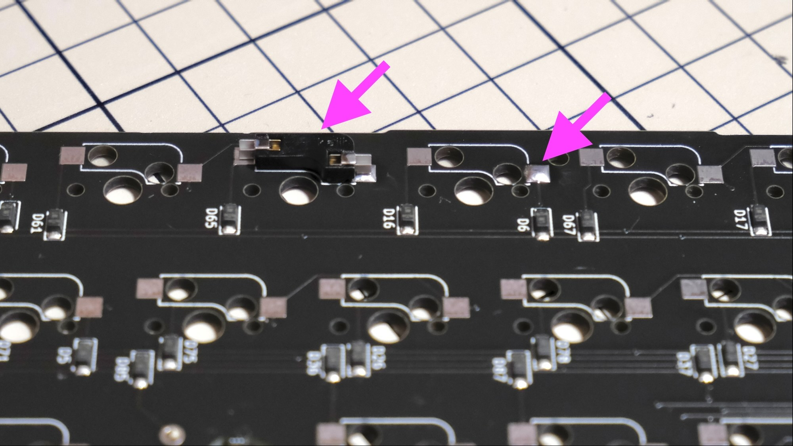
左：仮置きしたソケット  
右：ソケット用パッドへの予備はんだ  

#### ソケットの仮置き

ソケットを基板に描かれた枠に合わせ、プラスチックの突起が穴にはまるように仮置きします。

この段階では、ソケットの片方の端子が予備はんだの上に乗り、基板から少し浮いて傾いた状態になります。

*基板の製造ロットによっては、一部の穴が小さい（狭い）ことがあります。*  
*プラスチックの突起を穴に合わせ、ソケットを指で押してはめ込んでください。*

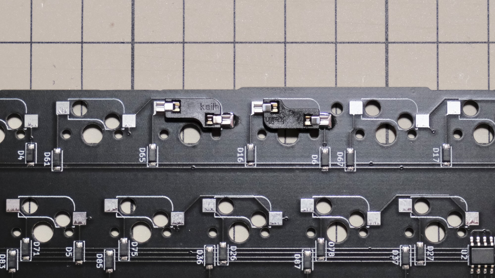
左：正しいソケットの方向  
右：間違い（スイッチ中央の穴をふさいでいる）

#### 予備はんだした端子のはんだ付け

予備はんだした端子をはんだ付けします。

<details>
<summary>《詳しい手順》</summary>

はんだごてを320℃程度に設定します。

利き手にはんだごて、もう一方の手にピンセットを持ちます。

ピンセットでソケット中央のプラ部分を押さえ、端子の隙間にこて先を押し込みます。

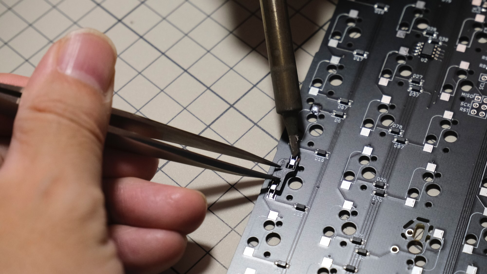
金属部分へコテ先を押し込む

1、2と数えたくらいで予備はんだが溶け始めます。  
ソケットを押さえていたピンセットを軽く押し込むと、ソケットのプラスチックの突起が基板の穴にはまり、浮いていた端子が基板に接します。

端子とパッドをしっかりと加熱するため、端子が基板に接してから、1、2と数えてこて先を離します。  
さらに1、2と数えて、はんだが冷えて固まるのを待ってから、ソケットを押さえていたピンセットを離します。
</details>

ソケットが枠に沿ってまっすぐに取り付けられ、傾いていないことを確認します。  
傾いている場合は端子部分を再加熱し、こて先とピンセットで傾きを修正します。

#### 残りの端子のはんだ付け

残りのもう一方の端子をはんだ付けします。

<details>
<summary>《詳しい手順》</summary>

利き手にはんだごて、もう一方の手にはんだを持ちます。

残りの端子の隙間にこて先を押し込み、1、2と数えて加熱します。

次の手順を、1、2、3、4と数える間におこないます。

1、基板のパッドと端子の隙間あたりへはんだを押しつけます。
2、はんだを溶かしながら隙間へ流し込みます。  
3、溶けたはんだがパッド全体に広がる程度まで流し込んだら、はんだを離します。  
4、ソケットを動かしてしまわないよう、静かにこて先を離します。

はんだがパッド全体に広がり、端子の間にポコっと盛り上がって固まっているのが良好な状態です。
</details>

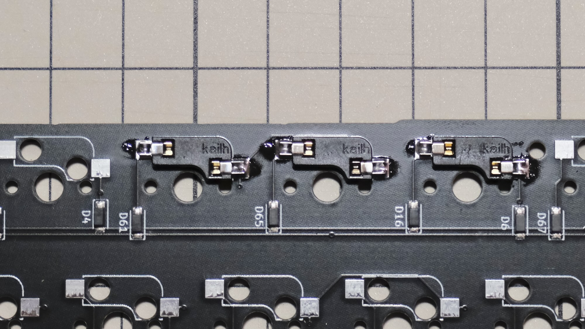
取り付けたソケット

ソケットが枠に沿ってまっすぐに取り付けられていることを確認します。  
また、ソケットのプラスチックの突起が基板の穴にぴったりとはまり、基板から浮いていないことを確認します。  

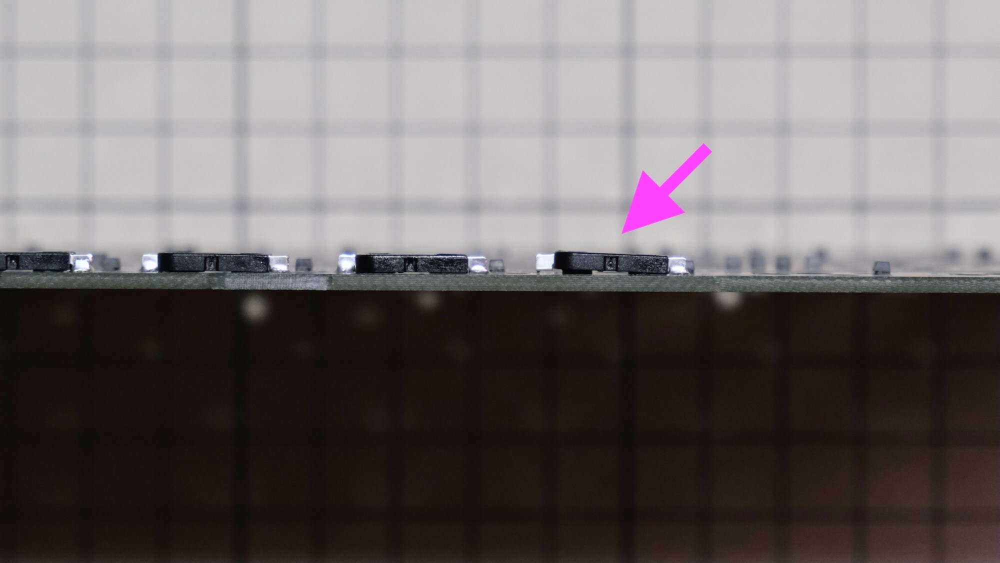
右端：基板から浮いているソケット

#### すべてのソケットの取り付け

作業を繰り返して、すべてのソケットを取り付けます。

取り付けが終わったら、**はんだ付けし忘れた箇所がないか、十分に確認します**。

特に”残りの端子のはんだ付け”を忘れることがよくあるため、この段階でよく確認しておきます。

### （オプション）インジケータLEDの取り付け

*インジケータLEDを使用しない場合、この手順は不要です。*

#### インジケータLEDの組み合わせとジャンパの設定

LED未使用も含め、4通りの組み合わせがあります。  

| 組み合わせ | 左側<br>LED1, 2 | 右側<br>LED3, 4 | ジャンパ<br>Left LEDs | ジャンパ<br>Right LEDs |
| :--: | :--: | :--: | :--: | :--: |
| LED未使用 | なし | なし | 不要 または Off | 不要 または Off |
| 左側のみ | あり | なし | On | 不要 または Off |
| 右側のみ | なし | あり | Off | On |
| 左右両方 | あり | あり | On | On |

#### ジャンパをおこなう

基板裏側のジャンパ`Right LEDs`と`Left LEDs`を、インジケータLEDの組み合わせに応じて`On`または`Off`にジャンパ（隣同士のパッドにはんだをつけてつなげる）します。  
`不要 または Off`となっている箇所は、ジャンパしなくてもかまいません。

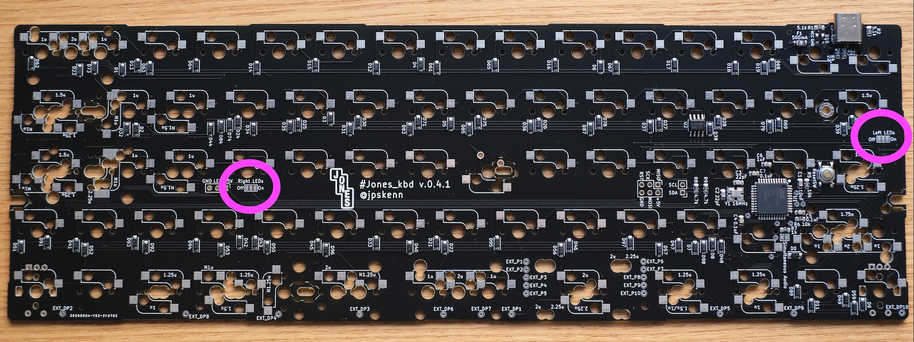
LEDジャンパ箇所

<details>
<summary>《詳しい手順》</summary>

3個あるパッドのうち、中央と`On`の2個、または中央と`Off`の2個を同時に温め、  
こて先にはんだを押し付けて、たっぷり目に溶かし、  
こて先を、基板をなでるようにスッと横へずらしてパッドから離し、2個のパッドをはんだでつなげます。

最初のうちはうまくつなげられないことが多いですが、はんだをチョンチョンとつけたりしていると、そのうちつながります。  
はんだをつけすぎて、3個あるパッドがすべてつながってしまわないように気をつけてください。
また、パッドをこて先でグリグリいじりすぎると基板から剥がてしまうため、こて先はパッドにそっと乗せて温めて、スッと横へずらすだけにしてください。
</details>

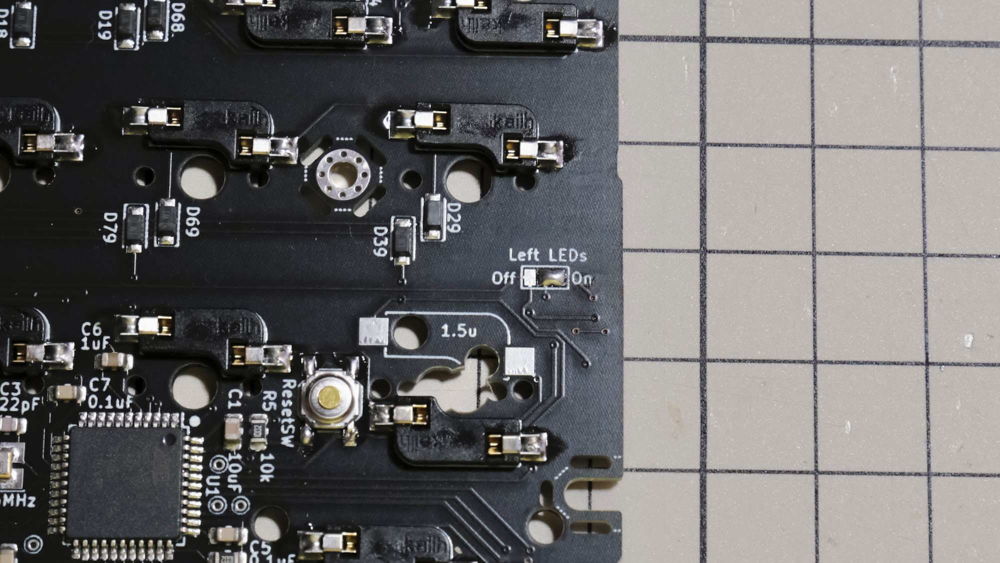
Left LEDsをOnにジャンパした例

#### LED用パッドの予備はんだ

基板おもて側から、インジケータLEDの組み合わせに応じたLEDの取り付け場所へ予備はんだします。

<details>
<summary>《詳しい手順》</summary>

LED1個につき4箇所のパッドがあり、そのうち*1箇所だけ*に予備はんだします。  
スイッチソケット用のパッドに比べてLEDのパッドはとても小さいため、はんだをつけすぎないようにします。
</details>

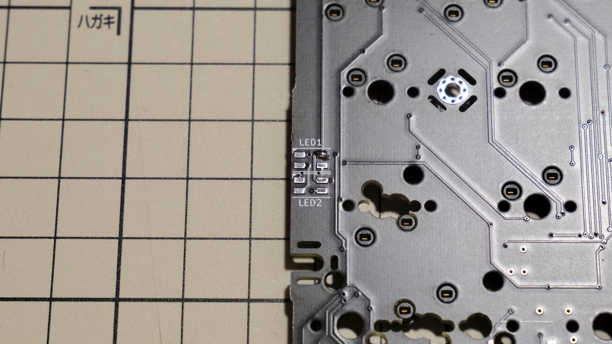
LED1のLED用パッド4箇所のうち、右上へ予備はんだした状態

#### LEDの仮固定

予備はんだした箇所へ。LEDを仮固定します。

<details>
<summary>《詳しい手順》</summary>

LEDの1箇所だけ欠けた角が、基板に描かれた▲マークに合うように、LEDを基板に置きます。  
この段階では、LEDが予備はんだした箇所に乗り、基板から少し浮いています。

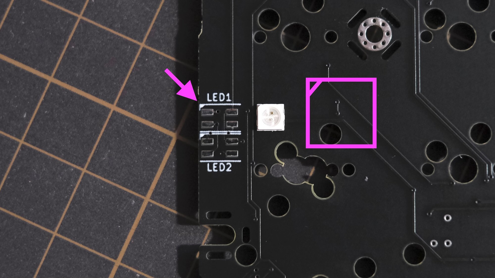
LED取り付け方向。基板に描かれた▲マークと、LEDの方向、

LEDは高温ではんだ付けすると壊れるため、こて先温度を220-270℃に設定します。  
220℃の方が安心ですが、加熱不足によるはんだ不良（表面上ははんだ付けされたように見えるが、内部はしっかりとくっついていない状態）になりやすいので注意してください。  
[加熱不足による、はんだ不良の例](https://twitter.com/jpskenn/status/1291328876283478016)

フラックスを予備はんだに塗っておくと、作業しやすくなります。

ピンセットでLEDをつまみ、位置がずれないように保持します。

はんだごてのこて先を、LEDの横方向からパッドとLEDの端子にあてて、予備はんだを溶かします。  
こて先温度を220℃に設定したときは、はんだが溶けるまでに少し時間がかかります。

予備はんだが溶けたら、LEDが設置位置の中心になるように微調整し、1、2と数えてこて先を離します。  
さらに1、2と数えて、はんだが固まったらLEDをつまんでいたピンセットを離します。  

はんだが、直径0.5-1mmくらいの小さな球のようになっていれば良い仕上がりです。

LEDの取り付け位置が大きくずれていたり基板から浮いている場合は、はんだ付けした箇所を再加熱し、ピンセットで修正します。  
再加熱する際も、フラックスを塗っておくと作業がしやすくなります。
</details>

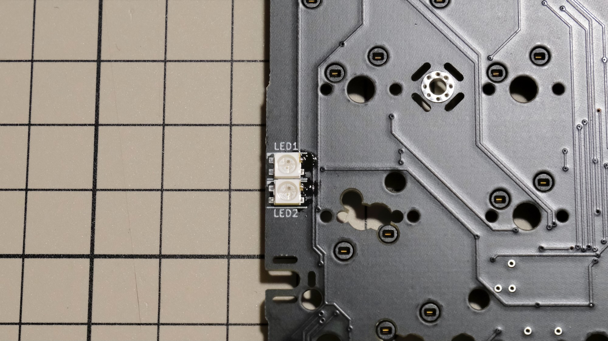
仮固定したLED

#### LEDの取り付け

残り3箇所のパッドをはんだ付けし、LEDを取り付けます。

<details>
<summary>《詳しい手順》</summary>

次の順番で残り3箇所のパッドをはんだ付けします。

1. 予備はんだしたパッドとLEDの発光部を挟んだ反対側のパッド

1. 1の隣のパッド

1. 残ったパッド（予備はんだしたパッドの隣）

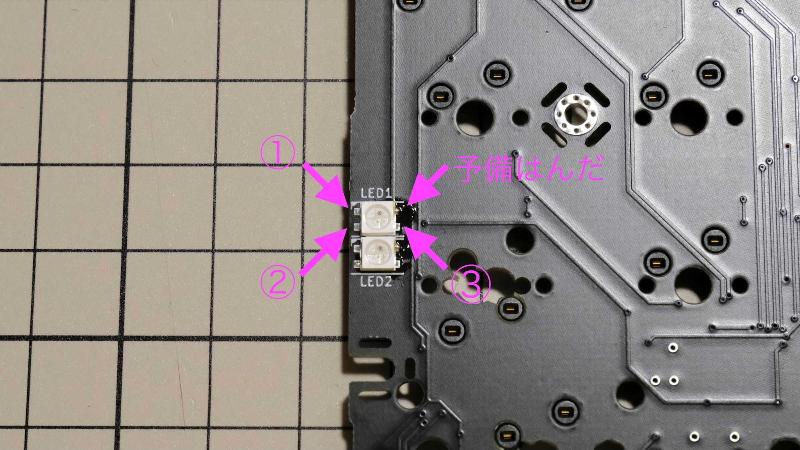
残り3箇所の、はんだ付け順序

フラックスを残り3箇所のパッドに塗っておくと、作業しやすくなります。

はんだをこて先にあてて溶かし、少量のはんだをこて先につけます（乗せます）。

こて先をパッドとLED側面の端子に軽く押しあて、こて先につけておいたはんだをパッドと端子にもつけます。  
押し当てるだけではんだがつくので、こて先は動かしません。

1、2と数えてこて先を離します。
</details>

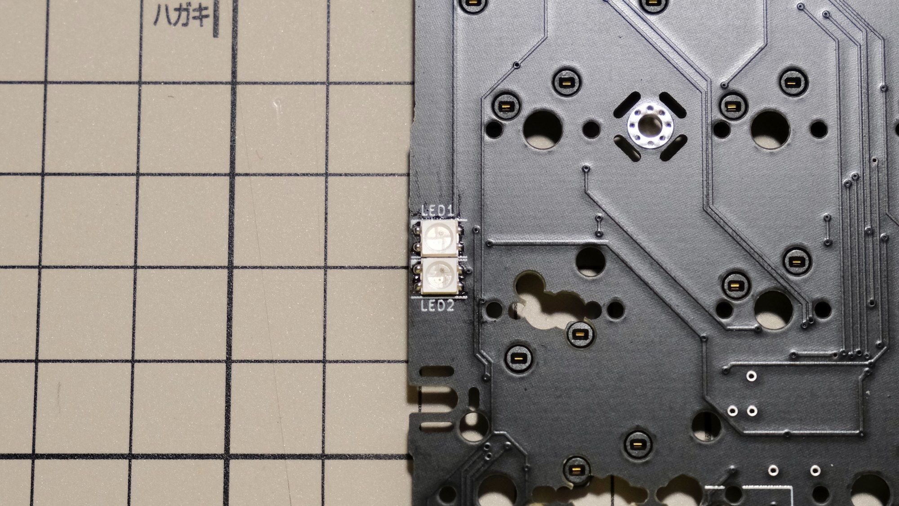
取り付けたLED

作業を繰り返し、必要な数のLEDを取り付けます。

#### LEDの動作確認

LEDの動作確認のため、次の3箇所へ一時的にスイッチを取り付けます。  

- `左シフト`キー（むらさき）
- `左スペース`キー（みどり）
- `右スペース`キー（あお）

レイアウトによって取り付ける位置が少し変わるため、図を参考に取り付けてください。

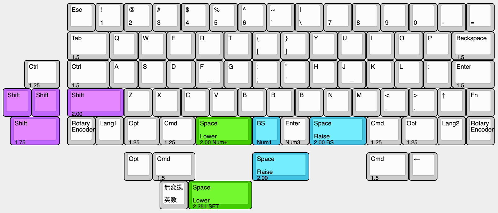
LEDテスト用スイッチ取り付け箇所

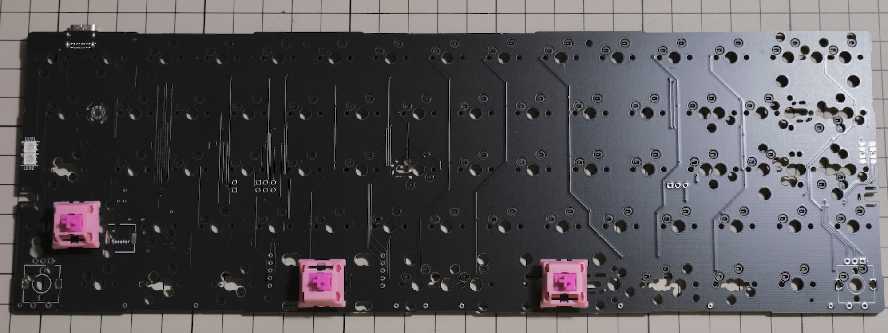
3箇所に取り付けたスイッチの例（Wideレイアウト：左シフト2u, 左スペース2.25u, 右スペース2u）

USBケーブルを接続します。

以下のように、スイッチの状態に応じてLEDが点灯することを確認します。  
LEDを左右両方に取り付けている場合も、左側と右側で同じ光り方になります。

| スイッチの状態 | LEDの点灯<br>手前, 奥 | 備考 |
| :-- | :--: | :-- |
| 何も押さない | 白, 白 | |
| `左スペース`を押し続ける | 白, 緑 | |
| `右スペース`を押し続ける | 白, 水 | |
| `左スペース`と`右スペース`を押し続ける | 白, 赤 | |
| `左スペース`と`右スペース`を押しながら`左シフト`を押し、<br>すべてのスイッチから手を離す | 紫, 白 | 操作するたびに”白, 白”と”紫, 白”が切り替わる。|

確認が終わったら、USBケーブルを抜き、スイッチを取り外します。

光らないLEDがある場合は、[LEDの取り付け不良調査](#LEDの取り付け不良調査)を参考にして調査します。

#### （オプション）LEDディフューザーの取り付け

*ディフューザーを使用しない場合、この作業は不要です。*

キープレートのLED窓部分にプラ板をディフューザーとして取り付け、LEDの視認性を向上させることができます。

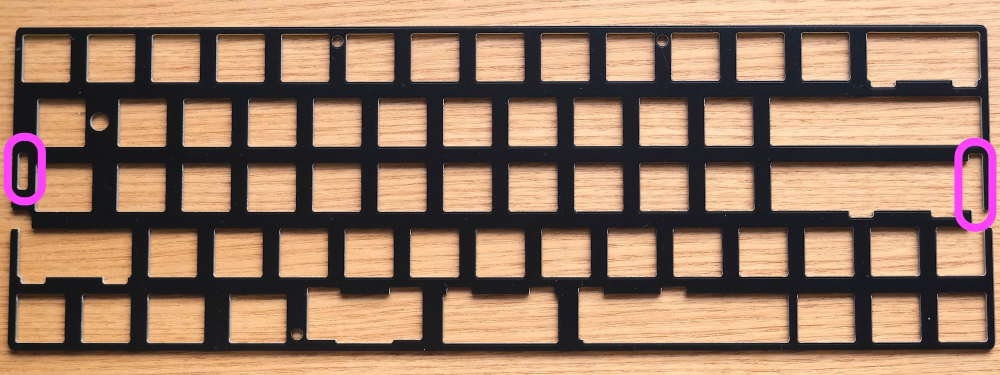
LED窓部分

LED窓の大きさに合わせて、プラ板を切り取ります。  
キープレートへ貼り付けるための、のりしろを残した大きさにします。

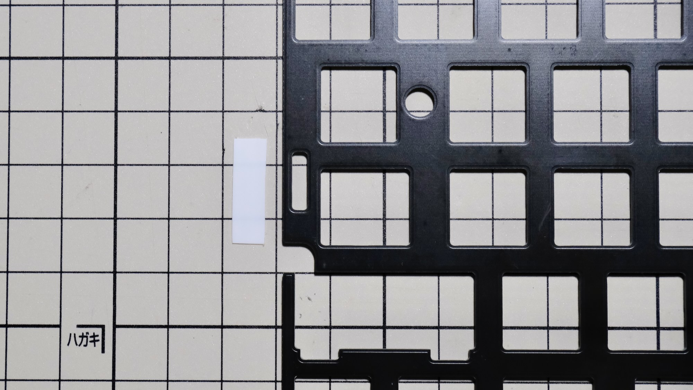
切り取ったプラ板

両面テープなどでキープレートへ貼り付けます。

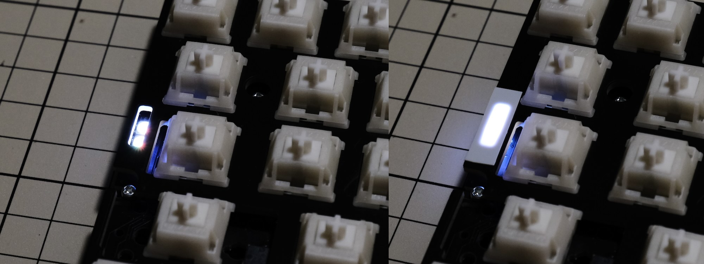
プラ板貼り付け前・後

### （オプション）スピーカーの取り付け

*スピーカーを使用しない場合、この作業は不要です。*  
*なお、スピーカーは、左シフトキーが1.75uまたは2uの場合にのみ取り付けることができます。*

実験的ですが、1スピーカーで2音同時再生する機能を有効にしたい方は以下を参考にしてください。

- [1個のスピーカーで2音同時再生する](#1個のスピーカーで2音同時再生する)

#### スピーカーの取り付け

基板おもて側、`Speaker`と書かれた枠内へスピーカーを取り付けます。  
スピーカーの端子に極性はないため、どちらの方向に置いてもかまいません。

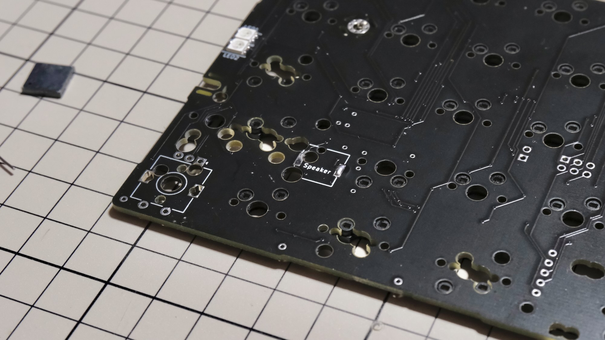
スピーカー取り付け箇所

<details>
<summary>《詳しい手順》</summary>

2箇所のパッドうち、1箇所だけに予備はんだします。

スピーカーを枠とパッドに合わせて置きます。

スピーカー上面の小さな穴が、左方向になるように取り付けるとキープレートの枠から音が抜け、聞こえやすくなります。

予備はんだした箇所の端子をはんだ付けします

スピーカーが枠に沿ってまっすぐに取り付けられていることを確認します。

残りの1箇所をはんだ付けします。
</details>

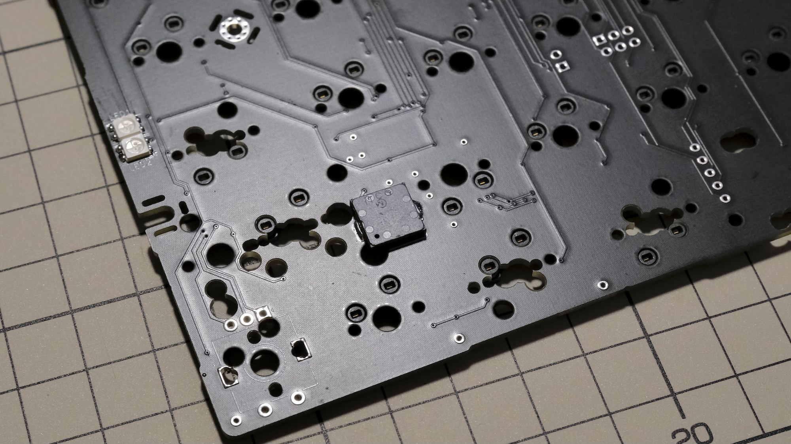
取り付けたスピーカー

#### スピーカーの動作確認

USBケーブルで接続した際、`♪ピッ`という音が聞こえることを確認します。

確認が終わったら、USBケーブルを抜きます。

音が聞こえない場合は、スピーカーが正しくはんだ付けされているか確認します。

### （オプション）ロータリーエンコーダの取り付け

*ロータリーエンコーダを使用しない場合、この作業は不要です。*

#### ロータリーエンコーダの取り付け

基板おもて側の右下と左下のどちらか一方、または両方へ、からロータリーエンコーダ（ALPS EC11, ALPS EC12とその互換品）を取り付けます。  
ノブは、キープレートと基板を組み合わせた後に取り付けます。

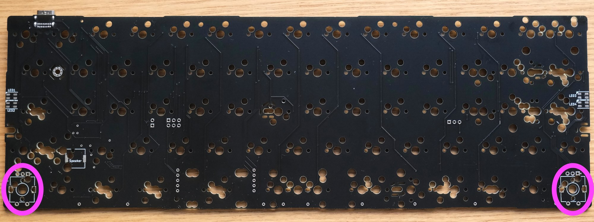
ロータリーエンコーダ取り付け箇所

取り付け確認済みのロータリーエンコーダは次の通りです。

- ALPS
  - EC11E09244AQ
  - EC11E153440D
  - EC11E18244AU
  - EC12E24204A2
- Bourns
  - PEC11R-4315F-S0012
  - PEC11R-4015F-S0024

<details>
<summary>《詳しい手順》</summary>

ロータリーエンコーダのピン（上3本または上下5本）と、左右の固定足を、基板の設置位置に合わせて差し込みます。  
固定足が差し込みにくいときは、足を横から少し押さえ、先端を基板の穴に入れます。  

左右の固定足である程度しっかりと基板に固定されるはずですが、固定がゆるく、基板から外れたり浮いたりする場合はマスキングテープなどで仮固定します。

基板を裏側が上になるように置き、いずれかのピンを*1本だけ*はんだ付けします。

ロータリーエンコーダが基板に描かれた枠に沿ってまっすぐ取り付けられていることを確認します。

ロータリーエンコーダが基板から浮かないように気をつけながら、残りのピンをはんだ付けします。
</details>

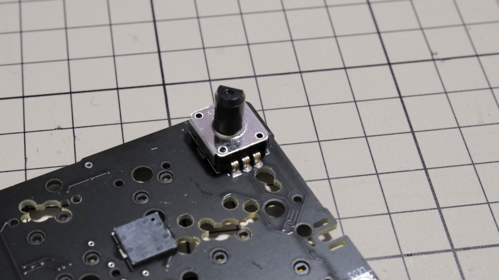
取り付けたロータリーエンコーダ（基板おもて側）

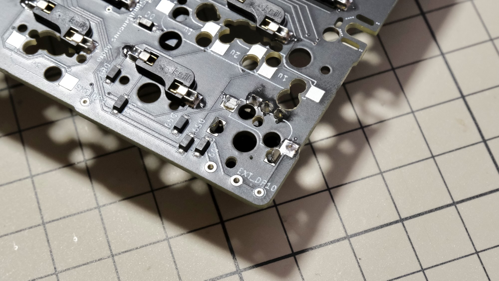
取り付けたロータリーエンコーダ（基板裏側）

#### ロータリーエンコーダの動作確認

USBケーブルを接続し、ロータリーエンコーダのつまみを左右に回すとOSの音声出力ボリュームが変化することを確認します。  
また、プッシュボタンスイッチ付きのロータリーエンコーダでは、プッシュするとOSの音声出力のミュート状態が切り替わることを確認します。

何か問題があった場合は、正しくはんだ付けされているかを確認してください。

### スタビライザーの取り付け

#### スタビライザーの取り付け位置の確認

使用するレイアウトに合わせて、基板おもて側のスタビライザー取り付け位置を確認します。  
なお、左シフトキーの2uスタビライザーは、ケースネジに干渉するため使用を避けてください。

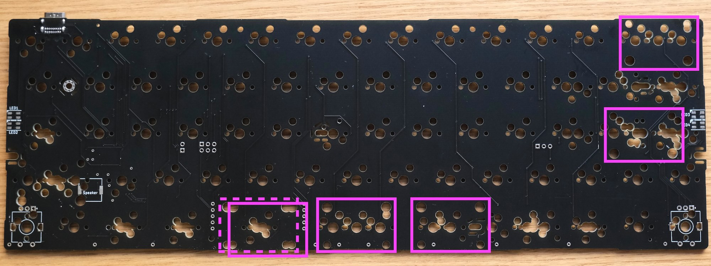
スタビライザー取り付け箇所（左下は2uキーと2.25uキーが並んでいる）

#### スタビライザーの組み立て

必要な数のスタビライザーを組み立てます。

<details>
<summary>《詳しい手順》</summary>

次のようにスタビライザーを組み立てます。  

大きいプラパーツの下側から、小さいプラパーツの切り欠きの位置を合わせて差し込みます。  

金属の棒の先を、大きいプラパーツの穴を通して、小さいプラパーツの溝へ差し込みます。  

金属の棒を、プラ部分の爪へパチンとはめ込みます。  

反対側も同じ方法で組み立てます。

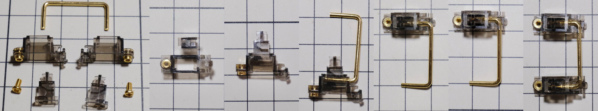
スタビライザーの組み立て（[拡大](../assets/BuildGuide_v.0.4/Stab_assemble.jpeg)）

</details>

#### スタビライザーの基板への取り付け

基板おもて側から、スタビライザーを取り付けます。

<details>
<summary>《詳しい手順》</summary>

スタビライザーの棒がある方の突起部分を、大きい方の穴に斜めに差し込んで引っ掛けます。  
スペースキーとそれ以外のキーのスタビライザーは、上下を逆向きに取り付けるため注意してください。

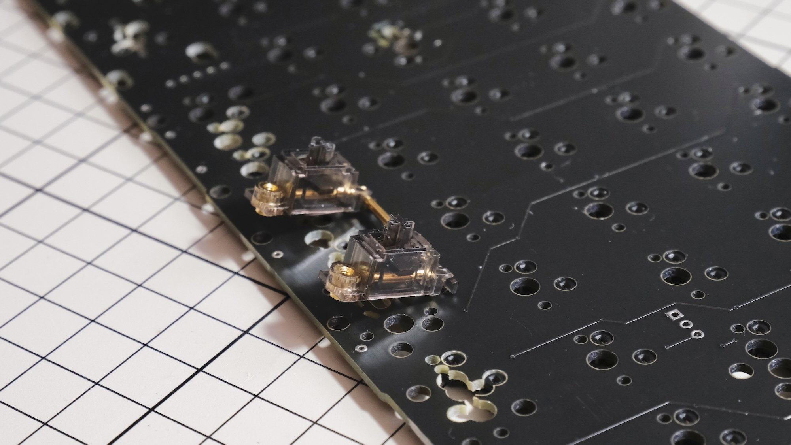
大きい方の穴に引っ掛けたスタビライザー

スタビライザーの反対側のねじ止めする部分を、小さい方の穴にはめ込んでねじ止めします。

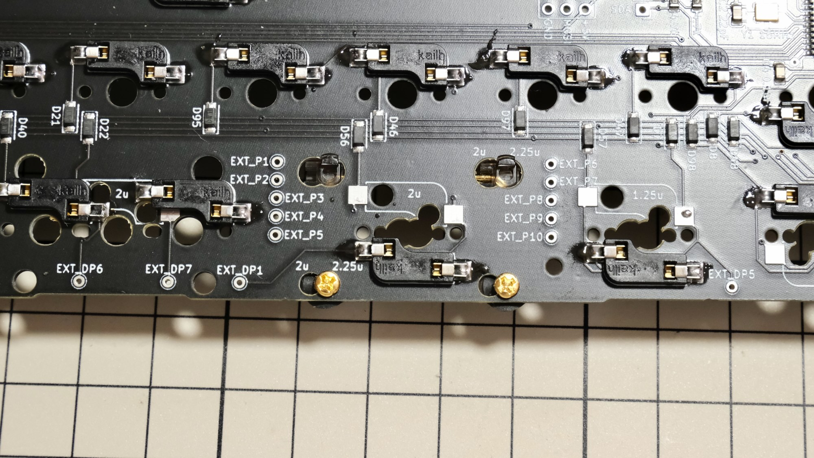
ねじ止めしたスタビライザー
</details>

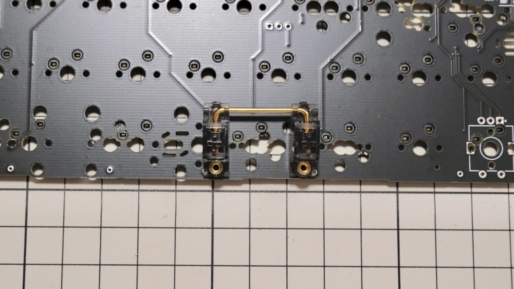
取り付けたスタビライザー

### スイッチの取り付け

スイッチを、キープレートを介して基板に取り付けます。

打鍵感向上に興味のある方は、次の項目をお読みになると何かヒントがあるかもしれません。

- [打鍵感向上：キープレートと基板間のパテ埋め](#打鍵感向上：キープレートと基板間のパテ埋め)

#### スイッチ取り付け前の確認

スイッチの端子を見て、折れたり、曲がったりしていないことを確認します。  
少しだけ曲がっているものは、まっすぐに戻します。

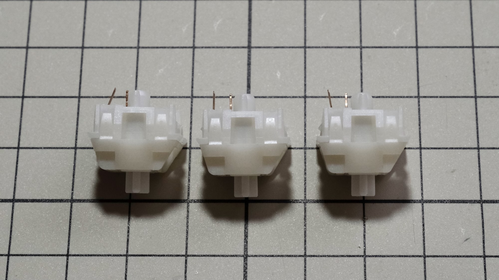
スイッチの端子（左から順に、曲がり、正常、曲がり）

折れてしまっているものは使用できません。  
また、大きく曲がっているものは、まっすぐに戻しても折れやすくなっているため、使用を避けた方がよいでしょう。

#### キープレートの仮固定

キープレートの4隅に仮固定用のスイッチをはめ込んでから、基板へ取り付けます。  

<details>
<summary>《詳しい手順》</summary>

キープレートをおもて側が上になるように置きます。

使用するレイアウトに合わせ、キープレートの4隅にスイッチをはめ込みます。  
ロータリーエンコーダを取り付けている場合は、その隣へはめ込みます。

スイッチの取り付け方向がソケットの方向に合うようにしてください。  
例えば、左上のキーは上下逆向きにはめ込みます。

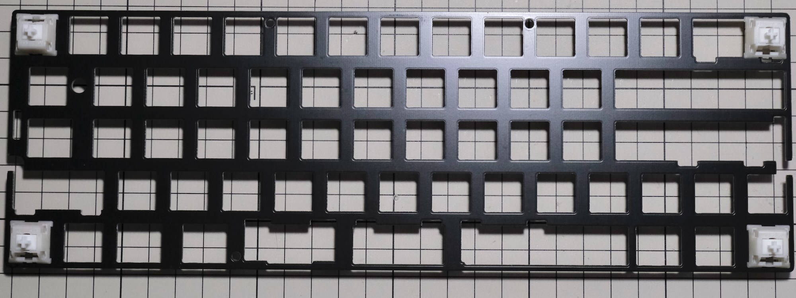
キープレート4隅につけたスイッチ

スイッチがキープレートの枠にぴったり密着してはまっていることを確認します。

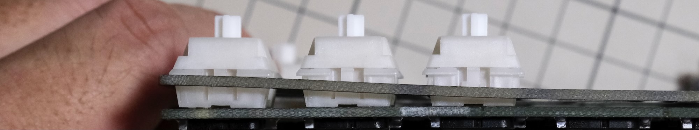
スイッチのキープレートへのはまり具合（異常）

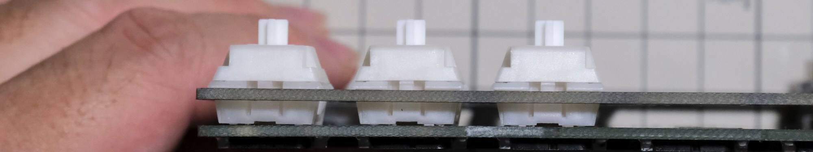
スイッチのキープレートへのはまり具合（正常）

基板を表側が上になるように置きます。

4隅にスイッチをはめ込んだプレートを基板に乗せ、スイッチの端子とソケットの位置を合わせます。
スタビライザーを取り付けているときは、キープレートの枠にはまるように位置を調整します。


キープレートの枠にはまったスタビライザー（Wideレイアウトの例）

4隅のスイッチを、1個ずつ基板のソケットに押し込んでいきます。  
スイッチの端子が奥まで差し込めるように、基板裏側のソケットを押さえながら、少しだけ力を入れて（\*）スイッチを押し込みます。  
※：洗濯バサミをつまんで開くよりも、もう少し強いくらいの力。

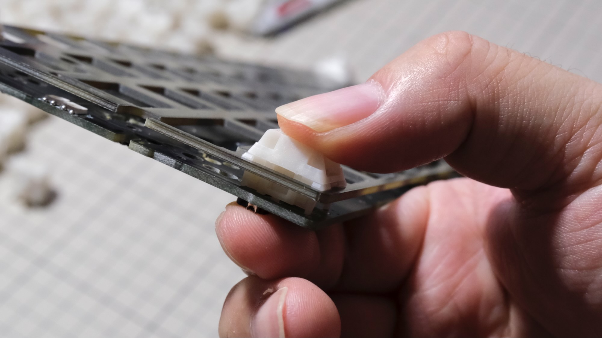
スイッチを押し込む様子
</details>

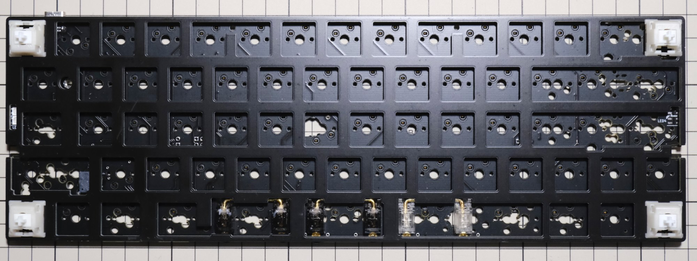
キープレートを基板に仮固定

#### （該当者のみ）ケースネジ穴に干渉するスッチの取り付け

*GH60型, Poker型ケースを使用しない場合、この手順は不要です。*

GH60型, Poker型ケースのネジ穴とスイッチ足の干渉を避けるため、スイッチの足を加工して取り付ける箇所があります。  

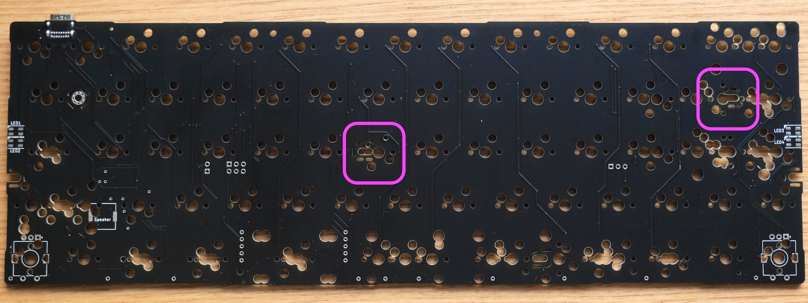

##### 中央ネジ穴に重なるスイッチ

すべてのレイアウトにおいて、中央ネジ穴に重なるスイッチ（Gの右隣）は、スイッチの足を加工して取り付けます。

5pinスイッチは、中央ネジ穴と干渉する片方の足を、ニッパーなどで切断して取り付けます。  

3pinスイッチは干渉しないため、そのまま取り付けできます。

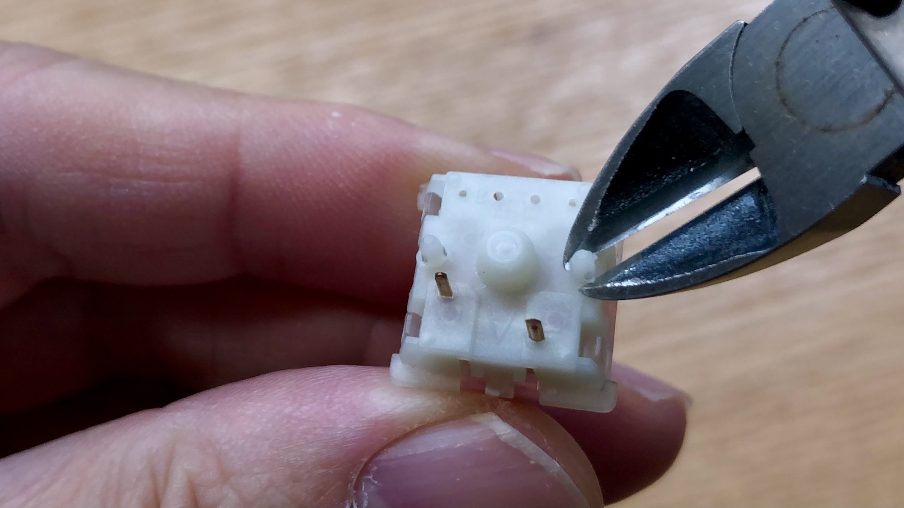
5pinスイッチの片方の足を切断

##### 右上ネジ穴に重なるスイッチ

Narrowレイアウトを使用する場合のみ、右上ネジ穴に重なるスイッチ（上から2行目、右から2番目）の足を加工して取り付けます。

ケースによってネジ穴サイズの大小が異なりスイッチとの干渉具合が変わってくるため、現物合わせで作業してください。

5pinスイッチ、3pinスイッチのいずれも、スイッチ中央の足（出っ張り）を、ネジ穴に当たらない程度に一部切断して取り付けます。  
中央の足をすべて切断しても良いですが、スイッチ固定の安定性が下がるため、1/4〜1/3に切り込みを入れて一部だけ切断する方がおすすめです。

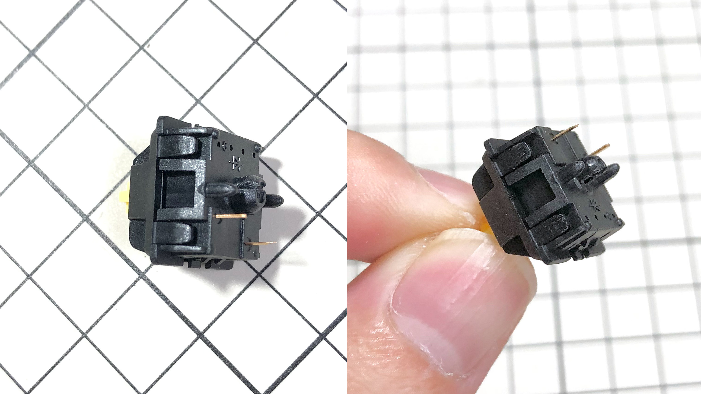
中央の足の1/4くらいに切り込みを入れてカットしたスイッチ

なお、押下時にスイッチの軸がネジに当たる場合は、軸の下端を切断したりして調整します。

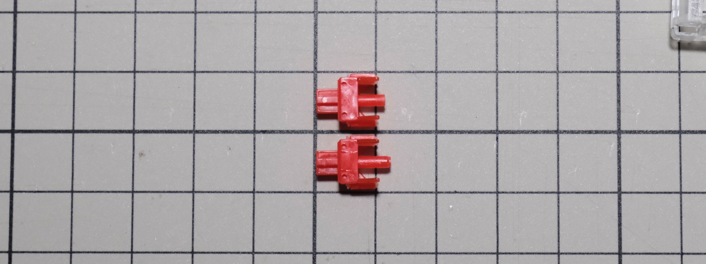
軸の下端を切断（上：切断後, 下：切断前）

#### 残りのスイッチの取り付け

スイッチの取り付け方向をソケットの方向に合わせて、残りのスイッチを取り付けます。

ロータリーエンコーダを使用する場合は、ノブを取り付けます。

<details>
<summary>《詳しい手順》</summary>

スイッチの端子が曲がらないよう、真上からまっすぐに押し込みます。  
押し込む際に変な抵抗を感じたり、奥までスッと刺さらないときは、スイッチを一旦取り外し、端子が曲がっていないか確認してやり直します。

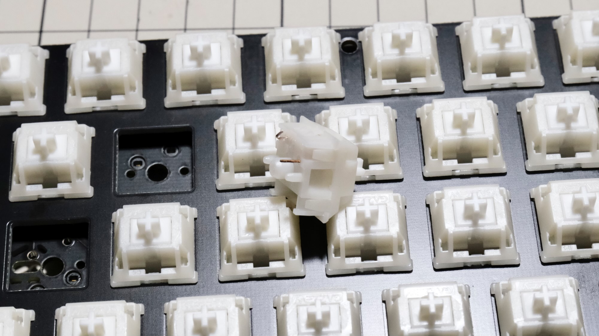
差し込み時に端子が曲がったスイッチ

取り付けたら、スイッチがキープレートの枠にぴったりとはまっていることを確認します。  
スイッチがキープレートから浮いているような場合は、プレートを指で引っ張り、スイッチと密着させます。
</details>

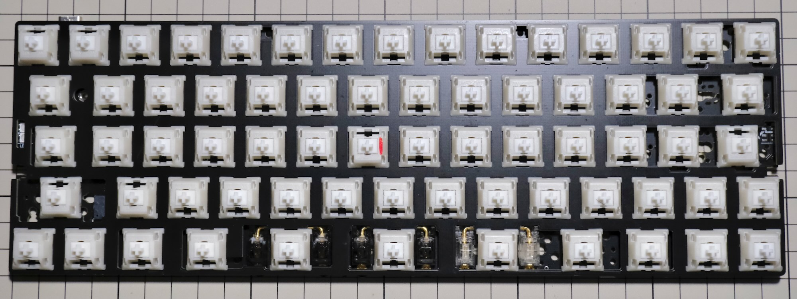
スイッチを全て取り付けた状態  
（赤いペイントは、スイッチの足を切断したことがわかるようにつけた印で、特に意味はありません）

#### スイッチの動作確認

組み立て前におこなった[ソケット用パッドの確認](#ソケット用パッドの確認)と同様に、動作確認をおこないます。  
以前はピンセットでソケット用パッドをショートさせましたが、この手順ではスイッチを押して正しく反応することを確認します。

正常に入力できないスイッチがあった場合は、[正常に入力できないスイッチの原因調査](#正常に入力できないスイッチの原因調査)の手順に沿って調査します。

### ケースへの取り付け

#### （該当者のみ）Jones用ボトムプレートキットの取り付け

*Jones用ボトムプレートキットを使用しない場合、この手順は不要です。*

ボトムプレート裏面から、ネジ（M2 3mm）を使い、スペーサー（M2 3mm）をねじ止めします。  
以下の写真のように、8箇所をねじ止めします。  
右下は、キースイッチでネジ穴がふさがるため、WideレイアウトとNarrow, Normalレイアウトでねじ止め位置が異なります。

なお、GH60型, Poker型ケース取り付け用の、中央と中央右下のネジ穴はねじ止めしません。

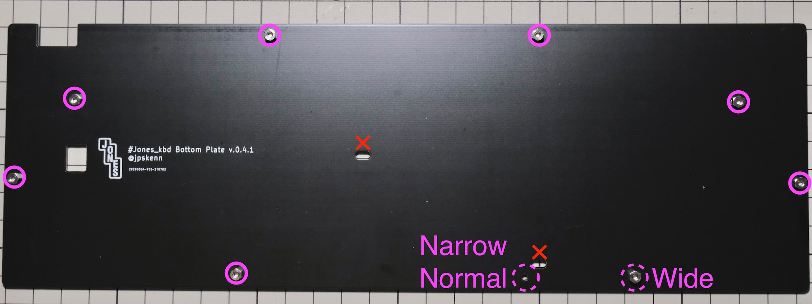
スペーサー取り付け箇所

基板を、ボトムプレートのスペーサーの位置にネジ穴の位置が合うように乗せます。  
基板裏側の部品やソケットが、スペーサーにぶつからないように気をつけてください。

基板おもて側から、ネジ（M2 3mm）を使ってねじ止めします。  
Narrowレイアウトの場合は、スイッチとの干渉を避けるため、右上のネジ穴にネジ（M2 3mm 低頭）を使用します。

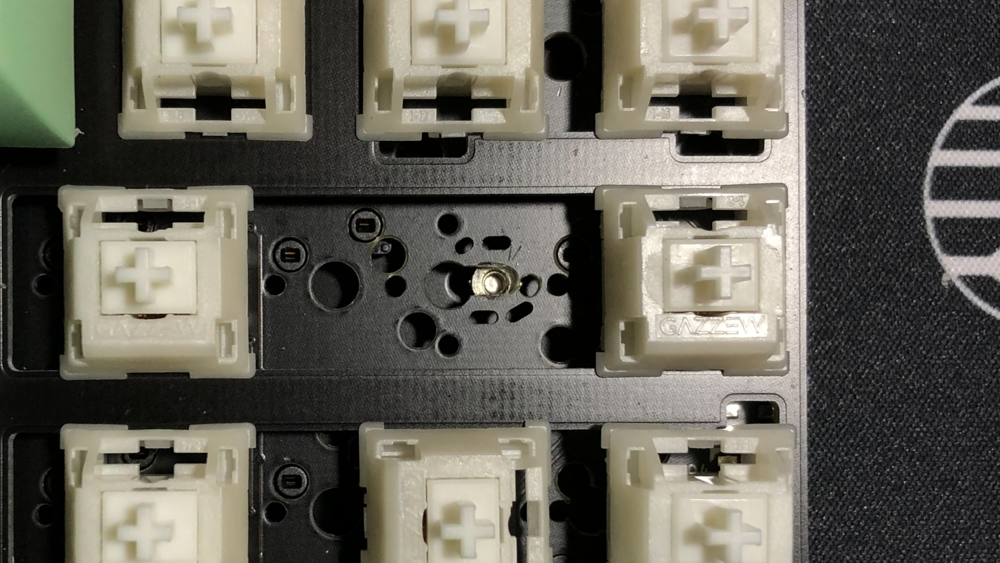
低頭ネジの取り付け箇所

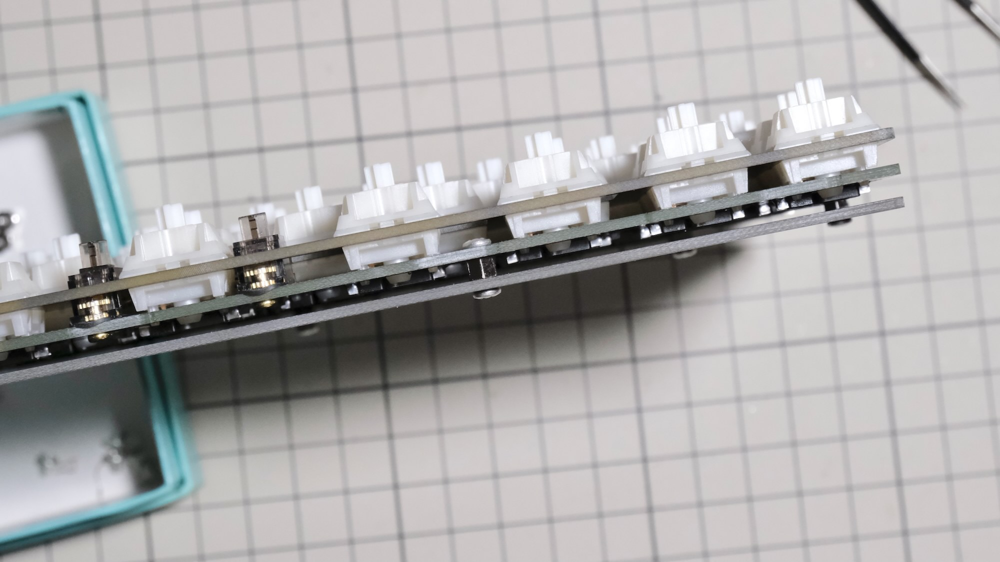
基板とボトムプレートをねじ止めした状態

取り外していたスイッチを取り付けます。

ボトムプレート底面に、次のように滑り止めのゴム足を貼り付けます。  

- キーボードに傾斜をつける場合
    奥の左・右の2箇所：ゴム足 大
    手前の左・中・右の3箇所：ゴム足 小

- キーボードをフラットにする場合
    手前と奥の左・中・右の6箇所：ゴム足 小

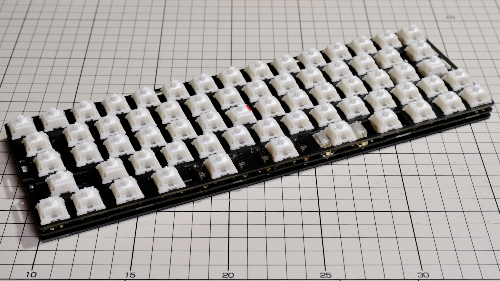
ボトムプレート取り付け完了

見た目を良くしたい場合は、キープレート, 基板, ボトムプレートの側面を、水性顔料インクのポスターカラーや油性マジックなどを使って塗ります。  
また、キープレートと基板の周りにマスキングテープなどを貼り付けて、見た目の印象を変えることもできます。

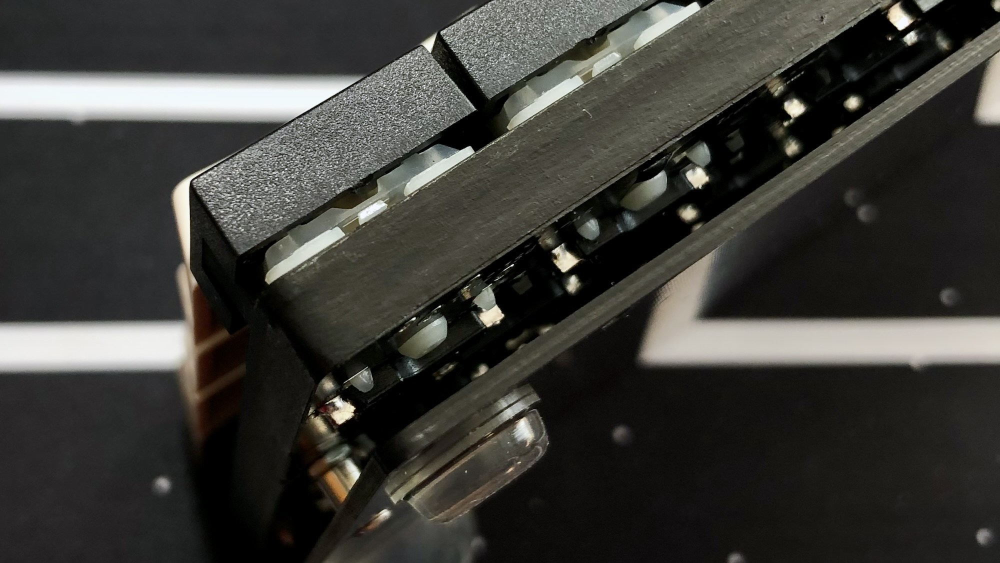
側面の加工例（マスキングテープ貼り付けと黒色ペンでの塗り）

#### （該当者のみ）60% プラスチックケースの加工

*60% プラスチックケースを使用しない場合、この手順は不要です。*

60% プラスチックケースへ取り付ける際は、基板裏側の部品がケース内リブと干渉するため、干渉箇所を切り取る加工を行います。

切り取る箇所は以下の点線で囲んだ部分です。

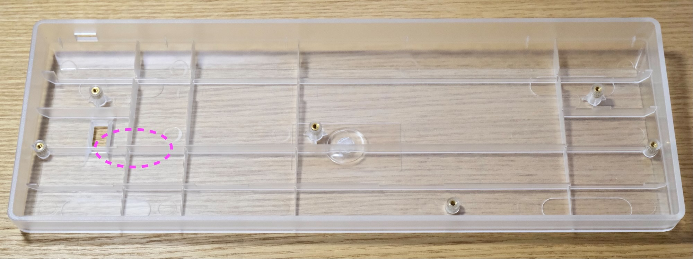
リブ切り取り箇所

写真で示した部分を、ニッパーやカッターなどを使って切り取ります。  
ニッパーで切り取る際は、1-2mmくらいずつ切り進んでください。  
それ以上の長さを一気に切断しようとすると、意図しないところが割れることがあります。

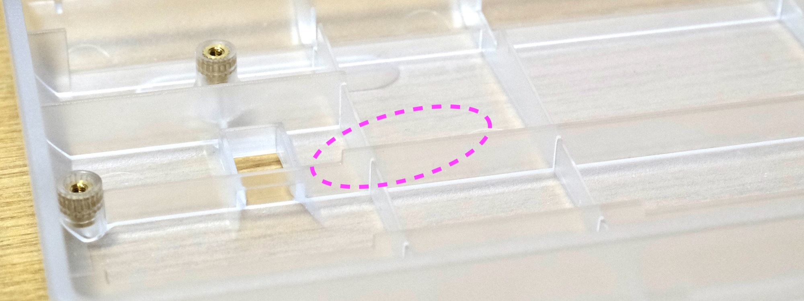
リブ切り取り前

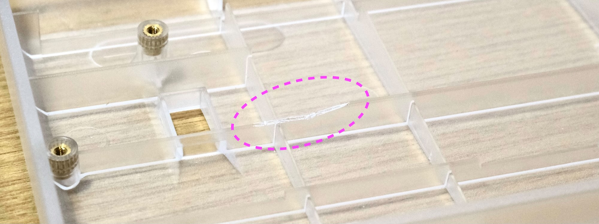
リブ切り取り後

#### （該当者のみ）GH60型, Poker型ケースへの取り付け

*GH60型, Poker型ケースを使用しない場合は、この手順は不要です。*

打鍵感向上に興味のある方は、次の項目をお読みになると何かヒントがあるかもしれません。

- [打鍵感向上：ケースへの基板取り付け方法](#打鍵感向上：ケースへの基板取り付け方法)
- [打鍵感向上：ケース内部の制振と静音化](打鍵感向上：ケース内部の制振と静音化)

基板の奥側（USBコネクタ側）からケース内へ入れていきます。

基板の奥側を水平から30度くらいの角度でケースへ差し込むと、USBコネクタがケースの穴にスッとはまります。  
その状態で基板の手前側を静かに下ろして水平にすると、力をかけることなく、基板全体がストンとケースに入ります。  
力を入れてグリグリとこじったり、ググググッと押し込むようなことはせず、角度を合わせて差し込むだけです。

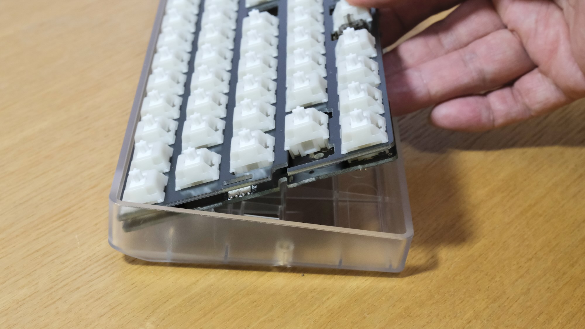
30度で差し込む

ケースネジ穴と基板のネジ穴の位置を合わせ、ケースに付属しているネジで仮止めします。
ネジ穴とスイッチがかぶさる箇所は、キット付属の低頭ネジを使用します。  
低頭ネジは、ケースに付属しているネジの長さと同じか、より短いものを使用します。

ケースに対して上下左右の真ん中になるように、基板の位置を調整します。

ネジを締めて基板を固定します。

取り外していたスイッチを取り付けます。

ケース底面に、滑り止めのゴム足を貼り付けます。

### 仕上げ

キーキャップを取り付けます。

Remapで自分好みのキーマップに変更します。  
初期状態では、Wideレイアウトで英語配列のキーマップが設定され、6個のレイヤーを使用できます。  
レイヤー構成とLEDインジケータの色は次の通りです。

| No. | レイヤー名 | LEDインジケータ色<br>手前, 奥 |
| :-: | :-- | :-: |
| 0 | ベースレイヤー #1 | 白, 白 |
| 1 | ベースレイヤー #2 | 青, 青 |
| 2 | ベースレイヤー #3 | 黄, 黄 |
| 3 | Lower | －, 緑 |
| 4 | Raise | －, 水 |
| 5 | Adjust | －, 赤 |

完成です。

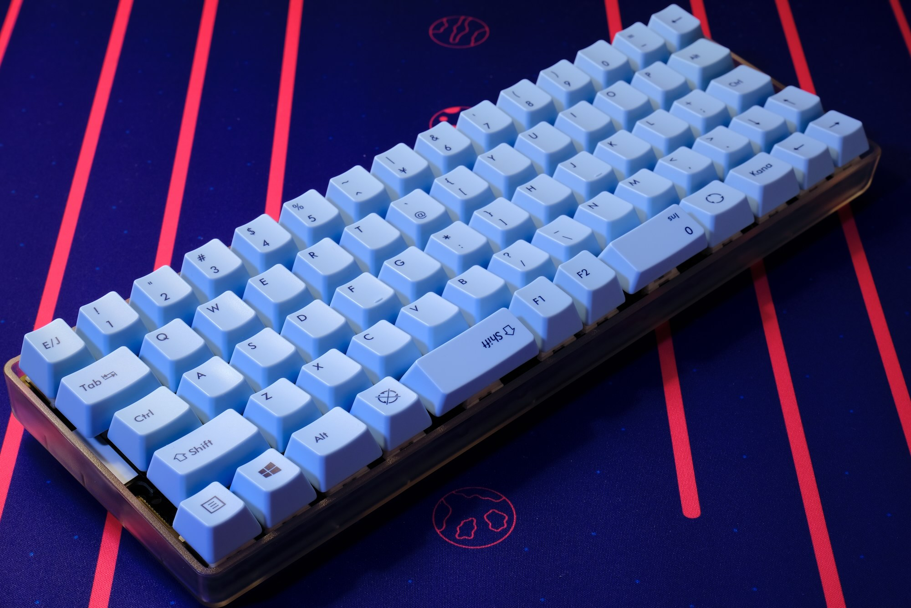
製作例

写真を撮影し、`#Jones_kbd` のタグをつけてツイートすると設計者が喜んだりします。  
[Twitter: #Jones_kbd](https://twitter.com/search?q=%23Jones_kbd&f=live)

完成したところですが、打鍵感の向上やアンダーグロー用LEDテープの使用など、DIYで楽しむ要素はまだまだ残っています。  
[参考](#参考)にいろいろと情報を載せていますので、ご活用ください。

## 参考

打鍵感向上や機能追加についてのDIY情報や、トラブル調査方法などの参考資料です。  
必要に応じてお読みください。

### 1個のスピーカーで2音同時再生する

*元々は2個のスピーカーで2音同時再生する機能であり、1個のスピーカーでの再生は**実験的な機能**です。*

QMKのAudio機能で[Music Mode](https://docs.qmk.fm/#/feature_audio?id=music-mode)を使用する際に、1つのスピーカーで2音同時再生させることができます。  
なお、2音同時再生されるのはMusic Modeで演奏する際の音だけで、キーボードの起動音やリセット音などの[Songs](https://docs.qmk.fm/#/feature_audio?id=songs)については、単音再生のままで変わりません。

[](https://www.youtube.com/watch?v=ZqbNMjGJpUM)
YouTube：2音同時再生デモ動画

ハードウェア的には1箇所ジャンパするだけで機能が有効になりますが、ファームウェアの書き換えが必要となります。

<details>
<summary>《詳しい手順》</summary>

#### 基板のジャンパ

キーボード裏側の`Simultaneous Audio`をジャンパします。

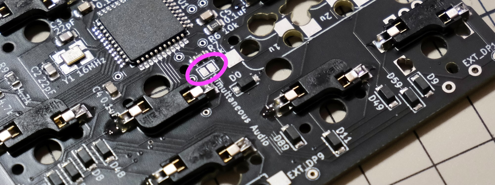
ジャンパ箇所

#### ファームウェアの書き換え

2音同時再生対応ファームウェアを用意します。

ビルド済みのHEXファイルは以下のリンクからダウンロードできます。

- [Jones v1 ファームウェア, 2音同時再生](https://gist.github.com/jpskenn/2a1d57117e745d635d038c64fdb32539)

ファームウェアサイズの制限により、`ベースレイヤー #3`を削除して、使用できるレイヤー数を6から5に減らしています。

[ファームウェアの書き込み方法](#ファームウェアの書き込み方法)を参考に、ファームウェアを書き込みます。  

#### 2音同時再生の確認

キーボード起動後に、`Raise` + `Lower` + `D`を押してMusic ModeをONにします。

`F`と`J`を同時に押して、2音同時再生されていれば正しく動作しています。

</details>

### 打鍵感向上：ケースへの基板取り付け方法

GH60型, Poker型ケースへの基板取り付け方法を変更し、打鍵感の向上を目指すための資料です。  

通常であれば、左2, 右2, 中央1, 中央下1の合計6本のネジで基板をケースに固定しますが、基板を改造して固定方法を変えることで、打鍵感の向上を狙います。

なお、通常の手順で組み立てた後でも、これらの改造をおこなうことができます。

``` aside
60%プラケースは、ケース内のリブがネジ穴と同じ高さに成形されているため、そのままでは打鍵感は向上しません。
ケース内のリブをネジ穴よりも低い高さに切り取る加工を行えば、効果が期待できます。
```

**この加工による基板の破損や、ケースへの取り付け不良などの不具合が発生することが考えられるため、加工者の責任でお楽しみください。**  
**また、改造を行なった基板は元には戻せませんので、それを理解した上でおこなってください。**

``` aside
今のところ、これらの改造をおこなって不具合が発生したことはありません。
```

#### 方法1：基板中央のフレックス加工

基板の中央付近のネジ穴を切り取り、左右のネジだけでケースに固定することで、基板を適度にしならせて打鍵感を柔らかくする改造です。  

<details>
<summary>《詳しい手順》</summary>

組み立て済みの場合は、切り取り箇所付近のスイッチを取り外します。

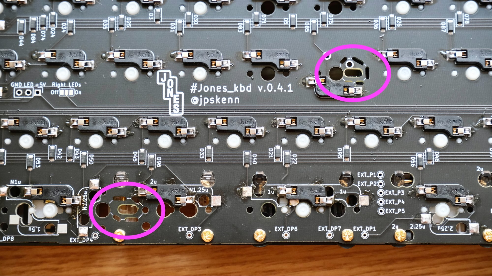
基板裏側、中央と中央下のネジ穴

中央と中央下のネジ穴を、基板裏側に白い点線で描かれた切断ガイドに沿ってニッパーなどを使って切り離します。  
まわりの部品を傷つけないように注意しながら、一度にカットしようとせず、基板の裏側とおもて側から少しずつ切り進めていきます。  
ケースねじ穴に当たらないよう、切り取った箇所のバリをやすりやカッターなどを使ってきれいにします。

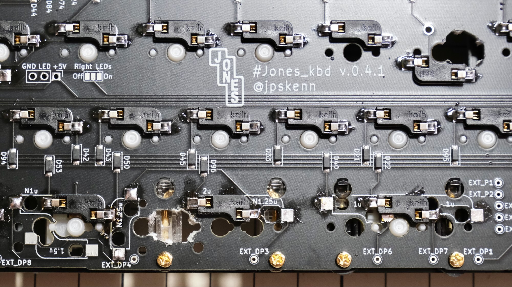
切り離した状態

ケースに基板を入れ、左右のネジだけでケースに固定します。


TOFUケースに入れた状態（中央ねじ穴）

</details>

#### 方法2：ネジを使わずにケースへ固定

基板からすべてのネジ穴を切り取り、制振スポンジによってケース内側側面に固定することで、打鍵時の衝撃がケースのネジ穴へ直接伝わるのを抑える改造です。  
制振スポンジは、PORON（衝撃吸収の良いマイクロセルウレタンフォーム）などを使用します。

<details>
<summary>《詳しい手順》</summary>

基板を支えるため、ケース内側に制振スポンジを敷き詰めます。  
ケースネジ穴と同じくらいの高さになるようにします。

すべてのネジ穴を、基板裏側に白い点線で描かれた切断ガイドに沿ってニッパーなどを使って切り離します。  
まわりの部品を傷つけないように注意しながら、一度にカットしようとせず、基板の裏側とおもて側から少しずつ切り進めていきます。

基板4辺の側面に、両面テープなどを使い、1.5mm厚の制振スポンジを貼り付けます。  
基板外形には0.5mmの凹みがついている箇所があるので、その部分へ貼り付けます。  
基板とケース内側との隙間が広い場合は、現物合わせで、凹みのない部分へ貼り付けます。

基板をケースへ入れます。

</details>

### 打鍵感向上：ケース内部の制振と静音化

ケース内部底面におもり（10円玉, 真鍮板, 自動車のホイールバランスウェイト, 鉛シート, etc.）を入れておくと、ケースの共振が抑えられ、打鍵感の向上や、打鍵音の変化が期待できます。

ウレタンスポンジやシリコンシートなどで基板とケース間の空間を埋めてケース内部の残響音を減らしたり、基板の振動を抑制して振動音の発生を抑えて静音化するのも効果的です。

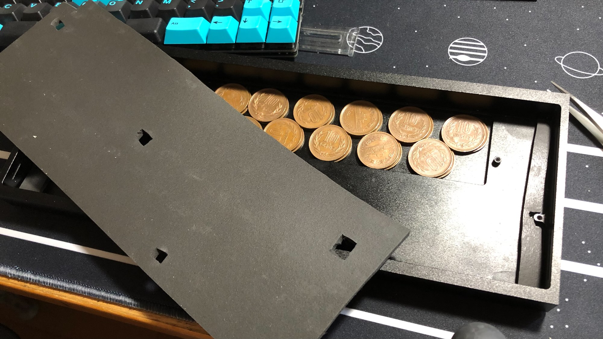

### 打鍵感向上：キープレートと基板間のパテ埋め

キープレートと基板の間をパテ埋めすることで、打鍵感の向上を目指すための資料です。  
パテはエアコン配管用パテを使用します。

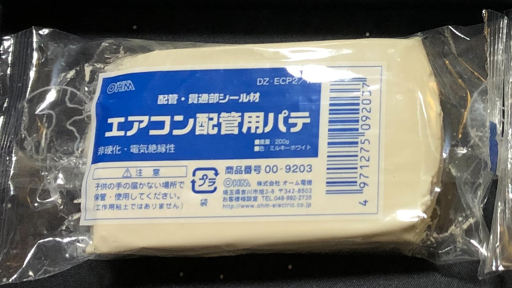

パテ埋めすることで、次のような効果が期待できます。

- 剛性の大幅な向上
- 振動を大幅に低減
- キープレートと基板の間の空間で発生する音を除去
- キースイッチの安定性の向上

これらの効果により、ブレの少ないかっちりとした打鍵感と、密度が高く、明瞭で少しピッチが高い打鍵音を得ることができます。
<!-- 〓打鍵音比較を見せたいが、使用前がないかも -->

<details>
<summary>《詳しい手順》</summary>
組み立て済みの場合は、ケースから基板を取り外し、キープレートと基板を分離します。

キープレートにスイッチを取り付けた状態にして、裏側（スイッチの端子が見える側）を上にして置きます。

スイッチとスイッチの間、キープレートの枠の部分にパテを乗せます。  
基板と組み合わせた時に、スイッチと基板の間にはみ出さない程度の量にします。  
スタビライザーを取り付けているスイッチ付近は、スタビライザーの動作を妨げることがあるので、この段階ではパテを乗せずにおきます。

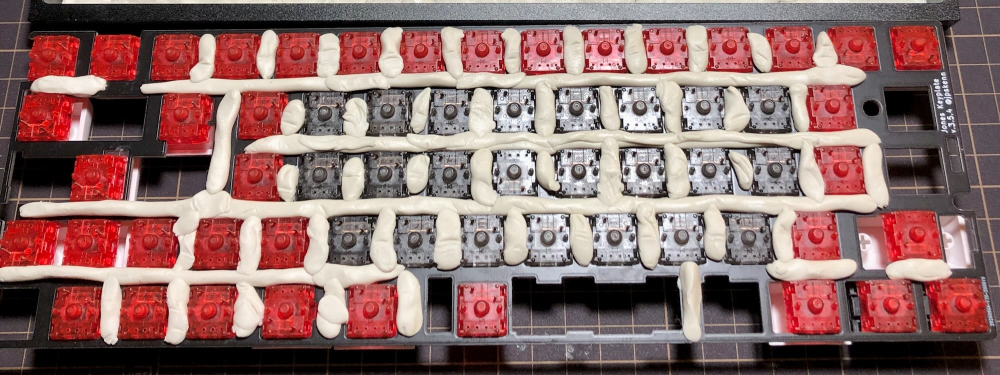

キープレートと基板を合わせ、スイッチをソケットにはめ込みます。

スタビライザー付近や、キープレートの枠がないスイッチの周り、基板外周部にパテを追加します。  

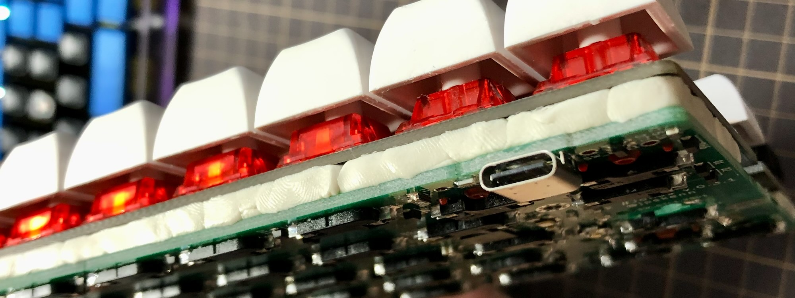

打鍵してみて、振動を感じたり、他と比べて音が異なる箇所があれば、スイッチを取り外してパテを押し込みます。

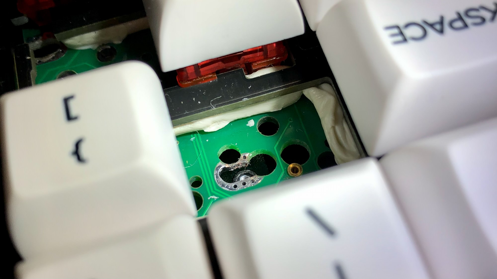

</details>

### USBコネクタ接続図

USBコネクタの配線は次の通りです。

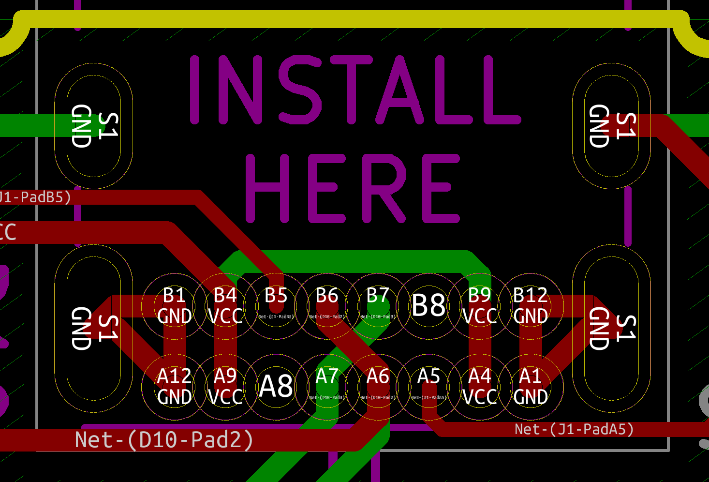
USBコネクタ接続図

### 正常に入力できないスイッチの原因調査

もっとも多い原因は、スイッチの取り付け不良です。  
スイッチを取り外し、端子が曲がったり折れたりしていないか確認します。  
端子の曲がりを修復するか、新しいスイッチに交換して、もう一度キー入力を確認します。

次いで多いのが、ソケットのはんだ不良です。  
ソケットのはんだ忘れや、はんだが適切に行われていないことが原因のため、ソケットのはんだ状態を確認します。  
必要であれば再度はんだ付けし直して、もう一度キー入力を確認します。

上記で解決できなかった場合は、基板のソケット用パッドをピンセットなどを使ってショートさせ、もう一度キー入力を確認します。  
キー入力が確認できた場合は、パッド自体は正常ですので、スイッチとソケットを再度調査します。

ソケット用パッドをショートしてもキー入力が確認できない場合は、組み立て途中に基板の配線や部品がダメージを受けたことが原因と考えられ、これ以降の調査と修復の難易度は、かなり高くなります。

電子工作に詳しい方であれば、[JonesのKiCadプロジェクト](https://github.com/jpskenn/Jones/tree/master/PCB)を参考にテスター等を用いて調査を進められると思います。

自分ではどうにもできない方は、キット同梱のリーフレットに記載された連絡先へ問い合わせてください。  
状況に応じて、できる限りのサポートをいたします。  

### LEDの取り付け不良調査

#### ジャンパの確認

LEDの組み合わせに応じて、基板裏側のジャンパが正しく行われていることを確認します。

| 組み合わせ | 左側<br>LED1, 2 | 右側<br>LED3, 4 | ジャンパ<br>Left LEDs | ジャンパ<br>Right LEDs |
| :--: | :--: | :--: | :--: | :--: |
| LED未使用 | なし | なし | 不要 または Off | 不要 または Off |
| 左側のみ | あり | なし | On | 不要 または Off |
| 右側のみ | なし | あり | Off | On |
| 左右両方 | あり | あり | On | On |

#### LEDの確認

ジャンパが正しく行われても点灯しない場合は、LEDに原因があると考えられますので、以下の順に対処します。  

``` aside
なお、基板の配線へのダメージなど、他の要因も考えられますが、確率はかなり低いです。  
「組み立て中に工具で基板をガリっとやってしまった…」などの心当たりがあれば、また別ですが…
```

1. 光らないLEDのはんだ不良を修復する
    光らないLEDが正しくはんだ付けされていない、と仮定した対処です。
    光らないLEDの側面の端子部分にフラックスを塗り、こて先につけたはんだを押しあてて、はんだ付けをやり直します。

1. 光らないLEDの*ひとつ前*のLEDのはんだ不良を修復する
    光らないLEDのはんだは正常だが、ひとつ前のLEDのはんだ不良が原因で配線がつながっていない、と仮定した対処です。
    LEDは組み合わせによって、以下に示す順番で並んでいます。
    ひとつ前のLEDのはんだ付けをやり直します。
    | 組み合わせ | LEDの並び |
    | :--: | :-- |
    | 左側のみ | 左上（LED1） → 左下（LED2） |
    | 右側のみ | 右上（LED3） → 右下（LED4） |
    | 左右両方 | 左上（LED1） → 左下（LED2） → 右上（LED3） → 右下（LED4） |

1. 光らないLEDを新しいものに交換する
    220-270℃で1、2と数える程の加熱ではそう簡単にはLEDは壊れないと考えますが、何度かはんだをやり直しても点灯しない場合は、LEDが壊れていると判断して新しいものに交換します。

### ファームウェアの書き込み方法

#### QMK　Toolboxの使用

ビルド済み（≒作成済み）のキーボード用ファームウェアを書き込むには、[QMK Toolbox](https://github.com/qmk/qmk_toolbox/releases)を使用します。

QMKファームウェアに関するドキュメントの、[ファームウェアを書き込む](https://docs.qmk.fm/#/ja/newbs_flashing?id=ファームウェアを書き込む)を参考に、QMK Toolboxを使ってキーボードに書き込みます。

#### キーボードを DFU (Bootloader) モードにする方法

ファームウェアを書き込む際には、キーボードを*DFU (Bootloader)モード*にする必要があります。  
Jonesキーボードでこのモードにするには、次のように操作します。

1. USBケーブルを抜きます。

1. キーボードの左上のキーを押したまま、USBケーブルを差し込みます。

この操作によってEEPROMも消去されるので、古いデータが残って動作がおかしくなるのを防止できます。  
ファームウェアの書き込みが終わった後、外部EEPROMの消去がおこなわれるため、キーボードの起動まで5秒ほどかかります。（書き込み直後の初回起動のみ）

**何らかの理由で上記の操作でモードが変わらない場合は、基板裏側のリセットボタン`Reset SW`を押すことでモードを変えることができます。**  
**ファームウェアの書き換え後に、[EEPROMを消去して、初期状態に戻す方法](#eepromを消去して-初期状態に戻す方法)を実施し、EEPROMを初期状態に戻してください。**

#### Jonesキーボードのデフォルトファームウェア

ビルド済みの初期書き込み済みのファームウェアは、以下に用意しています。
[Jones v1 ファームウェア, VIA対応デフォルト](https://gist.github.com/jpskenn/3fcebf6a7c17f1a8433a8d954e05206f)

ファームウェアのソースは、以下に用意しています。
[develop_jones](https://github.com/jpskenn/qmk_firmware/tree/develop_Jones/keyboards/jones/v1)  

### EEPROMを消去して、初期状態に戻す方法

RemapやVIAなどのキーマップ書き換えツールで設定した内容など、EEPROMに記録されているデータを消去し、ファームウェアの初期状態に戻すことができます。  
EEPROMに記録されている全てのデータが消去されるので、キーボードの動作がおかしい場合の最終手段としておこなってください。

また、古いデータが残って動作がおかしくなるのを防止するため、ファームウェアを書き換える際にもこの操作をおこないます。

なお、キーマップだけを初期状態に戻すのは、Remapでも可能です。

<details>
<summary>《詳しい手順》</summary>

USBケーブルを抜きます。

キーボードの左上のキーを押したまま、USBケーブルを差し込みます。

差し込んで1,2と数えてから、USBケーブルを抜きます。

USBケーブルを差し込みます。

5秒ほどで外部EEPROMが消去され、キーボードが動作するようになります。  

これで設定が初期状態に戻ります。

</details>

### アンダーグロー用LEDテープの使用

アンダーグロー対応ファームウェアへ書き換えることで、基板裏側へアンダーグロー用のLEDを取り付けて光らせることができ、クリアや半透明のケースの見栄えが良くなります。

なお、ファームウェアサイズの制限により、Audio機能の”Music Mode”は使用できなくなります。

``` aside
ファームウェアの機能を厳選すれば、アンダーグローと”Music Mode”を同時に使うことも可能です。
```

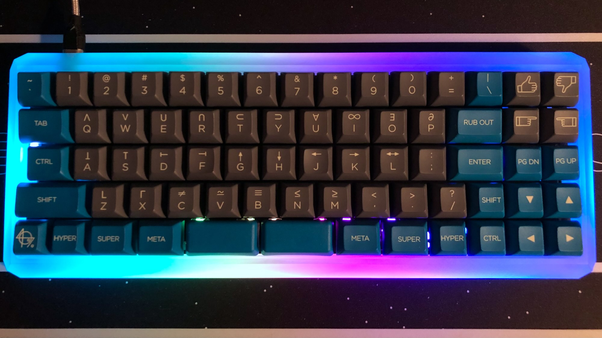
KBDfans 5° FROSTED ACRYLIC CNC 60% CASEでの使用例

不透明のケースを使用するとほとんど見えないため、取り付けても徒労に終わります。  
また、Jones用ボトムプレートを使用する際は、基板とボトムプレートの間隔が狭いため、取り付けることができません。

<details>
<summary>《詳しい手順》</summary>

#### 使用するLEDテープ

使用するLEDテープは、以下のようなタイプです。

- フルカラーシリアルLEDテープ  
  Neopixel WS2812BやRGBテープと表記されていることもあります。

- 幅1cm

- 1mあたり60個のLEDがついたタイプ

このテープを、LED15個分の約25cm使用します。

例えば、[NeoPixel RGB TAPE LED [1907]](https://www.akiba-led.jp/product/959)のような商品がこれに該当します。  
50cm/30LEDのものを買った場合は、真ん中で半分に切り、LED15個分を使用します。

#### LEDテープの取り付け

LEDテープを用意したら、LED信号の入力方向を示す`Din`の文字や、LEDに向かう矢印`→`が描かれている方向を確認します。


LED信号の入力方向を示す`Din`と矢印`→`

LED信号の入力側のテープ裏面の剥離紙を、端子が見える程度（5〜10mm）はがして切り取ります。  
端子が露出するように、シールの糊も取り除きます。

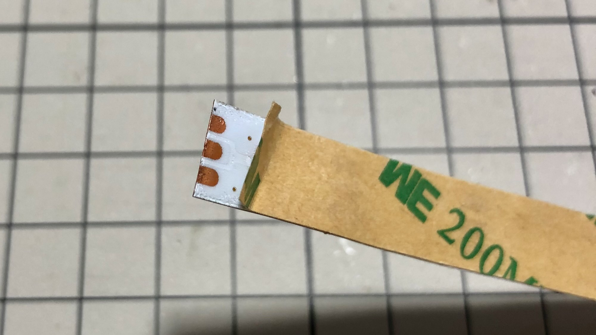
裏側の剥離紙をはがす様子

基板裏側のLEDテープ用パッド`LED STRIP`の、`GND`, `LED`, `VCC`の3箇所へ予備はんだします。

はんだごてを270℃程度に設定します。

LEDテープをマスキングテープなどで仮固定したり、端子付近をピンセットで押さえたりして、基板のパッドとテープ裏側の端子部分が重なるように固定します。  

テープおもて側の端子部分にはんだごてをあてて押さえつけ、パッド上の予備はんだが溶けたらはんだごてを離します。  
はんだごてで端子部分をグリグリいじりすぎると端子が剥がれてしまうため、上から押さえるだけにします。  
`GND`, `LED`, `VCC`の3箇所をはんだ付けします。

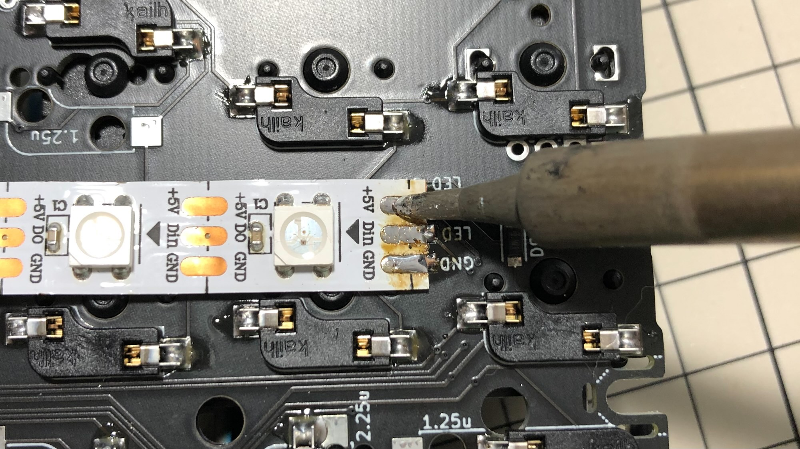
テープおもて側からはんだごてをあてて押さえつける様子

ソケットなどとのショートを防ぐため、テープのもう一方の端の端子部分へビニールテープなどを貼ります。

マスキングテープなどを使い、LEDテープを基板に固定します。

``` aside
LEDテープの剥離紙をすべてはがして基板に貼り付けてしまっても良いですが、メンテナンスしにくくなります。
また、はがす際に基板上の部品まではがれてしまったりするかもしれないので、注意が必要です。  
```

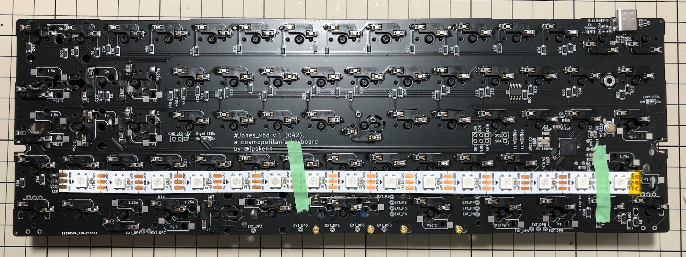
LEDテープを取り付けた様子

#### ファームウェアの書き換え

アンダーグロー対応ファームウェアを用意します。  
インジケータLEDの使用数によって、書き込むファームウェアが異なるため、使用環境に合ったものを用意してください。  
間違ったものを書き込んでも壊れることはありませんが、LEDの点灯位置がずれてしまいます。

ビルド済みのHEXファイルは以下のリンクからダウンロードできます。

- [インジケータLEDなし用 HEX](https://gist.github.com/jpskenn/50e3ec1cdb09e1d24a6f2a5ed4cc2e15)

- [インジケータLED2個（左または右の、どちらか片側のみ）用 HEX](https://gist.github.com/jpskenn/5f6d95be0a71697aa9e7e743e40a73b2)

- [インジケータLED4個（左右両側）用 HEX](https://gist.github.com/jpskenn/cc2e155be9b250978d8f289e9917b5cd)

[ファームウェアの書き込み方法](#ファームウェアの書き込み方法)を参考に、ファームウェアを書き込みます。  

#### アンダーグローの動作確認とケースへの取り付け

キーボードの起動後、LEDテープのすべてのLEDが赤色に点灯していれば正しく動作しています。  
点灯しない場合は、はんだ付けをやりなおします。

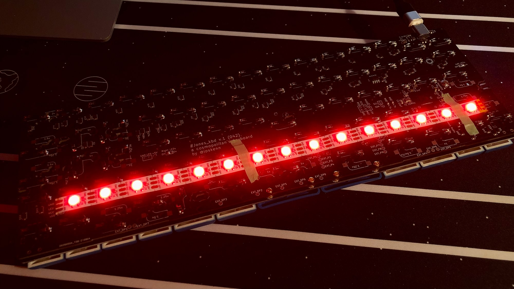
すべてのLEDが赤色に点灯している様子

アンダーグローLED関連のキー割り当て（一部抜粋）
`Raise + Lower + L`: ON/OFF切り替え
`Raise + Lower + P`: 表示モード切り替え
`Raise + Lower + I`: 明るさ増加
`Raise + Lower + K`: 明るさ減少

ケースへ基板を取り付けます。  
60%プラスチックケースと組み合わせたときにケース内のリブがLEDテープと干渉しやすいため、テープを少しずらすか、ケース内のリブをカットして対処します。  

〓写真、ボトムプレートとの組み合わせ

</details>
